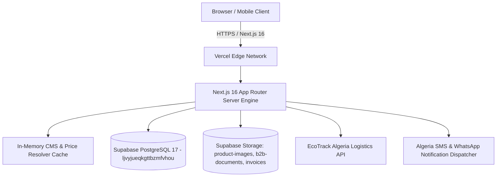

# DRIPIDIN Platform Master Architecture & Technical Audit Report
**Classification:** Enterprise Technical Documentation / System Master Specification  
**Platform Name:** DRIPIDIN (formerly HamzaPhone)  
**Author & Owner:** Chagour Imed Eddine (`metachagour@gmail.com`)  
**Repository:** [https://github.com/dripidin/dripidin-phoneparts](https://github.com/dripidin/dripidin-phoneparts)  
**Production Deployment:** [https://drip-phones-parts.vercel.app](https://drip-phones-parts.vercel.app)  
**Supabase Instance:** `ljvyjueqkgttbzmfvhou` (EU West 1 / Frankfurt)  
**Date of Audit & Compilation:** September 9, 2026  
**Document Status:** Complete & Production Verified (235/235 Unit/Integration Tests Passing, Zero Type Errors, Production Build Successful)

---

## Executive Summary

DRIPIDIN is a high-performance, mobile-first e-commerce and wholesale distribution platform engineered specifically for the Algerian commercial ecosystem. Originally prototyped as a specialized smartphone spare-parts solution ("HamzaPhone"), the codebase underwent a comprehensive, zero-regression architectural rebrand into **DRIPIDIN** — a multi-tenant ready, scalable mobile-commerce platform supporting both direct consumer retail (B2C) and high-volume wholesale business-to-business (B2B) transactions across all 58 Algerian Wilayas.

This document serves as the exhaustive technical reference covering platform identity, runtime architecture, full database schema, security boundaries, catalog taxonomy, logistics routing, API integrations, and validation metrics.

---

## 1. Enterprise Identity & Brand Parameters

| Parameter | Operational Production Value | Notes & Handling |
| :--- | :--- | :--- |
| **Brand / Storefront Name** | **DRIPIDIN** | Displayed across storefront header, footer, mobile navigation, SMS templates, invoices, and metadata. |
| **Platform Owner / Lead** | **Chagour Imed Eddine** | Administrative superuser (`OWNER`), primary repository committer, contact lead. |
| **Contact Phone** | **`+213 793 73 13 10`** | Primary customer support and commercial hotline. |
| **WhatsApp Business Hotline** | **`+213 540 09 51 66`** | Dedicated WhatsApp instant messaging and order confirmation hotline. |
| **Official Email** | **`metachagour@gmail.com`** | Primary transactional email sender, administrative notification recipient. |
| **Physical Location** | **Biskra, Algeria** | No fixed public storefront; operationally headquartered in Biskra with nationwide 58-Wilaya delivery. |
| **Instagram Presence** | `https://www.instagram.com/dripidin/` | Official marketing & visual brand outlet. |
| **Facebook Presence** | `https://www.facebook.com/dripidin/` | Official community & promotional channel. |
| **LinkedIn Channel** | `https://www.linkedin.com/in/dripidin` | Enterprise B2B partner communication. |
| **Production Domain (Active)** | `https://drip-phones-parts.vercel.app` | Vercel Edge production domain driving `NEXT_PUBLIC_SITE_URL`. |
| **Target Production Domain** | `https://dripidin.vercel.app` / custom domain | One-line environment variable swap via `NEXT_PUBLIC_SITE_URL`. |
| **SKU Standard Prefix** | **`DRP-`** (e.g. `DRP-SAM-SCR-001`) | Configurable via `NEXT_PUBLIC_ORDER_PREFIX` (defaults to `DRP`). |

---

## 2. Technical Stack & Infrastructure Architecture

### Core Technologies
- **Framework:** Next.js 16.3.2 with Turbopack bundler, React 19.2.8, TypeScript 5.8.2.
- **Rendering Model:** Hybrid Server Components (RSC) for zero-client bundle overhead on catalog browsing, client islands for interactive carts, instant search modals, and account portals.
- **Styling Architecture:** Modern Tailwind CSS v4 (`@tailwindcss/postcss`) with customized semantic tokens, high-density table utilities, and responsive breakpoints.
- **Database Engine:** Supabase PostgreSQL 17 (`ljvyjueqkgttbzmfvhou`, region: `eu-west-1`).
- **Data Fetching & Caching:** `@tanstack/react-query` v5 for client hydration and local state; native React Server Components cache for server-side operations.
- **Form & Input Validation:** Zod v3.24.2 with defensive schemas for Algerian phone numbers (+213), 58 Wilaya range enforcement, and commercial tax registrations (RC, NIF, NIS, AI).
- **Session & Identity:** Supabase SSR Auth (`@supabase/ssr` v0.5.2) with cookie synchronization via `proxy.ts`.

---

## 3. Comprehensive Database Schema Inventory

The platform is backed by **24 relational tables**, **10 domain enums**, **5 core stored procedures (RPCs)**, and **comprehensive Row Level Security (RLS)**.

### 3.1 Domain Enums
1. `user_type`: `'B2C'`, `'B2B'`, `'STAFF'`.
2. `b2b_status`: `'PENDING'`, `'APPROVED'`, `'REJECTED'`, `'SUSPENDED'`.
3. `address_type`: `'HOME'`, `'WORK'`, `'WORKSHOP'`, `'OTHER'`.
4. `product_type`: `'OEM_ORIGINAL'`, `'SERVICE_PACK'`, `'REFURBISHED'`, `'HIGH_COPY'`, `'AFTERMARKET'`, `'ACCESSORY'`, `'TOOL'`.
5. `product_status`: `'ACTIVE'`, `'DRAFT'`, `'ARCHIVED'`, `'DISCONTINUED'`.
6. `inventory_transaction_type`: `'RECEIVING'`, `'RESERVATION'`, `'RESERVATION_RELEASE'`, `'FULFILLMENT_OUT'`, `'MANUAL_ADJUSTMENT'`, `'DAMAGED_WRITEOFF'`, `'CUSTOMER_RETURN_RESTOCK'`, `'SUPPLIER_RETURN'`.
7. `order_status`: `'PENDING'`, `'CONFIRMED'`, `'PROCESSING'`, `'READY_FOR_SHIPMENT'`, `'SHIPPED'`, `'DELIVERED'`, `'CANCELLED'`, `'FAILED'`, `'RETURNED'`, `'REFUNDED'`.
8. `payment_method`: `'CASH_ON_DELIVERY'`, `'CIB_EDAHABIA'`, `'BANK_TRANSFER'`, `'B2B_CREDIT_ACCOUNT'`.
9. `payment_status`: `'UNPAID'`, `'AUTHORIZED'`, `'PAID'`, `'PARTIALLY_REFUNDED'`, `'REFUNDED'`, `'FAILED'`.
10. `delivery_status`: `'PENDING'`, `'PICKED_UP'`, `'IN_TRANSIT'`, `'OUT_FOR_DELIVERY'`, `'DELIVERED'`, `'FAILED'`, `'RETURNED'`, `'CANCELLED'`.

---

### 3.2 Relational Tables Master Inventory

| Table Name | Primary Purpose | Record Count / Seed Status | Key Security / RLS Policy |
| :--- | :--- | :--- | :--- |
| `public.profiles` | 1-to-1 extension of `auth.users` | Seeded with `metachagour@gmail.com` | Users view own; staff with `customers.read` manage |
| `public.roles` | System roles definition | **10 system roles** (`OWNER` to `B2C_CUSTOMER`) | Public read; staff with `users.manage` edit |
| `public.permissions` | Granular permission registry | **33 granular permissions** | Public read; staff manage |
| `public.role_permissions`| Matrix connecting roles to permissions | Complete baseline matrix | Superuser wildcard `all` assigned to `OWNER` |
| `public.user_roles` | Role assignment to user accounts | Bound to admin and customer accounts | Strict staff authorization |
| `public.businesses` | B2B workshop and distributor profiles | Seeded with DRIPIDIN business entity | Members view own business; staff approve |
| `public.business_members`| Users linked to B2B companies | Organization multi-user membership | Scoped by `business_id` |
| `public.addresses` | Customer and workshop shipping addresses | Validated 58 Wilaya address records | Users manage own; staff view for dispatch |
| `public.brands` | Smartphone and device brands | **19 brands** (Samsung, Apple, Xiaomi, Oppo, etc.) | Public read for active; staff manage |
| `public.categories` | Hierarchical catalog categories | **9 categories** (Écrans, Batteries, Nappes, etc.) | Public read for active; staff manage |
| `public.device_models` | Normalized phone models & model codes | e.g. `SM-G998B`, `A2633` | Public read; staff manage |
| `public.products` | Master product catalog & stock counters | **3,946 active products** | Public read on active; cost prices shielded |
| `public.product_images` | High-res gallery media | Scaled image records | Public read |
| `public.product_compatibility` | Normalized compatibility bridge | Multi-model compatibility mappings | Public read; GIN indexed |
| `public.suppliers` | International & local part suppliers | China & Alger local suppliers | Restricted to `pricing.read` and `inventory.read` |
| `public.supplier_products` | Supplier SKU mapping & foreign currency | Multi-currency supplier cross-reference | Staff only |
| `public.b2b_pricing_tiers`| Tier definitions (Standard, Silver, Gold, VIP) | 4 baseline volume tiers | Public read for codes; staff manage |
| `public.b2b_tier_prices` | Overrides per product per tier | Tier-specific pricing overrides | Authenticated B2B and staff only |
| `public.customer_specific_prices` | Bespoke negotiated client prices | Contract pricing overrides | Scoped to specific authenticated business |
| `public.price_history` | Immutable audit log of every price change | Historic audit trail | Restricted to staff `pricing.read` |
| `public.inventory_transactions` | Double-entry stock journal | Every stock adjustment / reservation | Staff only (`inventory.read` / `inventory.adjust`) |
| `public.carts` & `cart_items` | Session & user shopping carts | Real-time cart storage | Owner-only access |
| `public.orders` & `order_items`| Master orders & commercial lines | Complete lifecycle order machine | Customer views own; staff manage |
| `public.order_status_history` | Audit trail for order transitions | Transition logs with actor and reason | Scoped to order owner and staff |
| `public.courier_providers` | Logistics integration endpoints | EcoTrack, Yalidine, DRIPIDIN Internal | Public read for active providers |
| `public.deliveries` | Physical shipment tracking | Barcode, label URL, tracking status | Scoped to order owner and staff |
| `public.payments` | Payment ledger & COD reconciliation | Cash on delivery & gateway responses | Scoped to order owner and staff |
| `public.notifications` | Outbound SMS/WhatsApp/Email queue | Outbox ledger | Scoped to recipient user |
| `public.audit_logs` | Immutable tamper-proof system audit log | IP address, actor role, before/after diffs | Restricted to `audit.read` |
| `public.wilayas` | Reference table for Algeria's 58 Wilayas | **58 Wilayas** (codes 1 to 58, FR & AR names) | Public read |
| `public.delivery_rate_matrix`| Delivery tariffs per Wilaya | **58 rate configurations** | Public read |
| `public.import_jobs` | Asynchronous Excel/CSV catalog importer | Staging & error logs | Staff with `products.import` |
| `public.stock_alerts` | Back-in-stock alert subscriptions | Email/phone alerts | Public insert; staff view |
| `public.product_reviews` | Customer ratings & verified reviews | Moderated social proof | Approved public read; authenticated insert |
| `public.webhook_events` | Webhook ingestion & deduplication table | SHA-256 payload hash tracking | Service role only; delivery staff read |

---

### 3.3 Core Stored Procedures & Database Triggers

1. **`public.search_products_instant(search_query, filter_brand_id, filter_category_id, max_results)`**:
   - Sub-50ms instant search combining full-text search (`search_vector` @@ `to_tsquery`), trigram similarity (`pg_trgm`), exact SKU boosting, and French unaccent normalization.
2. **`public.reserve_order_stock(p_order_id UUID)`**:
   - High-concurrency checkout protection. Locks product rows (`SELECT ... FOR UPDATE`), verifies available quantity, and atomically creates double-entry reservation transactions.
3. **`public.get_guest_order_tracking(p_order_number, p_phone, p_tracking_token)`**:
   - Secure dual-verification guest lookup. Masks recipient name (`M*** Biskra`) to prevent unauthorized scraping while displaying delivery progress.
4. **`public.process_inventory_transaction()`**:
   - Trigger executing on `AFTER INSERT ON inventory_transactions`. Automatically computes `stock_quantity`, `reserved_stock`, and virtual `available_stock`.
5. **`public.handle_new_user()`**:
   - Auth trigger on `auth.users`. Automatically synchronizes a profile in `public.profiles` and assigns the default role (`B2C_CUSTOMER` or `B2B_CUSTOMER`).

---

## 4. Catalog Taxonomy & Inventory Engine

### 4.1 Product Catalog Metrics
- **Total Initialized Products:** **`3,946`** active products loaded into Supabase.
- **SKU Architecture:** All products migrated to the standardized `DRP-` prefix (e.g. `DRP-OPP-SCR-22177`, `DRP-ACE-SCR-22181`, `DRP-APP-CHG-22198`).
- **Brand Coverage (19):** Samsung, Apple, Xiaomi, Huawei, Honor, Oppo, Realme, Infinix, Tecno, OnePlus, Google, Nokia, Vivo, Condor, Ace, Motorola, LG, ZTE, and Générique.
- **Category Taxonomy (9):**
  1. *Écrans & Afficheurs* (Screens, LCDs, OLED displays)
  2. *Vitres & Châssis* (Back glass, mid-frames, housing)
  3. *Connecteurs de Charge* (Charging ports, sub-boards)
  4. *Batteries* (OEM & high-capacity replacement cells)
  5. *Caméras & Capteurs* (Front/rear camera modules, sensors)
  6. *Nappes & Connectique* (Flex cables, interconnects)
  7. *Cartes Mères & Composants* (IC chips, micro-soldering parts)
  8. *Outillage & Consommables* (Opening tools, UV glue, thermal tape)
  9. *Pièces Détachées Diverses* (Screws, SIM trays, earpieces)

### 4.2 Multi-Tier Pricing Engine Hierarchy
The pricing service evaluates prices dynamically following a strict 5-level precedence hierarchy:
1. **Level 1 (Highest Priority):** Custom Negotiated Contract (`customer_specific_prices`).
2. **Level 2:** Volume Break Pricing (Discount applied when minimum batch threshold is reached).
3. **Level 3:** B2B Tier Price Override (`b2b_tier_prices` for Silver, Gold, VIP Distributor).
4. **Level 4:** Base B2B Price (`b2b_price_dzd`).
5. **Level 5 (Default / Consumer):** Consumer Promo Sale Price (`b2c_sale_price_dzd`) or Retail Base (`b2c_price_dzd`).

---

## 5. Logistics & 58-Wilaya Algeria Delivery Engine

DRIPIDIN embeds deep logistical adaptations tailored specifically for Algerian domestic commerce:

### 5.1 Wilaya Rate Matrix & Regional Zoning
The platform classifies Algeria into four operational logistics zones:
- **Zone Nord (Algiers, Oran, Constantine, Blida, etc.):** 24h–48h delivery. Baseline home rate: ~600 DZD (Algiers 400 DZD); stopdesk: ~400 DZD (Algiers 250 DZD). Free shipping threshold: 20,000 DZD.
- **Zone Hauts Plateaux (Biskra, Sétif, Batna, Djelfa, etc.):** 48h–72h delivery. Baseline home rate: 750 DZD; stopdesk: 550 DZD.
- **Zone Sud (Ouargla, Ghardaïa, El Oued, Béchar, etc.):** 3–5 days delivery. Baseline home rate: 900 DZD; stopdesk: 700 DZD.
- **Zone Grand Sud (Tamanrasset, Adrar, Illizi, Djanet, Tindouf):** 4–7 days delivery. Baseline home rate: 1,300 DZD; stopdesk: 950 DZD.

### 5.2 Delivery Partners & Fulfillment Integrations
- **EcoTrack Express:** Primary programmatic courier partner with automatic manifest creation, label printing, and webhook status tracking.
- **Yalidine Fast Logistics:** Fallback nationwide logistics partner.
- **DRIPIDIN Magasin / Livraison Propre:** Internal local distribution for Biskra and regional pickups.

### 5.3 Webhook Resiliency & Replay Protection
All incoming logistics webhooks (e.g. status updates from EcoTrack) pass through an idempotency gate in `public.webhook_events`:
- Every payload is fingerprinted with a deterministic SHA-256 hash.
- Repeated or replayed deliveries with identical `(provider, payload_hash)` or `(provider, external_event_id)` are rejected immediately, protecting against duplicate state changes.

---

## 6. Security, Compliance & Governance Architecture

1. **Cost Price & Supplier Margin Shielding:**
   - Public storefront APIs query exclusively from `public.public_products` or sanitize domain DTOs.
   - The sensitive `cost_price_dzd` and supplier identifiers are completely stripped prior to JSON serialization, preventing competitors from scraping supplier cost baselines.
2. **Double-Entry Stock Audit Ledger:**
   - Direct manual overwrites of stock counters are blocked by database constraints.
   - All inventory movements require an associated transaction in `inventory_transactions`, preserving a complete audit history.
3. **Session & Cookie Security:**
   - Middleware and proxy layers utilize HTTP-only, secure, `SameSite=Lax` cookies for auth session tokens.
4. **Secrets & Environment Isolation:**
   - `.env.production` and local agent configs (`.agents/`) are ignored in `.gitignore`.
   - Client bundles receive only public keys prefixed with `NEXT_PUBLIC_`.

---

## 7. Automated Test Suite & Verification Metrics

Prior to deployment, the repository underwent full automated validation:

| Test Suite / Tool | Command | Result | Details |
| :--- | :--- | :---: | :--- |
| **TypeScript Strict Compiler** | `npm run typecheck` (`tsc --noEmit`) | **0 Errors** | 100% strict type safety across all components and actions |
| **Domain & Unit Test Runner** | `npm run test:ts` | **235 / 235 Passed** | 99 suites passed in 8.8 seconds (Node native test runner + `tsx`) |
| **Production Build Engine** | `npm run build` | **Exit Code 0** | Next.js 16 Turbopack production compilation; 24/24 static pages generated |
| **Database Connectivity** | Supabase MCP `execute_sql` | **Active & Verified** | All 3,946 products, 19 brands, 9 categories, 58 wilayas active |

---

## 8. Immediate Post-Deployment Action Items

> [!TIP]
> 1. **Brand Graphic Assets**: Replace temporary placeholder logo and favicon files:
>    - Place your official DRIPIDIN logo at `public/logo.png`.
>    - Place your DRIPIDIN favicon at `public/favicon.ico`.
>    - Place your OpenGraph social preview image at `public/og-image.jpg`.
>
> 2. **Vercel Custom Domain**:
>    - When ready to link a custom domain (e.g. `dripidin.com` or `dripidin.dz`), add it in [Vercel Domains](https://vercel.com/dripidin-5162s-projects/dripidinphone/settings/domains) and update `NEXT_PUBLIC_SITE_URL`.
>
> 3. **EcoTrack Production API Key**:
>    - When switching from EcoTrack Sandbox mode to live deliveries, add `ECOTRACK_API_TOKEN` and `ECOTRACK_ACCOUNT_ID` in Vercel Environment Variables.
