# HamzaPhone - Admin Dashboard Specification & Module Blueprint

## 1. Design Principles & Operational Philosophy

The **HamzaPhone Admin Dashboard** is designed as a mission-critical operations workstation for high-velocity spare parts commerce.

### Core UX Principles:
1. **High Information Density**: Dense, scannable data layouts using Tailwind CSS compact tokens and virtualized `@tanstack/react-table` data grids.
2. **Keyboard-Centric Ergonomics**: Global command palette (`Cmd/Ctrl + K`), shortcut keys for row selection (`J`/`K`), batch action triggers (`Shift + Select`), and modal navigation (`Esc`, `Enter`).
3. **No Blind Mutations**: All destructive and financial mutations (bulk price shifts, stock adjustments, order cancellations) require an interactive preview and validation step.
4. **Realtime Operability**: Live indicators for new incoming orders, stock deductions, and EcoTrack delivery status transitions via Supabase Realtime CDC channels.

---

## 2. Dashboard Modules & Feature Breakdown

```mermaid
graph TD
    AdminRoot[Admin Dashboard] --> Comm[Commerce Core]
    AdminRoot --> Cat[Catalog & Inventory]
    AdminRoot --> Biz[B2B & Commercial]
    AdminRoot --> Ops[Logistics & Operations]
    AdminRoot --> Gov[System & Governance]

    Comm --> M1[1. Overview]
    Comm --> M2[2. Orders OMS]
    Comm --> M13[13. Payments]
    Comm --> M14[14. Reports & Analytics]

    Cat --> M3[3. Products]
    Cat --> M4[4. Categories]
    Cat --> M5[5. Brands & Models]
    Cat --> M6[6. Inventory Ledger]
    Cat --> M7[7. Suppliers]

    Biz --> M8[8. Customers]
    Biz --> M9[9. B2B Verification]
    Biz --> M10[10. Pricing & Bulk Modifiers]

    Ops --> M11[11. Import / Export]
    Ops --> M12[12. Delivery & EcoTrack]
    Ops --> M15[15. Notification Hub]

    Gov --> M16[16. Website & CMS Settings]
    Gov --> M17[17. Staff Users]
    Gov --> M18[18. Roles & Permissions]
    Gov --> M19[19. Immutable Audit Logs]
    Gov --> M20[20. Trash & Archive]
    Gov --> M21[21. System Settings]
```

---

### Module Specifications

#### 1. Overview (Command Center)
* **Realtime KPI Cards**: Gross Merchandise Value (GMV in DZD), Total Orders Today, Average Order Value (AOV), Return Rate percentage (Taux de retour), and Low Stock Alerts.
* **Live Order Stream**: Sound notifications and badge updates on newly submitted B2C and B2B orders.
* **Logistics Health Bar**: Real-time status breakdown of packages currently in transit with EcoTrack.

#### 2. Orders Management System (OMS)
* **Table View**: Filterable by Status (`PENDING`, `CONFIRMED`, `SHIPPED`, etc.), Date, Wilaya (1–58), Payment Method, and Customer Type.
* **Batch Actions**: Bulk Status Transition, Bulk Print Pick Lists, Bulk Generate EcoTrack Labels, Bulk Export CSV.
* **Order Detail Drawer / Page**: Full audit trail, line items, recipient contact validation, EcoTrack live shipment tracking timeline, customer notes, and internal staff memo thread.

#### 3. Products Management
* **Data Grid**: 4,000+ items rendered smoothly via virtualization; shows SKU, Barcode, Image, Name, Brand, Quality Grade, Cost Price, B2C Price, B2B Price, and Available Stock.
* **Inline Quick-Edit**: Fast cell editing for prices, stock threshold, and visibility toggle without leaving table.
* **Structured Compatibility Builder**: Interactive UI to attach device models (Brand > Series > Model > Specific Variant Codes `SM-G998B`) to parts.

#### 4. Categories Hierarchy Manager
* Drag-and-drop nested category tree (e.g. *Displays > OLED Displays > Samsung*).
* Category metadata, cover images, SEO slugs, and default commission/margin rules.

#### 5. Brands & Device Models Manager
* Management of phone brands (Samsung, Apple, Xiaomi, Realme, Oppo, Infinix, Tecno, Huawei, Google).
* Device model database containing model codes, release years, and component compatibility mappings.

#### 6. Inventory Ledger & Cycle Counting
* **Double-Entry Stock Adjustment Modal**: Allows adjustments with explicit reason codes (`RECEIVING`, `MANUAL_ADJUSTMENT`, `DAMAGED_WRITEOFF`, `RMA_RESTOCK`).
* **Warehouse Bin Tagging**: Assign and filter parts by physical warehouse shelf/bin location (e.g. `Bin A-04-2`).
* **Low Stock Intelligence**: Filter products below safety threshold with automated purchase order generation.

#### 7. Supplier Hub
* Profiles for international (Shenzhen/Guangzhou) and local Algerian suppliers.
* Supplier SKU cross-referencing, primary purchase currency (USD/RMB/EUR/DZD), exchange rate overrides, and lead-time performance tracking.

#### 8. Customers Directory
* Unified directory of B2C consumers and B2B technicians.
* Customer 360° view: Lifetime spend, total orders, return rate percentage, saved delivery addresses (Home/Work/Workshop), and phone verification status.

#### 9. B2B Wholesale Approvals
* Queue of pending B2B applications with preview of uploaded *Registre de Commerce (RC)* documents and Tax IDs (NIF/NIS).
* One-click approval flow to assign B2B Pricing Tiers (`TIER_1`, `TIER_2`, `VIP`) and Payment Terms (`COD`, `NET_30`).

#### 10. Pricing & Bulk Modification Center
* **Interactive Bulk Modifier Wizard**:
  1. *Filter Scope*: Select all products, specific supplier, brand, category, or manual SKU list.
  2. *Operation*: Increase / Decrease by percentage ($\pm X\%$) or set fixed margin above cost.
  3. *Rounding*: Auto-round to nearest 10 or 50 DZD.
  4. *Preview & Validation Diff*: Visual check of previous vs new prices and margin checks.
  5. *Commit & Audit Log*: Executes atomic update and writes to `price_history`.

#### 11. Import / Export Hub
* Drag-and-drop CSV/Excel upload with streaming parser.
* Pre-import validation report with line-by-line error flags.
* One-click export of Catalog Master, B2B Price Lists, and Inventory Valuation sheets.

#### 12. Delivery & EcoTrack Logistics Manager
* EcoTrack API settings, Webhook endpoint health monitor, and manual sync triggers.
* 58 Wilayas & Communes shipping fee rate matrix (Home Delivery vs Stop Desk pricing).

#### 13. Payments & COD Reconciliation
* Daily Cash on Delivery (COD) settlement reconciliation against courier remittance reports.
* CIB/Edahabia transaction logs and CCP bank wire transfer receipt approval queue.

#### 14. Reports & Business Intelligence
* Visual charts: Sales volume over time, revenue breakdown by brand (Samsung vs Apple vs Xiaomi), gross profit margins, and dead stock velocity (items unsold $>90$ days).

#### 15. Notification Hub
* Template manager for Transactional SMS (Arabic/French), WhatsApp Cloud API messages, and email invoices.

#### 16. Website Content & CMS Settings
* Control over storefront hero carousel banners, promotional announcement bars, WhatsApp floating button phone numbers, warranty terms, and store opening hours.

#### 17. Staff Users
* Invitation system for staff members with email activation and 2FA enforcement.

#### 18. Roles & Granular Permissions
* Visual matrix to inspect and adjust granular capabilities assigned to each role.

#### 19. Immutable Activity Logs
* Filterable security audit ledger showing Actor, Action, Entity, Timestamp, IP Address, and JSON before/after state diffs.

#### 20. Trash & Archive
* Soft-deleted products, categories, and orders with 30-day retention before permanent purge or one-click restore.

#### 21. System Settings
* Base currency settings (DZD), tax rules, company business information, database maintenance tools, and cache revalidation triggers.
