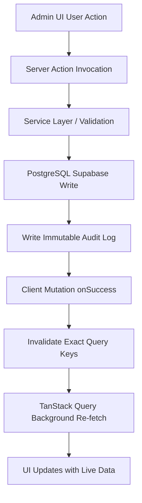

# HamzaPhone Admin Dashboard: Data Layer Integration Architecture

**Document Reference**: `HP-INT-001`  
**Status**: `APPROVED & IMPLEMENTED`  
**Version**: `1.0.0`  
**Target Platform**: HamzaPhone E-Commerce (Algeria - 58 Wilayas)

---

## 1. Executive Summary

This document specifies the architecture, data layer contracts, and query/mutation patterns implemented to connect the HamzaPhone Admin Dashboard to the real Supabase PostgreSQL backend.

All administrative modules interact directly with verified server-side actions (`src/lib/actions/`), enforced by strict PostgreSQL schemas, Row-Level Security (RLS), domain service validation layers (`src/lib/services/`), and TanStack Query client caching hooks (`src/lib/hooks/use-admin-queries.ts`).

---

## 2. Implemented Administrative Modules

| Module # | UI Component & Route | Server Action Source | Key Domain Capabilities |
| :--- | :--- | :--- | :--- |
| **1. Dashboard Overview** | `overview-view.tsx` | `overview.actions.ts` | Real-time aggregate KPI metrics (active catalog, low stock count, orders by status, B2B registrations, revenue), recent order stream, live activity logs. |
| **2. Products & Catalog** | `products-view.tsx` | `product.actions.ts` | Paginated product table, faceted search by brand/category/status/stock, multi-image Supabase Storage upload, device compatibility matrix builder, product cloning, safe archiving & restoration. |
| **3. Categories** | `categories-view.tsx` | `category-brand.actions.ts` | Hierarchical category CRUD, slug generation, display order sequencing, product reference counter. |
| **4. Brands** | `categories-view.tsx` | `category-brand.actions.ts` | Smartphone manufacturer repository (Apple, Samsung, Xiaomi, Realme, etc.), slug mapping, active model counting. |
| **5. Inventory & Warehouse** | `inventory-view.tsx` | `inventory.actions.ts` | Real-time available vs reserved vs physical stock computation, warehouse bin tracking, manual adjustment modal with double-entry ledger in `inventory_transactions`. |
| **6. Dynamic Pricing Engine** | `pricing-view.tsx` | `pricing.actions.ts` | Direct retail/wholesale editing, multi-step bulk percentage adjustments with DZD rounding (10/50/100 DZD), cost margin guard warning (<5%), and batch audit tracking. |
| **7. Orders (OMS)** | `orders-view.tsx` | `order.actions.ts` | Complete order lifecycle with status filters, Wilaya/Commune dispatch details, line items table, COD collection breakdown, internal staff notes, and state machine transitions. |
| **8. B2C Customers** | `customers-view.tsx` | `customer-b2b.actions.ts` | Particulier profile directory, address records, order history summary, customer status toggling. |
| **9. B2B Wholesale Accounts** | `customers-view.tsx` | `customer-b2b.actions.ts` | Professional repair shop verification, Registre de Commerce (RC) / NIF / NIS validation, wholesale tier assignment (`SILVER`, `GOLD`, `PLATINUM`), and credit limit allocation. |
| **10. Suppliers** | `suppliers-view.tsx` | `supplier.actions.ts` | Direct factory suppliers (Shenzhen, Guangzhou, local importers), lead times, currency configurations (USD/DZD/EUR), contact registry. |
| **11. Activity Logs** | `activity-logs-view.tsx` | `activity-log.actions.ts` | Immutable system audit trail, operator email attribution, entity filtering, and JSON diff inspector (Old vs New state comparison). |
| **12. Trash / Archival** | `trash-view.tsx` | `product.actions.ts` | Soft-deleted / archived products retention table with one-click restore to active catalog. |

---

## 3. Query Strategy & TanStack Query Infrastructure

### 3.1. Query Client Configuration (`src/components/providers/query-provider.tsx`)
```typescript
const [queryClient] = useState(
  () =>
    new QueryClient({
      defaultOptions: {
        queries: {
          staleTime: 1000 * 30, // 30 seconds fresh data window
          gcTime: 1000 * 60 * 10, // 10 minutes cache garbage collection
          refetchOnWindowFocus: false,
          retry: (failureCount, error) => {
            if (failureCount < 2) return true;
            return false;
          },
        },
      },
    })
);
```

### 3.2. Query Key Design
To allow surgical cache invalidation without refetching unrelated tables, query keys are structured hierarchically:
- `['admin', 'overview']`
- `['admin', 'products', params]`
- `['admin', 'product', id]`
- `['admin', 'categories']`
- `['admin', 'brands']`
- `['admin', 'suppliers']`
- `['admin', 'inventory', params]`
- `['admin', 'inventory-history', productId]`
- `['admin', 'orders', params]`
- `['admin', 'order', orderId]`
- `['admin', 'customers', params]`
- `['admin', 'b2b-accounts', status]`
- `['admin', 'activity-logs', params]`

---

## 4. Mutation Strategy & Cache Invalidation

Every mutation triggers targeted invalidation of related query keys to ensure UI consistency immediately after successful database writes:



### Invalidation Cross-Reference Matrix:
- **Product Creation / Edit / Archive**: Invalidates `['admin', 'products']`, `['admin', 'overview']`, and `['admin', 'inventory']`.
- **Inventory Adjustment**: Invalidates `['admin', 'inventory']`, `['admin', 'inventory-history']`, `['admin', 'products']`, and `['admin', 'overview']`.
- **Order State Transition**: Invalidates `['admin', 'orders']`, `['admin', 'order', id]`, and `['admin', 'overview']`.
- **Bulk Price Adjustment**: Invalidates `['admin', 'products']`, `['admin', 'pricing']`, and `['admin', 'activity-logs']`.
- **B2B Account Review**: Invalidates `['admin', 'b2b-accounts']`, `['admin', 'overview']`, and `['admin', 'customers']`.

---

## 5. Authorization & Server Action Security Guardrails

All Server Actions executed from the Admin Dashboard enforce authorization constraints before performing database writes:

1. **Authentication Verification**: `requireStaff(supabase)` validates that the calling session belongs to an active staff user (`ADMIN`, `OPERATOR`, `INVENTORY_MANAGER`, etc.).
2. **Permission Evaluation**: `requirePermission(supabase, permissionCode)` evaluates granular RBAC permissions against the `role_permissions` and `permissions` tables.
3. **Audit Trail Logging**: All destructive or state-changing operations write an immutable record into `audit_logs` capturing:
   - `actor_email` and `actor_role`
   - `action` (e.g. `PRODUCT_ARCHIVE`, `INVENTORY_ADJUSTMENT`, `ORDER_STATUS_TRANSITION`)
   - `entity_type` and `entity_id`
   - `old_values` and `new_values` JSON payloads

---

## 6. Realtime Readiness & Next Steps

1. **Supabase Realtime Channel Subscription**:
   - The React Query architecture is ready for Supabase Realtime bindings via `supabase.channel('public:orders').on('postgres_changes', ...)` which will invoke `queryClient.invalidateQueries({ queryKey: ['admin', 'orders'] })` upon new incoming orders.
2. **Next Milestone Roadmap**:
   - Complete CSV / Excel spreadsheet batch importer in `ImportExportView`.
   - Implement EcoTrack API automated label generation in `DeliveryView`.
   - Implement B2C Storefront mobile web application views.
