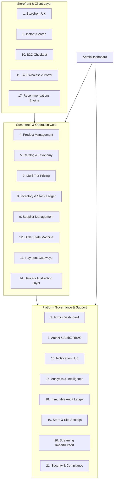
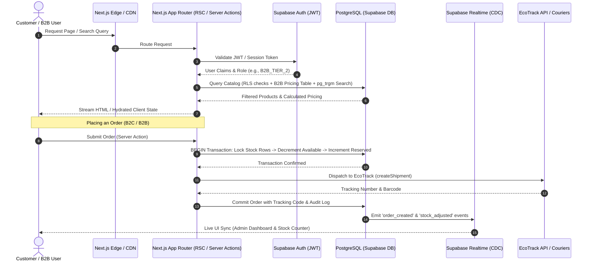

# HamzaPhone - System Architecture & Technical Specification

## 1. Executive Summary & System Purpose

**HamzaPhone** is an enterprise-grade, high-performance e-commerce and catalog management platform tailored for the smartphone replacement parts and repair ecosystem in **Algeria**. The platform is architected to simultaneously serve high-frequency B2C retail buyers and wholesale B2B repair shops, corporate fleets, and regional distributors, while providing an administrative control center for inventory, pricing, logistics, and multi-supplier catalog updates.

The system is designed from day one to handle **4,000+ active SKUs** scaling to **100,000+ parts**, supporting complex device-model compatibility trees, instant full-text search with zero perceived latency, multi-tier pricing, Algerian localized logistics (58 Wilayas with EcoTrack and local couriers), and granular Role-Based Access Control (RBAC).

---

## 2. Technology Stack & Decision Rationale

| Layer | Technology | Selection Rationale & Constraints |
| :--- | :--- | :--- |
| **Framework** | Next.js 16 (App Router) | Server Components (RSC) for zero-bundle rendering, Server Actions for type-safe mutations, streaming SSR with Suspense for ultra-fast initial page loads. |
| **UI Library** | React 19 | Actions, `useActionState`, `useOptimistic`, and Transitions for instant UI feedback during complex operations. |
| **Language** | TypeScript 5+ (Strict Mode) | Full-stack end-to-end type safety with zero `any` allowance, robust schema definitions, and autocompletion across data layers. |
| **Styling** | Tailwind CSS v4 | CSS-first architecture, reduced build times, CSS variables design tokens, custom brand colors (HamzaPhone Orange `#FF6600` & White). |
| **Component System** | shadcn/ui + Base UI primitives | Accessible, headless, unstyled primitives guaranteeing complete styling control, keyboard navigation, and accessibility (WCAG 2.2 AA). |
| **Data Grid** | TanStack Table v8 | Virtualized rendering for high-volume tabular data (admin inventory, order logs, product batches), column resizing, sorting, and facet filtering. |
| **Client State / Cache** | TanStack Query v5 | Server state management, smart background refetching, optimistic updates, request deduplication, and cache invalidation on mutations. |
| **Form Handling** | TanStack Form + Zod | Type-safe form validation, field-level reactivity, minimal re-renders for large forms (product variants, multi-step import/pricing workflows). |
| **Database & Engine** | Supabase / PostgreSQL 16+ | Enterprise relational integrity, ACID transactions, `pg_trgm` & Full-Text Search indexing, JSONB for structured compatibility trees, Row Level Security (RLS). |
| **Authentication** | Supabase Auth (GoTrue) | Built-in OAuth (Google, Facebook, Apple), session management via HTTP-only cookies, JWT verification in middleware and RLS. |
| **Object Storage** | Supabase Storage (S3 API) | CDN-backed asset delivery, automatic image resizing/transformation pipelines for product galleries and invoices. |
| **Realtime Sync** | Supabase Realtime (CDC) | Postgres Logical Replication streams for stock deduction events, critical order status changes, and admin notification dispatch. |

### Explicit Exclusions
* **No GraphQL**: REST/RPC Server Actions provide simpler caching, lower bundle overhead, native TypeScript inferencing, and direct Postgres transactional boundaries.
* **No NextAuth**: Supabase Auth directly integrates with PostgreSQL RLS and user session lifecycle without double-token indirection.
* **No TanStack Start**: Next.js 16 provides the requisite hybrid static/dynamic caching, image optimization, edge routing, and established ecosystem for Algerian e-commerce.

---

## 3. Modular System Decomposition (21 Core Modules)

### Module Descriptions

1. **Storefront (B2C/B2B Hybrid)**: Responsive, mobile-first visual catalog with brand-specific orange/white aesthetics, instant search drawer, faceted part selector (Brand > Series > Model > Part Category), quick order tools for repair technicians, and multi-address checkout.
2. **Admin Dashboard**: Operational command center built with density-friendly layouts, virtualized data tables, fast keyboard shortcuts, batch actions, status badges, and sub-second navigation.
3. **Authentication & Authorization**: Multi-provider authentication (Google, Apple, Facebook, Email/Password, Magic Link) combined with a database-backed Role-Based Access Control (RBAC) engine enforcing 10 distinct staff and customer roles.
4. **Product Management**: Specialized phone-part product modeling with structured compatibility trees (screens, batteries, charging ICs, flex cables, chassis), dual-SKU tracking, and barcode recognition.
5. **Catalog Management**: Hierarchical category trees (e.g. `Screens > OLED Assemblies > Samsung > Galaxy S Series`), brands, device models, and attribute specifications.
6. **Search & Discovery**: Sub-50ms instant search powered by PostgreSQL GIN indexes, `pg_trgm` fuzzy matching, and generated `tsvector` weighted documents.
7. **Pricing Engine**: Multi-tiered pricing architecture supporting Cost + Margin rules, B2C Retail, B2C Promotional Sales, B2B Tier 1/2/3, Customer-Specific contracts, volume discounts, and bulk percentage adjustment workflows.
8. **Inventory & Stock Ledger**: Double-entry inventory transactions tracking `Current Stock`, `Reserved Stock` (unpaid/pending orders), `Available Stock`, safety buffers, low-stock triggers, and warehouse location bin tags.
9. **Supplier Management**: Supplier profiles, supplier SKU cross-referencing, cost price histories, lead-time tracking, and automated supplier catalog sync.
10. **B2C Engine**: Guest checkout, saved delivery locations (Home, Work, Workshop), one-click re-ordering, SMS/WhatsApp order tracking, and social proof widgets.
11. **B2B Wholesale Portal**: Dedicated business verification workflow (Registre de Commerce / NIF / NIS validation), bulk order matrix (order by SKU list or CSV paste), credit limits, and tax-exempt invoicing.
12. **Order Management System (OMS)**: Strict state-machine workflow governing orders from `PENDING` through `DELIVERED`, `CANCELLED`, or `REFUNDED`, with granular transition permissions.
13. **Payment Systems**: Multi-mode payment handler supporting Cash on Delivery (COD), CIB/Edahabia (SATIM gateway integration readiness), Bank Wire transfer receipts, and B2B Account Credit terms.
14. **Delivery & Logistics Abstraction**: Provider-agnostic shipping integration engine featuring an out-of-the-box **EcoTrack** adapter, Yalidine/ZR Express extensibility, automated tracking sync, and 58 Algerian Wilaya/Commune rate tables.
15. **Notification Hub**: Multi-channel notification pipeline (Transactional SMS via Algerian gateways, WhatsApp Business API, Resend/SMTP Email, and Admin In-App Push).
16. **Analytics & Business Intelligence**: Operational KPIs: Gross Merchandise Value (GMV), net margins by part brand, dead stock velocity, EcoTrack delivery success vs return rates (taux de retour), and customer lifetime value (LTV).
17. **Recommendation Engine**: Association-rule cross-selling (e.g. *Customer buying an iPhone 13 Screen is recommended the waterproof adhesive gasket, B-7000 glue, and screen opening pry tools*).
18. **Audit Logging**: Immutable, tamper-evident audit ledger capturing every administrative mutation, price change, stock override, and export event with actor, timestamp, previous value, and new value.
19. **Website Settings**: Dynamic CMS-like configuration for hero banners, announcements, Wilaya delivery operational statuses, WhatsApp floating contact, and business metadata.
20. **Import / Export Pipeline**: Streaming parser capable of handling 50,000+ line Excel/CSV spreadsheets with validation previews, duplicate detection, diff summaries, and asynchronous background execution.
21. **Security & RLS Governance**: Multi-tier defense including PostgreSQL Row Level Security policies, Next.js Server Action authentication guards, rate limiting, and input sanitization.

---

## 4. Architectural Data Flow & Component Interaction

---

## 5. Scaling Strategy for 4,000+ to 100,000+ SKUs

1. **Database Indexing & Partitioning**:
   * Compound B-Tree indexes on `(category_id, brand_id, status, is_visible)`.
   * GIN indexes with `gin_trgm_ops` on `name`, `sku`, `supplier_sku`, and `barcode`.
   * JSONB containment GIN indexes on `compatibility` array expressions.
   * Future-proof table partitioning on `inventory_transactions` and `audit_logs` by `created_at` (quarterly partition ranges).
2. **Server-Side Rendering & Caching**:
   * Static Site Generation with On-Demand Revalidation (`revalidateTag`) for high-traffic public catalog pages.
   * Cache tagging: `products`, `product:[id]`, `category:[id]`, `pricing:[tier]`. Dynamic revalidation on price or stock updates.
3. **Client-Side Data Virtualization**:
   * `@tanstack/react-virtual` in all admin data grids and customer search dropdowns to ensure 60fps scrolling irrespective of list size.
4. **Asynchronous Batch Execution**:
   * Chunked streaming for CSV/Excel imports (1,000 rows per batch transaction) to keep memory footprint below 50MB and prevent Vercel/Node event loop stalls.

---

## 6. Verification of Architectural Fit

* **Algeria Local Market Realities**: Full native support for Algerian Dinar (DZD), dual language readiness (French/Arabic), Cash on Delivery (COD) order reconciliation, 58 Wilaya delivery topology, and B2B paper trail compliance (Bons de Livraison / Factures proforma).
* **High-Concurrency Stock Accuracy**: Postgres row-level locking (`SELECT ... FOR UPDATE`) prevents overselling during flash sales or heavy B2B bulk orders.
* **Separation of Concerns**: Complete isolation between Storefront presentation and the Admin commerce core allows future native mobile apps or POS terminals to reuse the underlying Supabase/Postgres business layer.
