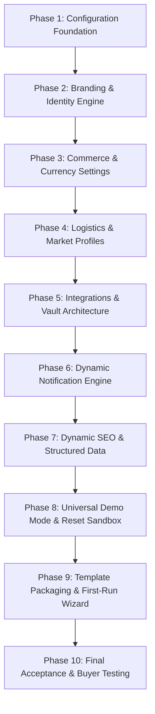

# DRIPIDIN Architectural Audit: Reusable Commercial E-Commerce Template Transformation

> **Executive Status**: READ-ONLY ARCHITECTURAL AUDIT & DECOUPLING BLUEPRINT  
> **Platform**: DRIPIDIN (Originally HamzaPhone)  
> **Target Architecture**: One Codebase + One Database Schema + Configurable Store Identity + Configurable Commerce Settings = Reusable Commercial E-Commerce Template  
> **Date**: September 2026  
> **Version**: 1.0.0-PROPOSAL  
> **Audited Baseline**: Next.js 16 (App Router), React 19, TypeScript strict, Tailwind CSS v4, Supabase PostgreSQL (RLS), Supabase Storage, EcoTrack 58-Wilaya Logistics Engine  

---

## Executive Summary & Core Objective

The current repository represents a battle-tested, high-performance e-commerce platform originally developed as **HamzaPhone** (specialized in smartphone spare parts distribution in Algeria) and subsequently rebranded to **DRIPIDIN**. 

While the functional depth (B2C/B2B commerce, 58-Wilaya logistics, multi-role RBAC, ledger-based inventory, deterministic recommendations, instant search) is production-grade, the application architecture currently embodies the paradigm:

$$\text{\bf "DRIPIDIN is the store"}$$

The platform hard-codes brand identifiers, phone numbers, WhatsApp dispatch numbers, social links, SEO tags, currency representations (`DZD`), order prefixes (`DRP`), delivery providers (`EcoTrack`), and catalog taxonomy directly within React components, Next.js metadata routes, server actions, and TypeScript service singletons. Crucially, settings altered via the Admin UI are stored only in an **in-memory JavaScript object** (`SettingsCmsService.activeSettings`), which resets to hard-coded code constants upon every Vercel serverless function cold start or redeployment.

The objective of this architectural audit is to establish the complete blueprint for transitioning to:

$$\text{\bf "DRIPIDIN is the reusable e-commerce engine; store identity and commerce settings are fully dynamic."}$$

Any commercial buyer or licensee must be able to deploy this codebase, access the Owner/Admin dashboard, and configure their business identity, regional currency, logistics rules, catalog taxonomy, and API integrations **without editing a single line of source code**.

---

## Repository Audit: 30 Specific Dimensions

### 1. Hard-Coded Brand Names
- **HamzaPhone**: 364 active code occurrences in `src/`. Prominent instances include:
  - `src/app/search/page.tsx:29`: Metadata title contains `HamzaPhone Algérie`.
  - `src/app/register/page.tsx:25`: Header contains `<span>Nouveau Client HamzaPhone</span>`.
  - `src/app/page.tsx:17`: Main title contains `HamzaPhone — N°1 des Pièces Détachées Smartphones en Algérie`.
  - `src/app/login/page.tsx:10`: Title contains `Connexion Client & Espace Pro | HamzaPhone Algérie`.
  - `src/app/products/[slug]/page.tsx:81`: Fallback brand name: `product.brand?.name || 'HamzaPhone'`.
  - `src/components/storefront/product-detail/product-info.tsx:55`: WhatsApp template begins with `"Bonjour HamzaPhone..."`.
  - `src/components/storefront/catalog/product-card.tsx:100`: Fallback brand pill `<span className="font-medium text-gray-400">HamzaPhone</span>`.
  - `src/components/storefront/home/hero-section.tsx:87`: Badge label `Garantie HamzaPhone`.
  - `src/components/storefront/home/reviews-section.tsx:23`: Customer testimonial `"chez HamzaPhone"`.
  - `src/lib/admin-store.ts:49`: Default admin email `admin@hamzaphone.dz`.
  - `src/lib/services/connection-test.service.ts:238`: Fallback bot handle `@${data.result?.username || 'hamzaphone_bot'}`.
  - `src/lib/recommendations/recommendation.service.ts:147`: Recommendation reason `Meilleure vente populaire chez HamzaPhone`.
- **DRIPIDIN**: 42 active code occurrences in `src/`:
  - `src/app/layout.tsx:8,18`: `title: { default: 'DRIPIDIN — Plateforme E-Commerce...', template: '%s | DRIPIDIN' }`.
  - `src/components/storefront/layout/storefront-header.tsx:101`: Hard-coded JSX logo `DRIP<span className="text-orange-500">IDIN</span>`.
  - `src/components/storefront/layout/storefront-footer.tsx:98`: Hard-coded footer logo `DRIP<span className="text-orange-500">IDIN</span>`.
  - `src/components/admin/admin-sidebar.tsx:141`: Admin sidebar header `<span className="font-bold">DRIPIDIN</span>`.
  - `src/components/admin/views/overview-view.tsx:56`: Header `<h1 className="text-2xl font-black">DRIPIDIN Operations Suite</h1>`.
  - `src/components/admin/views/delivery-view.tsx:522`: Label `Flotte Interne DRIPIDIN`.
  - `src/components/admin/views/import-export-view.tsx:477`: Column header `Champ DRIPIDIN Correspondant`.
  - `src/lib/notifications/notification.service.ts:255,279,359`: SMS messages `"DRIPIDIN: Votre commande..."`, `"Bienvenue sur l'Espace Pro DRIPIDIN"`.

### 2. Hard-Coded Contact Information
- **Phone Numbers**:
  - Support: `+213 793 73 13 10` hard-coded in `src/lib/settings/settings-cms.service.ts:20` and `src/components/storefront/layout/storefront-footer.tsx:28`.
  - Fallback phone: `'0550 00 00 00'` in `src/components/storefront/layout/storefront-header.tsx:33`.
- **WhatsApp Numbers**:
  - `+213 540 09 51 66` in `src/lib/settings/settings-cms.service.ts:21` and `src/components/storefront/product-detail/product-info.tsx:57`.
- **Email Addresses**:
  - `metachagour@gmail.com` in `settings-cms.service.ts:19,57`, `storefront-footer.tsx:30`, and `integration-config.service.ts:42`.
  - `admin@hamzaphone.dz` in `admin-store.ts:49`.
  - Placeholder `amina.touati@dripidin.com` in `src/components/admin/views/users-view.tsx:469`.
- **Physical Addresses**:
  - `Biskra, Algérie` (Wilaya 07) hard-coded in `settings-cms.service.ts:23-25` and `storefront-footer.tsx:25-27`.
- **Social Media URLs**:
  - `https://www.facebook.com/dripidin/` in `settings-cms.service.ts:28`.
  - `https://www.instagram.com/dripidin/` in `settings-cms.service.ts:29`.
  - Placeholders `facebook.com/hamzaphone.dz`, `instagram.com/hamzaphone.dz`, `tiktok.com/@hamzaphone.dz` in `website-settings-view.tsx:449,458,467`.

### 3. Hard-Coded Branding (Visual Assets & Identity)
- **Logos**:
  - Hard-coded SVG/JSX icon `<Smartphone className="w-5 h-5" />` in `storefront-header.tsx:96` and `storefront-footer.tsx:95` instead of rendering `settings.logoUrl`.
  - Default logo path `'/logo.png'` in `settings-cms.service.ts:17`.
- **Favicon**:
  - Default `'/favicon.ico'` in `settings-cms.service.ts:18`.
- **Colors**:
  - Primary accent color `orange-500` / `orange-600` is hard-coded across dozens of Tailwind classes in `src/components/storefront/` and `src/components/admin/` rather than using CSS theme tokens (e.g., `var(--color-primary)` or `bg-primary`).
- **Typography**:
  - Default sans font `Inter`/system fonts declared in `src/app/globals.css`.
- **Taglines & Badges**:
  - `"Smartphones & Équipements Mobiles, Livrés en 48h dans 58 Wilayas"` in `settings-cms.service.ts:81`.
  - `"Garanties & Engagements DRIPIDIN"` in `settings-cms.service.ts:97`.
  - `"Plateforme E-Commerce DRIPIDIN"` in `settings-cms.service.ts:87`.
- **OpenGraph & Metadata**:
  - `src/app/layout.tsx:14-21`: `siteName: 'DRIPIDIN'`, `locale: 'fr_DZ'`, `metadataBase: new URL('https://dripidin.vercel.app')`.

### 4. Hard-Coded Domain / Deployment URLs
- `https://dripidin.vercel.app`: Primary fallback in `src/app/layout.tsx:14`, `src/app/robots.ts:4`, `src/app/sitemap.ts:5`.
- `https://hamzaphone.vercel.app`: OAuth callback fallback in `src/app/auth/callback/route.ts:24`.
- `https://hamzaphone.dz`: Product JSON-LD URL in `src/app/products/[slug]/page.tsx:85` and B2B SMS template in `notifications-view.tsx:103`.
- `https://gcqseaefboaijktusjmg.supabase.co`: Hard-coded legacy Supabase project URL fallback in `src/lib/config/integration-config.service.ts:391,440`.

### 5. Hard-Coded Currency and Locale
- **Currency Code**: `DZD` hard-coded in:
  - `src/lib/utils.ts:16`: `new Intl.NumberFormat('fr-DZ', { currency: 'DZD' })`.
  - `src/app/products/[slug]/page.tsx:86`: `priceCurrency: 'DZD'`.
  - 153 occurrences across order totals, checkout summaries, admin views, and notifications.
- **Currency Symbol**: `DA` hard-coded in `src/lib/utils.ts:18` (`.replace('DZD', 'DA')`).
- **Locale**: `'fr-DZ'` hard-coded in `src/lib/utils.ts:14,26` (`Intl.NumberFormat('fr-DZ')`, `Intl.DateTimeFormat('fr-DZ')`), `src/app/layout.tsx:19` (`fr_DZ`), and `<html lang="fr">` in `src/app/layout.tsx:30`.
- **Fraction Digits**: `maximumFractionDigits: 0` hard-coded in `formatDZD` (appropriate for Algerian Dinars, but breaks for USD, EUR, GBP, or SAR).

### 6. Hard-Coded Algeria-Specific Business Logic
- **58 Wilayas**:
  - `ALGERIA_WILAYAS` static array (1 to 58) hard-coded in `src/lib/utils.ts:38-97`.
  - `coverageWilayasCount: 58` in `src/lib/settings/settings-cms.service.ts:53`.
  - `GRAND_SUD_WILAYAS = [11, 33, 37, 49, 50, 52, 53, 54, 55, 56, 57, 58]` in `src/lib/delivery/delivery-pricing.service.ts:28`.
- **Delivery Pricing Calculation**:
  - Hard-coded in `src/lib/delivery/delivery-pricing.service.ts:48-53`: Alger (16) is 400 DZD home / 300 DZD desk; other wilayas are 600 DZD home / 450 DZD desk.
- **Payment Method Assumption**:
  - "Paiement Cash à la Livraison (COD)" is assumed as the primary payment flow across cart, checkout, order processing, and payment reconciliation.
- *Preservation Requirement*: This logic is outstanding for Algerian merchants and **must not be discarded**; it must simply be enveloped into an activated `CountryProfile` or `LogisticsZoneMatrix`.

### 7. Hard-Coded Order & SKU Prefixes
- **Order Prefix**:
  - `process.env.NEXT_PUBLIC_ORDER_PREFIX || 'DRP'` in `src/lib/services/checkout.service.ts:417` and `src/lib/services/order.service.ts:158`.
  - Order numbers in mock data and notifications hard-code `'HP-'` (`HP-2026-004921`) in `src/lib/notifications/notification.service.ts:25,46,109` and `src/lib/mock-data.ts`.
- **SKU Prefixes**:
  - `SKU-SAM-`, `SKU-APP-`, `SKU-XIA-` hard-coded in mock generation and product forms.

### 8. Hard-Coded Delivery Provider Configuration
- `ECOTRACK`: Hard-coded default in `src/lib/delivery/registry.ts:11` (`defaultProviderCode = 'ECOTRACK'`), `src/lib/delivery/delivery-pricing.service.ts:39`, and `src/lib/services/delivery.service.ts`.
- Mock courier codes `'YALIDINE'` and `'INTERNAL'` in `src/lib/mock-data.ts`.
- Courier tracking URL `https://ecotrack.dz/tracking/` hard-coded in delivery services.

### 9. Hard-Coded API Endpoints
- `https://api.ecotrack.dz/api/v1` in `src/lib/config/integration-config.service.ts:28`.
- `https://api.maghrebsms.dz/v1` in `src/lib/config/integration-config.service.ts:50`.
- `https://graph.facebook.com/v19.0` in `src/lib/config/integration-config.service.ts:61`.
- `https://api.telegram.org` in `src/lib/config/integration-config.service.ts:72`.
- `smtp://smtp.resend.com:587` in `src/lib/config/integration-config.service.ts:39`.

### 10. Direct process.env Usage in Business/Domain Logic
- Direct access in `src/lib/services/checkout.service.ts:417`: `process.env.NEXT_PUBLIC_ORDER_PREFIX`.
- Direct access in `src/lib/services/order.service.ts:158`: `process.env.NEXT_PUBLIC_ORDER_PREFIX`.
- Direct access in `src/lib/services/delivery.service.ts:460`: `process.env.ECOTRACK_WEBHOOK_SECRET`.
- Direct access in `src/lib/config/integration-config.service.ts:121`: `process.env.DRIPIDIN_DEMO_MODE ?? process.env.HAMZAPHONE_DEMO_MODE`.
- Domain services should consume configuration injected via a unified settings provider, never directly reading `process.env`.

### 11. Integration Credentials & Secret Management
- Secrets are sourced exclusively from environment variables (`ECOTRACK_API_TOKEN`, `SMS_GATEWAY_API_KEY`, `WHATSAPP_CLOUD_API_TOKEN`, `TELEGRAM_BOT_TOKEN`, `SMTP_PASSWORD`, `SUPABASE_SERVICE_ROLE_KEY`).
- `IntegrationConfigService.getAllIntegrationsSummary` implements safe presence checks (`'Configured' | 'Missing'`) with zero leakage.
- However, there is no secure administrative mechanism to configure or rotate secrets from the Admin UI; buyers without direct server env access cannot set up integrations.

### 12. Settings Currently Stored in Database
- **Currently in Database**:
  - `public.courier_providers`: Courier codes and basic JSONB config.
  - `public.delivery_rate_matrix`: Wilaya delivery costs, min/max delivery days, free shipping threshold (added in migration `00008` & `00009`).
  - `public.roles` & `public.permissions`: RBAC matrix including `settings.manage` permission.
- **NOT in Database**: General store identity, branding, contact info, SEO metadata, order prefixes, currency, and homepage CMS sections are **completely absent** from the database schema.

### 13. Settings Currently Hard-Coded in Source Code
- Store identity (`storeName`, `supportEmail`, `supportPhone`, `whatsappPhone`, `addressLine`, `commune`, `wilayaCode`).
- Visual brand assets (`logoUrl`, `faviconUrl`, `ogImageUrl`).
- 10 Homepage CMS sections (Hero banner title, subtitle, CTA, B2B wholesale banners, trust badges, FAQ).
- Social profile URLs (Facebook, Instagram, TikTok, Telegram).
- Delivery badges, warranty badges, return policy text, footer copyright text.
- Currency rules (`DZD`, `DA`, `fr-DZ`, `0 decimals`).
- Order number format template (`${prefix}-${year}-${randomSuffix}`).

### 14. Settings That Already Have Admin UI Controls
- `WebsiteSettingsView` (`src/components/admin/views/website-settings-view.tsx`):
  - Store identity (Store Name, Support Phone, WhatsApp, Support Email, Address).
  - Social Links (Facebook, Instagram, TikTok, YouTube, Telegram).
  - SEO & Meta (Meta Title, Meta Description, Meta Keywords).
  - Storefront Trust Badges & Policies (Announcement text, Delivery badge, Payment badge, Warranty text, Return policy).
  - Structured Homepage Sections (Reordering, toggling visibility, editing titles/subtitles/CTAs).
- `IntegrationsView` (`src/components/admin/views/integrations-view.tsx`):
  - Sandbox vs Production toggle.
  - Integration enable/disable toggle.
  - API endpoint override.
  - Connection test triggers (`testIntegrationConnectionAction`).
  - Non-secret parameter editing.

### 15. Settings That Are Missing Admin UI Controls
- **Currency & Regional**: Currency code selector (DZD, USD, EUR, SAR, etc.), currency symbol (DA, $, €, etc.), decimal places, locale string (`fr-DZ`, `en-US`, `ar-DZ`).
- **Market & Country Profile**: Default country selection, international shipping toggle, postal code requirement toggle.
- **Commerce Core**: Order prefix (`DRP`, `ORD`, etc.), invoice numbering prefix (`INV-`), SKU automatic generator template, tax rate (TVA) percentage, minimum order amount.
- **Feature Flags**: Wholesale B2B module toggle (show/hide B2B tabs, registration, and pricing), Guest checkout toggle, Reviews module toggle, WhatsApp quick-order button toggle.
- **Payment Methods**: Payment gateway toggles (COD, BaridiMob, CIB, Stripe) and payment instructions.
- **Storage Configuration**: Media bucket name, CDN base URL, max image upload size.
- **Notification Templates**: Visual editor for SMS, Email, and WhatsApp templates with dynamic tokens (`{customer_name}`, `{order_number}`, `{tracking_link}`).

### 16. Product, Category, and Brand Configuration
- Hard-coded categories in sitemap: `['ecrans-oled', 'batteries', 'connecteurs-charge', 'vitres-tactiles', 'outillage']`.
- Hard-coded brands in sitemap: `['samsung', 'apple', 'xiaomi', 'oppo', 'realme', 'huawei']`.
- Hardware-specific device model hierarchy (`device_models` table and `product_compatibility`) is deeply coupled to smartphones. Non-electronics stores (e.g., fashion, cosmetics) have no need for "device compatibility".

### 17. Feature Flags That Should Become Configurable
1. `feature.b2b_wholesale`: Enables/disables wholesale registration, wholesale pricing tiers, and B2B approval workflows.
2. `feature.guest_checkout`: Allows purchases without creating an account.
3. `feature.device_compatibility`: Enables/disables device model compatibility matrix on product pages.
4. `feature.whatsapp_ordering`: Enables/disables direct "Commander par WhatsApp" button.
5. `feature.customer_reviews`: Enables/disables public product reviews.
6. `feature.announcement_bar`: Toggles the top notification strip on storefront.
7. `feature.low_stock_alerts`: Enables/disables automated threshold warnings to warehouse staff.
8. `feature.cod_payment`: Enables/disables Cash-on-Delivery payment option.

### 18. Admin Permissions Related to Configuration
- Migration `00007` created the system permission `settings.manage` with description: *"Configure site settings, API keys, and notification templates"*.
- In `00007_storage_and_seed.sql`, `settings.manage` is granted to `OWNER` (via wildcard `all`) and `ADMINISTRATOR`.
- Currently, server actions verifying settings changes check `context.userType === 'STAFF'` but do not consistently check `has_permission('settings.manage')`.

### 19. Storefront Components Directly Referencing DRIPIDIN
- `src/components/storefront/layout/storefront-header.tsx:101`: `DRIP<span className="text-orange-500">IDIN</span>` (hard-coded logo text).
- `src/components/storefront/layout/storefront-footer.tsx:32,98,220,240`: `DRIPIDIN` in logo, admin link, and copyright.
- `src/components/storefront/checkout/customer-step.tsx:61`: Fallback guest name `'Client HamzaPhone'`.
- `src/components/storefront/product-detail/product-info.tsx:55`: Pre-filled WhatsApp message `"Bonjour HamzaPhone..."`.
- `src/components/storefront/home/hero-section.tsx:87`: `"Garantie HamzaPhone"`.
- `src/components/storefront/home/reviews-section.tsx:23`: `"chez HamzaPhone"`.
- `src/components/storefront/catalog/product-card.tsx:100`: Fallback brand pill `<span className="font-medium text-gray-400">HamzaPhone</span>`.

### 20. Admin Components Directly Referencing DRIPIDIN
- `src/components/admin/admin-sidebar.tsx:141`: `<span className="font-bold">DRIPIDIN</span>`.
- `src/components/admin/views/overview-view.tsx:56`: `<h1 className="text-2xl font-black">DRIPIDIN Operations Suite</h1>`.
- `src/components/admin/views/delivery-view.tsx:522`: `<h4 className="font-extrabold text-sm">Flotte Interne DRIPIDIN</h4>`.
- `src/components/admin/views/import-export-view.tsx:477`: `<th>Champ DRIPIDIN Correspondant</th>`.
- `src/components/admin/views/payments-view.tsx:1001`: `compte bancaire ou CCP de DRIPIDIN`.
- `src/components/admin/views/users-view.tsx:450`: `Créez un compte pour un employé de DRIPIDIN`.

### 21. Notification Templates Containing Hard-Coded Identity
- `src/lib/notifications/notification.service.ts:108`: Title: `"Votre colis DRIPIDIN est en cours de livraison"`.
- `src/lib/notifications/notification.service.ts:255`: Title: `"Confirmation Commande DRIPIDIN"`.
- `src/lib/notifications/notification.service.ts:256`: SMS message: `"DRIPIDIN: Votre commande ${orderNo} est validée. Livraison sous 24/48h via EcoTrack."`.
- `src/lib/notifications/notification.service.ts:279`: SMS message: `"DRIPIDIN: Votre colis ${orderNo} est en route. Suivi: ${trackingNumber}"`.
- `src/lib/notifications/notification.service.ts:359`: In-app message: `"Bienvenue sur l'Espace Pro DRIPIDIN. Vos tarifs grossistes..."`.
- `src/components/admin/views/notifications-view.tsx:97,100,103`: Templates contain hard-coded `"HamzaPhone"` and `"https://hamzaphone.dz"`.

### 22. Invoice, PDF, and Proforma Templates
- `src/components/admin/views/website-settings-view.tsx:249`: Notes that company information is displayed on official invoices.
- `src/lib/config/integration-config.service.ts:44,66`: Flags `b2bInvoiceAttachment` and `sendInvoicePdf`.
- Invoices currently lack a dedicated visual template file; printable slips in OMS (`orders-view.tsx`) and delivery manifests (`delivery-view.tsx`) derive company headers from in-memory settings. Legal company numbers (RC, NIF, NIS, Article d'Imposition) are not structured as configurable fields.

### 23. SEO Metadata Containing Hard-Coded Identity
- `src/app/layout.tsx:8`: `default: 'DRIPIDIN — Plateforme E-Commerce & Distribution Mobile en Algérie'`.
- `src/app/layout.tsx:13`: `authors: [{ name: 'DRIPIDIN' }, { name: 'Chagour Imed Eddine' }]`.
- `src/app/layout.tsx:18`: `siteName: 'DRIPIDIN'`.
- `src/app/search/page.tsx:29`: `title: 'Recherche de pièces | HamzaPhone'`.
- `src/app/checkout/page.tsx:9`: `title: 'Validation de Commande | HamzaPhone Algérie'`.
- `src/app/cart/page.tsx:9`: `title: 'Mon Panier | HamzaPhone Algérie'`.
- `src/app/login/page.tsx:10`: `title: 'Connexion Client & Espace Pro | HamzaPhone Algérie'`.
- `src/app/register/page.tsx:10`: `title: 'Inscription Particulier & Espace Grossiste Pro | HamzaPhone Algérie'`.

### 24. JSON-LD / Structured Data
- `src/app/products/[slug]/page.tsx:81-86`:
  ```json
  {
    "@context": "https://schema.org",
    "@type": "Product",
    "brand": { "@type": "Brand", "name": "HamzaPhone" },
    "offers": {
      "@type": "Offer",
      "url": "https://hamzaphone.dz/products/...",
      "priceCurrency": "DZD"
    }
  }
  ```
  - Brand name falls back to `"HamzaPhone"`.
  - Canonical URL is hard-coded to `https://hamzaphone.dz`.
  - `priceCurrency` is hard-coded to `"DZD"`.

### 25. Error Pages
- `src/app/error.tsx:19`: Console message: `console.error('HamzaPhone Application Error:', error.message)`.
- `src/app/not-found.tsx:25`: Text references: `"La pièce détachée ou la page que vous recherchez n'existe pas"`.
- `src/app/not-found.tsx:30`: Placeholder: `"Rechercher votre modèle (ex: Samsung A52, iPhone 12)..."`.

### 26. Auth Callback URLs and Site URL Logic
- `src/app/auth/callback/route.ts:24`: Fallback URL: `process.env.NEXT_PUBLIC_SITE_URL || 'https://hamzaphone.vercel.app'`.
- In production without `NEXT_PUBLIC_SITE_URL` defined, OAuth redirects users to the defunct `hamzaphone.vercel.app`.

### 27. Storage Bucket & Path Assumptions
- Bucket `'product-images'` is hard-coded in `src/lib/actions/product.actions.ts:395` and `src/lib/actions/settings-cms.actions.ts:240`.
- Buckets `'b2b-documents'` and `'invoices'` are hard-coded in migration `00007_storage_and_seed.sql`.
- In a multi-tenant or white-label environment, bucket names or path prefixes should be configurable.

### 28. Demo Mode Assumptions
- `IntegrationConfigService.isDemoMode()` in `src/lib/config/integration-config.service.ts:127`:
  ```typescript
  if (siteUrl.includes('vercel.app') || siteUrl.includes('localhost')) {
    return true;
  }
  ```
  - **Critical Assumption**: Any deployment on `*.vercel.app` (including a client's staging or production preview on Vercel) **automatically forces demo mode**, mocking out real shipping and notification dispatches even if valid API keys are configured!

### 29. Demo Inventory Assumptions
- `seedDemoInventoryAction` in `src/lib/actions/integration.actions.ts` seeds 8 smartphone replacement parts (iPhone 13 OLED, Samsung S22 Ultra screen, battery, charger, etc.) from `src/lib/mock-data.ts`.
- If a client purchases the platform for a clothing, electronics, or grocery store, the demo seed inserts smartphone hardware components into their live database.

### 30. Code Preventing Deployment for a Different Buyer/Store
- Lack of a database table for settings means **the store identity cannot be customized via GUI without code recompilation and deployment**.
- Hard-coded Algerian Dinar currency formatting prevents deploying for any non-Algerian merchant.
- Hard-coded smartphone spare parts category/brand assumptions in sitemap, search placeholders, and 404 pages leak previous store identity.

---

## Mandatory Comprehensive Configuration Table

The table below catalogs every hard-coded element discovered during the audit.

| Current Hard-coded Value | Location | Type | Should become configurable? | Recommended storage | Recommended Admin UI |
| :--- | :--- | :--- | :--- | :--- | :--- |
| `'DRIPIDIN'` / `'HamzaPhone'` | `settings-cms.service.ts:16`, `layout.tsx:8` | `STORE_SETTING` | **Yes** | Database (`store_settings.store_name`) | Store Identity & Branding |
| `'+213 793 73 13 10'` | `settings-cms.service.ts:20`, `storefront-footer.tsx:28` | `STORE_SETTING` | **Yes** | Database (`store_settings.support_phone`) | Store Identity & Contact |
| `'+213 540 09 51 66'` | `settings-cms.service.ts:21`, `product-info.tsx:57` | `STORE_SETTING` | **Yes** | Database (`store_settings.whatsapp_phone`) | Store Identity & Contact |
| `'metachagour@gmail.com'` | `settings-cms.service.ts:19`, `storefront-footer.tsx:30` | `STORE_SETTING` | **Yes** | Database (`store_settings.support_email`) | Store Identity & Contact |
| `'Biskra, Algérie'` / `Wilaya 07` | `settings-cms.service.ts:22-25` | `STORE_SETTING` | **Yes** | Database (`store_settings.address_json`) | Store Physical Address |
| `'/logo.png'` / Hardcoded JSX SVG | `settings-cms.service.ts:17`, `storefront-header.tsx:96` | `STORE_SETTING` | **Yes** | Database (`store_settings.logo_url`) | Media & Branding Uploader |
| `'/favicon.ico'` | `settings-cms.service.ts:18` | `STORE_SETTING` | **Yes** | Database (`store_settings.favicon_url`) | Media & Branding Uploader |
| `'/og-image.jpg'` | `settings-cms.service.ts:39`, `layout.tsx:16` | `STORE_SETTING` | **Yes** | Database (`store_settings.og_image_url`) | SEO & Social Sharing |
| Tailwind `orange-500` / `orange-600` | `globals.css`, `storefront-header.tsx`, etc. | `PLATFORM_SETTING` | **Yes** | Database (`store_settings.primary_color`) | Brand Color Customizer |
| `'DZD'` / `'DA'` | `src/lib/utils.ts:16,18`, `products/[slug]/page.tsx:86` | `STORE_SETTING` | **Yes** | Database (`store_settings.currency_code`, `symbol`) | Regional & Currency Settings |
| `'fr-DZ'` / `<html lang="fr">` | `src/lib/utils.ts:14`, `src/app/layout.tsx:30` | `STORE_SETTING` | **Yes** | Database (`store_settings.default_locale`) | Regional & Currency Settings |
| `maximumFractionDigits: 0` | `src/lib/utils.ts:17` | `STORE_SETTING` | **Yes** | Database (`store_settings.decimal_places`) | Regional & Currency Settings |
| `'DRP'` / `'HP-'` | `checkout.service.ts:417`, `order.service.ts:158` | `STORE_SETTING` | **Yes** | Database (`store_settings.order_prefix`) | Commerce & Order Numbering |
| `'ECOTRACK'` | `registry.ts:11`, `delivery-pricing.service.ts:39` | `PLATFORM_SETTING` | **Yes** | Database (`store_settings.default_courier_code`) | Logistics Providers Manager |
| `400 / 600 DZD` Wilaya Rates | `delivery-pricing.service.ts:48-53` | `COUNTRY_DEFAULT` | **Yes** | Database (`delivery_rate_matrix`) | Wilaya Shipping Rate Matrix |
| `ALGERIA_WILAYAS` (58 Wilayas) | `src/lib/utils.ts:38-97` | `COUNTRY_DEFAULT` | **Yes** | Database (`wilayas` table) | Country & Regions Manager |
| Alger/Oran/Constantine Reviews | `reviews-section.tsx:9-34` | `DEMO_SETTING` | **Yes** | Database (`product_reviews` or CMS section) | Homepage CMS / Reviews |
| Phone Regex `/^(?:\+213\|0)[5-7]\d{8}$/` | `channels/index.ts:64` | `COUNTRY_DEFAULT` | **Yes** | Code Strategy / Country Profile | Regional & Compliance |
| `ECOTRACK_API_TOKEN` | `integration-config.service.ts:177` | `SECRET` | **Yes** | Environment / Supabase Vault | Integrations Security |
| `ECOTRACK_WEBHOOK_SECRET` | `delivery.service.ts:460` | `SECRET` | **Yes** | Environment / Supabase Vault | Integrations Security |
| `SMS_GATEWAY_API_KEY` | `integration-config.service.ts:266` | `SECRET` | **Yes** | Environment / Supabase Vault | Integrations Security |
| `WHATSAPP_CLOUD_API_TOKEN` | `integration-config.service.ts:307` | `SECRET` | **Yes** | Environment / Supabase Vault | Integrations Security |
| `TELEGRAM_BOT_TOKEN` | `integration-config.service.ts:347` | `SECRET` | **Yes** | Environment / Supabase Vault | Integrations Security |
| `SMTP_PASSWORD` | `integration-config.service.ts:227` | `SECRET` | **Yes** | Environment / Supabase Vault | Integrations Security |
| `SUPABASE_SERVICE_ROLE_KEY` | `integration-config.service.ts:415` | `SECRET` | **No** (Master Server Key) | Environment (`process.env`) | Server Runtime Only |
| `NEXT_PUBLIC_SUPABASE_URL` | `src/lib/auth/client.ts` | `ENVIRONMENT_SETTING` | **No** (Infra Anchor) | Environment (`process.env`) | Hosting Setup |
| `NEXT_PUBLIC_SUPABASE_ANON_KEY` | `src/lib/auth/client.ts` | `ENVIRONMENT_SETTING` | **No** (Infra Anchor) | Environment (`process.env`) | Hosting Setup |
| `NEXT_PUBLIC_SITE_URL` | `layout.tsx:14`, `sitemap.ts:5`, `robots.ts:4` | `ENVIRONMENT_SETTING` | **Yes** | Environment (`NEXT_PUBLIC_SITE_URL`) | Hosting Setup |
| `'https://hamzaphone.vercel.app'` | `auth/callback/route.ts:24` | `CODE_CONSTANT` | **Yes** (Eliminate hardcoded string) | Environment / Settings Fallback | N/A (Code Fix) |
| `'product-images'` Bucket Name | `product.actions.ts:395`, `settings-cms.actions.ts:240` | `DATABASE_REFERENCE` | **Yes** | Database / Config (`store_settings.storage_bucket`) | Advanced System Settings |
| `"DRIPIDIN: Votre commande..."` | `notification.service.ts:256` | `STORE_SETTING` | **Yes** | Database (`notification_templates`) | Notification Template Editor |
| `"Bonjour HamzaPhone..."` | `product-info.tsx:55` | `STORE_SETTING` | **Yes** | Database (`store_settings.whatsapp_message_template`) | Storefront Feature Settings |
| Smartphone Categories in Sitemap | `sitemap.ts:52` | `CODE_CONSTANT` | **Yes** (Query dynamic DB) | Database (`public.categories`) | Catalog Categories View |
| Smartphone Brands in Sitemap | `sitemap.ts:61` | `CODE_CONSTANT` | **Yes** (Query dynamic DB) | Database (`public.brands`) | Catalog Brands View |
| Mock Smartphone Products (iPhone/Samsung) | `mock-data.ts:20-150` | `DEMO_SETTING` | **Yes** | Database (Clean initial seed / Configurable demo) | Integrations & Demo Tools |
| Auto-Demo on `*.vercel.app` | `integration-config.service.ts:127` | `PLATFORM_SETTING` | **Yes** | Database (`store_settings.force_demo_mode`) | Demo Sandbox Controls |
| B2B Module Always Visible | `storefront-header.tsx:72`, `register/page.tsx` | `PLATFORM_SETTING` | **Yes** | Database (`store_settings.enable_b2b`) | Feature Toggles Manager |

---

## Detailed Architectural Analysis (Sections A – N)

### Section A: Hard-Coded Identity Inventory
The repository contains two historical layers of identity:
1. **The Legacy Layer (`HamzaPhone`)**: 364 occurrences across `src/` spanning metadata tags, error screens, WhatsApp ordering pre-filled strings, fallback brand names, admin breadcrumbs, and recommendation reason strings.
2. **The Current Rebranded Layer (`DRIPIDIN`)**: 42 occurrences across `src/` spanning root layout metadata, SVG logos in headers/footers, notifications text, admin shell headers, and import mapper headers.

**Root Architectural Issue**: Rather than fetching identity from an authoritative configuration service backed by a database table, identity is hard-coded into JSX literals, static string interpolations, and an in-memory TypeScript store (`settings-cms.service.ts`).

### Section B: Existing Configuration Architecture
1. **CMS Settings**: Located in `src/lib/settings/settings-cms.service.ts`. It provides an in-memory object `activeSettings` of type `WebsiteSettings` with getters/setters, version increments, and an audit trail (`settingsHistoryStore`).
2. **Integrations Configuration**: Located in `src/lib/config/integration-config.service.ts`. It manages `persistentStateStore`, an in-memory dictionary mapping integration IDs (`ecotrack`, `email`, `sms`, `whatsapp`, `telegram`, `supabase_auth`, etc.) to non-secret config and test outcomes.
3. **Database Tables**:
   - `public.wilayas`: 58 Wilayas with French and Arabic names and logistics zones (`NORD`, `HAUTS_PLATEAUX`, `SUD`, `GRAND_SUD`).
   - `public.delivery_rate_matrix`: Wilaya-by-courier pricing matrix with home/desk costs, min/max days, and free shipping thresholds.
   - `public.courier_providers`: Courier registry with JSONB configuration fields.

### Section C: Missing Configuration Architecture
1. **No Persistent Store Settings Table**: There is no table in PostgreSQL (`store_settings`) to persist general store settings. In-memory settings evaporate upon serverless cold-start.
2. **No Dynamic Currency & Locale Layer**: Formatters (`formatDZD`, `formatDate`) rely on hard-coded currency symbols (`DA`), codes (`DZD`), and locales (`fr-DZ`).
3. **No Dynamic Order/Invoice Numbering Engine**: Order prefixes are read from `process.env.NEXT_PUBLIC_ORDER_PREFIX` with a hard-coded fallback `'DRP'`. There is no sequence generator or customizable pattern (e.g., `{PREFIX}-{YYYY}-{SEQ}`).
4. **No Notification Template Repository**: SMS, WhatsApp, and email messages are hard-coded in TypeScript strings inside `notification.service.ts` rather than being loaded from database-driven templates with token interpolation (`{store_name}`, `{order_number}`, `{tracking_link}`).
5. **No Feature Flag Subsystem**: Toggles for B2B wholesale, guest checkout, WhatsApp ordering, customer reviews, and maintenance mode do not exist as persistent flags.

### Section D: Secret-Management Risks
1. **Environment Variable Dependency**: All integration secrets (`ECOTRACK_API_TOKEN`, `SMS_GATEWAY_API_KEY`, `WHATSAPP_CLOUD_API_TOKEN`, `TELEGRAM_BOT_TOKEN`, `SMTP_PASSWORD`) reside exclusively in `process.env`. If a non-technical store owner purchases the template, they cannot enter credentials via the Admin UI without developer intervention.
2. **No Secure Vault Storage**: If credentials are moved to the database to enable Admin UI configuration, storing them in plaintext JSONB inside `courier_providers` or `store_settings` introduces a severe vulnerability. They must be stored using Supabase Vault (`vault.decrypted_secrets`) or encrypted using AES-256-GCM via a server-side master key (`ENCRYPTION_KEY`).
3. **Client Leakage Prevention**: `IntegrationConfigService` currently maintains an exemplary boundary (`checkSecretStatus` returning only `'Configured' | 'Missing'`). This strict boundary must be preserved in any database-backed secret architecture.

### Section E: Database Changes Required
To transform the codebase into a zero-code-change reusable template, the following database schema enhancements are required:

1. **Table: `public.store_settings`** (Singleton row with `id = 'default'`):
   ```sql
   CREATE TABLE IF NOT EXISTS public.store_settings (
       id VARCHAR(32) PRIMARY KEY DEFAULT 'default',
       -- General Identity
       store_name VARCHAR(128) NOT NULL DEFAULT 'My Store',
       legal_name VARCHAR(255),
       tagline VARCHAR(255),
       logo_url TEXT DEFAULT '/logo.png',
       favicon_url TEXT DEFAULT '/favicon.ico',
       og_image_url TEXT DEFAULT '/og-image.jpg',
       primary_color VARCHAR(16) DEFAULT '#F97316',
       
       -- Contact & Physical Address
       support_email VARCHAR(128),
       support_phone VARCHAR(32),
       whatsapp_phone VARCHAR(32),
       address_line TEXT,
       commune VARCHAR(64),
       wilaya_code INTEGER REFERENCES public.wilayas(code),
       opening_hours TEXT,
       
       -- Regional & Currency
       currency_code VARCHAR(8) NOT NULL DEFAULT 'DZD',
       currency_symbol VARCHAR(8) NOT NULL DEFAULT 'DA',
       currency_locale VARCHAR(16) NOT NULL DEFAULT 'fr-DZ',
       currency_decimals INTEGER NOT NULL DEFAULT 0,
       default_country_code VARCHAR(4) NOT NULL DEFAULT 'DZ',
       
       -- Commerce Settings
       order_prefix VARCHAR(16) NOT NULL DEFAULT 'ORD',
       invoice_prefix VARCHAR(16) NOT NULL DEFAULT 'INV',
       default_courier_code VARCHAR(32) DEFAULT 'ECOTRACK',
       free_shipping_threshold_dzd NUMERIC(12,2) DEFAULT NULL,
       
       -- Legal & Invoicing
       tax_registration_number VARCHAR(64), -- NIF
       trade_register_number VARCHAR(64),   -- RC
       statistical_id_number VARCHAR(64),   -- NIS
       tax_article_number VARCHAR(64),      -- Article d'Imposition
       
       -- Social Links
       facebook_url TEXT,
       instagram_url TEXT,
       tiktok_url TEXT,
       youtube_url TEXT,
       telegram_url TEXT,
       
       -- Feature Flags
       enable_b2b BOOLEAN NOT NULL DEFAULT true,
       enable_guest_checkout BOOLEAN NOT NULL DEFAULT true,
       enable_whatsapp_ordering BOOLEAN NOT NULL DEFAULT true,
       enable_product_reviews BOOLEAN NOT NULL DEFAULT true,
       enable_announcement_bar BOOLEAN NOT NULL DEFAULT true,
       force_demo_mode BOOLEAN NOT NULL DEFAULT false,
       
       -- Storefront Trust Badges
       announcement_bar_text TEXT,
       announcement_bar_link TEXT,
       delivery_badge_text TEXT DEFAULT 'Livraison rapide 58 Wilayas',
       payment_badge_text TEXT DEFAULT 'Paiement à la livraison (COD)',
       warranty_badge_text TEXT DEFAULT 'Produits 100% testés et certifiés',
       support_badge_text TEXT DEFAULT 'Support client réactif',
       return_policy_text TEXT,
       footer_copyright_text TEXT,
       footer_description TEXT,
       
       updated_at TIMESTAMPTZ NOT NULL DEFAULT NOW(),
       updated_by UUID REFERENCES public.profiles(id)
   );
   ```
2. **Table: `public.homepage_sections`**:
   To persist the 10 homepage sections (Hero banner, trust pillars, category cards, B2B banner, FAQ) instead of holding them in memory.
3. **Table: `public.notification_templates`**:
   To store customizable templates for `order.created`, `order.shipped`, `order.delivered`, and `b2b.approved` across `SMS`, `WHATSAPP`, `EMAIL`, and `DASHBOARD`.

### Section F: Admin UI Changes Required
1. **Revamped Website Settings Workstation (`website-settings-view.tsx`)**:
   - Persist all form updates directly to Supabase via server actions interacting with `store_settings`.
   - Add new tab: **"Devise & Région"** (Currency code, symbol, decimals, locale, country selector).
   - Add new tab: **"Règles Commerciales & Numérotation"** (Order prefix, invoice prefix, free shipping threshold, tax rates).
   - Add new tab: **"Identifiants Fiscaux & Factures"** (NIF, NIS, RC, Article d'Imposition for automated B2B invoicing).
   - Add new tab: **"Modules & Fonctionnalités"** (Feature toggles: B2B Wholesale, Guest Checkout, WhatsApp Order button, Reviews).
2. **Notification Templates Editor (`notifications-view.tsx`)**:
   - Visual editor for notification text across SMS, WhatsApp, and Email with dynamic placeholders (`{store_name}`, `{order_number}`, `{total_amount}`, `{tracking_link}`).
3. **Integrations Workstation (`integrations-view.tsx`)**:
   - Provide secure modal inputs allowing the store owner to input/update API tokens (encrypted on write).

### Section G: Storefront Changes Required
1. **Dynamic Header & Navigation (`storefront-header.tsx`, `storefront-nav.tsx`)**:
   - Replace hard-coded SVG smartphone icon with dynamic `settings.logoUrl`.
   - Replace hard-coded text `DRIPIDIN` with `settings.storeName`.
   - Conditionally render B2B Wholesale links based on `settings.enable_b2b`.
2. **Dynamic Footer (`storefront-footer.tsx`)**:
   - Replace hard-coded brand logo and text.
   - Dynamically render popular category links from active catalog categories rather than hard-coded smartphone parts.
3. **Product Detail Page (`product-info.tsx`)**:
   - Parameterize the WhatsApp direct-order template message using `settings.whatsapp_message_template`.
   - Conditionally render the WhatsApp button based on `settings.enable_whatsapp_ordering`.
4. **Universal Price Formatter**:
   - Replace direct imports of `formatDZD` with a context-aware or hook-based `formatPrice(amount)` that respects `store_settings.currency_code` and `store_settings.currency_symbol`.

### Section H: Environment Variable Changes Required
1. **Eliminate Brand-Specific Env Vars**:
   - Deprecate `HAMZAPHONE_DEMO_MODE` and `DRIPIDIN_DEMO_MODE` in favor of universal `DEMO_MODE`.
2. **Centralize Order Prefix**:
   - Deprecate `NEXT_PUBLIC_ORDER_PREFIX` from `.env` in favor of database-driven `store_settings.order_prefix` (with fallback to `'ORD'`).
3. **Standard Environment Schema**:
   ```env
   # Mandatory Infrastructure
   NEXT_PUBLIC_SUPABASE_URL=https://your-project.supabase.co
   NEXT_PUBLIC_SUPABASE_ANON_KEY=your-anon-key
   SUPABASE_SERVICE_ROLE_KEY=your-service-role-key
   NEXT_PUBLIC_SITE_URL=https://yourstore.com

   # Platform Execution Mode
   NODE_ENV=production
   DEMO_MODE=false

   # Master Encryption Key (For database-persisted integration credentials)
   SETTINGS_ENCRYPTION_KEY=32_byte_hex_secret_key

   # Optional Global Secrets (Can also be configured in Admin DB)
   ECOTRACK_API_TOKEN=
   ECOTRACK_WEBHOOK_SECRET=
   SMS_GATEWAY_API_KEY=
   WHATSAPP_CLOUD_API_TOKEN=
   TELEGRAM_BOT_TOKEN=
   SMTP_PASSWORD=
   ```

### Section I: Integration Architecture Changes Required
1. **Provider Agnostic Courier Interface**:
   - `DeliveryProvider` interface (`src/lib/delivery/types.ts`) is currently clean. However, `ecotrack-provider.ts` assumes Algerian Wilayas and DZD currency.
   - Logistics providers must receive the store's currency code and country code in `CreateShipmentInput`.
2. **Decoupled SMS Gateway**:
   - `SmsChannel` in `src/lib/notifications/channels/index.ts` must delegate phone number validation to the active country strategy instead of hard-coding Algerian regex `/^(?:\+213|0)[5-7]\d{8}$/`.

### Section J: Multi-Store / Template Risks
1. **Database Schema Multi-Tenancy vs Single-Tenant Template**:
   - For a commercial template sold as an independent deployment (one instance per buyer), single-tenant with `store_settings` is the most secure, maintainable, and cost-effective approach.
   - Multi-tenant shared database (`tenant_id` on every table) introduces massive RLS complexity, migration risks, and noisy-neighbor issues for independent store buyers.
2. **Vercel Deployment Auto-Demo Risk**:
   - As identified in Dimension 28, any Vercel domain (`*.vercel.app`) forces demo mode. A buyer testing their production setup on Vercel preview before DNS propagation will have their live payments and orders intercepted by mock dispatchers.

### Section K: Recommended Migration Sequence
1. **Migration 00013_store_settings_and_cms.sql**:
   - Create `store_settings`, `homepage_sections`, and `notification_templates` tables.
   - Seed `store_settings` with the existing DRIPIDIN configuration so zero existing functionality breaks.
2. **Database Settings Service (`settings.service.ts`)**:
   - Implement cached database client for `store_settings` using Next.js `unstable_cache` with tag-based revalidation (`revalidateTag('store-settings')`).
3. **Storefront & Admin Integration**:
   - Update `useWebsiteSettings` hook and server actions to read/write to `public.store_settings`.
4. **Decouple Currency & Formatters**:
   - Introduce `formatPrice` helper reading active currency tokens.

### Section L: Files That Should Be Modified

#### Database & Schema
- `supabase/migrations/00013_store_settings_and_cms.sql` `[NEW]`
- `src/types/settings-cms.types.ts` `[MODIFY]`

#### Core Services & Configuration
- `src/lib/settings/settings-cms.service.ts` `[MODIFY]` (Migrate from in-memory to Supabase PostgreSQL)
- `src/lib/config/integration-config.service.ts` `[MODIFY]` (Support DB settings & clean demo mode logic)
- `src/lib/utils.ts` `[MODIFY]` (Add dynamic `formatPrice` and parameterize `formatDZD`)
- `src/lib/services/checkout.service.ts` `[MODIFY]` (Read order prefix from `store_settings`)
- `src/lib/services/order.service.ts` `[MODIFY]` (Read order prefix from `store_settings`)
- `src/lib/notifications/notification.service.ts` `[MODIFY]` (Load dynamic notification templates)
- `src/lib/notifications/channels/index.ts` `[MODIFY]` (Dynamic phone validation)

#### Storefront Components & Layout
- `src/app/layout.tsx` `[MODIFY]` (Dynamic metadata generator from `store_settings`)
- `src/app/sitemap.ts` `[MODIFY]` (Dynamic query for categories/brands)
- `src/app/robots.ts` `[MODIFY]`
- `src/app/products/[slug]/page.tsx` `[MODIFY]` (Dynamic brand fallback & JSON-LD currency/store)
- `src/app/error.tsx` `[MODIFY]` (Generic error boundary text)
- `src/app/not-found.tsx` `[MODIFY]` (Configurable 404 search placeholders)
- `src/components/storefront/layout/storefront-header.tsx` `[MODIFY]` (Dynamic logo & store name)
- `src/components/storefront/layout/storefront-footer.tsx` `[MODIFY]` (Dynamic logo, store name, category links)
- `src/components/storefront/product-detail/product-info.tsx` `[MODIFY]` (Dynamic WhatsApp template)
- `src/components/storefront/catalog/product-card.tsx` `[MODIFY]` (Dynamic fallback brand)
- `src/components/storefront/home/hero-section.tsx` `[MODIFY]` (Dynamic badge label)
- `src/components/storefront/home/reviews-section.tsx` `[MODIFY]` (Configurable reviews)

#### Admin Components
- `src/components/admin/admin-sidebar.tsx` `[MODIFY]` (Dynamic store name)
- `src/components/admin/views/overview-view.tsx` `[MODIFY]` (Dynamic header)
- `src/components/admin/views/website-settings-view.tsx` `[MODIFY]` (Add Currency, Regional, and Feature flag tabs)
- `src/components/admin/views/notifications-view.tsx` `[MODIFY]` (Dynamic template editor)
- `src/components/admin/views/delivery-view.tsx` `[MODIFY]` (Generic label for internal fleet)
- `src/components/admin/views/import-export-view.tsx` `[MODIFY]` (Generic column mapper header)

### Section M: Files That Should NOT Be Modified
- `supabase/migrations/00001_extensions_and_enums.sql` through `00012_rebrand_dripidin.sql` (Immutable migration history).
- `src/lib/auth/server.ts` & `src/lib/auth/client.ts` (Core Supabase client factories; well-architected).
- `src/types/database.types.ts` (Generated Supabase types).
- `src/lib/permissions/` & `src/types/rbac.types.ts` (Granular RBAC system; completely generic and robust).
- `src/lib/delivery/registry.ts` & `src/lib/delivery/types.ts` (Logistics provider abstraction; clean pluggable architecture).
- `src/lib/import-export/column-mapper.service.ts` (Catalog import engine; clean aliases).

### Section N: Potential Regression Risks
1. **Serverless Cold-Start Cache Stutter**: If database settings are fetched on every request without caching, SSR page rendering latency will increase.  
   *Mitigation*: Wrap settings queries in Next.js `unstable_cache` with tag-based revalidation (`revalidateTag('store_settings')`).
2. **Broken Algeria Checkout if Settings Missing**: If a store owner misconfigures Wilaya delivery rates or currency, Algerian checkout could fail.  
   *Mitigation*: Database migration `00013` must insert Algerian defaults (`DZD`, `DA`, `fr-DZ`, `58 Wilayas`, EcoTrack) as the initial seed, guaranteeing zero regression for the primary market.
3. **Hard-Coded Test Assertions**: Existing test files (`checkout.test.ts`, `delivery.test.ts`, `settings-cms.test.ts`) assert exact strings like `DRP-2026-` or `ECOTRACK`.  
   *Mitigation*: Update test fixtures to mock or supply dynamic configuration during testing.

---

## 10-Phase Implementation Roadmap



### PHASE 1 — Configuration Foundation
- **Goal**: Create the persistent database storage layer for settings, establish cached accessors, and eradicate in-memory ephemeral state.
- **Actions**:
  1. Author migration `00013_store_settings_and_cms.sql` creating `public.store_settings` and `public.homepage_sections`.
  2. Implement `StoreSettingsService` backed by Supabase PostgreSQL and cached via Next.js `unstable_cache`.
  3. Wire server actions `getStoreSettingsAction` and `updateStoreSettingsAction` with `revalidatePath` and `revalidateTag`.
  4. Ensure RLS allows `SELECT` to public and `UPDATE` exclusively to staff with `settings.manage` permission.

### PHASE 2 — Branding
- **Goal**: Allow full brand customization (store name, logos, typography, color palette, trust badges) with zero code modifications.
- **Actions**:
  1. Update `storefront-header.tsx` and `storefront-footer.tsx` to render `settings.logoUrl` and `settings.storeName`.
  2. Implement CSS variable tokens in `src/app/globals.css` (`--color-primary`, `--color-primary-hover`) injected dynamically from `store_settings.primary_color`.
  3. Replace all remaining hardcoded `'HamzaPhone'` and `'DRIPIDIN'` labels in admin sidebar, header, and storefront pages.
  4. Build image uploader in Admin Settings for direct upload of brand logo, favicon, and OpenGraph visuals to Supabase Storage.

### PHASE 3 — Commerce Settings
- **Goal**: Decouple currency, decimal precision, order numbering, and B2B feature flags.
- **Actions**:
  1. Introduce universal `formatPrice(amount, settings?)` helper replacing hard-coded `formatDZD`.
  2. Enable currency selection in Admin UI (Currency Code, Currency Symbol, Fraction Digits, Locale).
  3. Replace hard-coded order prefix `'DRP'` in `checkout.service.ts` and `order.service.ts` with dynamic `settings.order_prefix`.
  4. Connect feature flags (`enable_b2b`, `enable_guest_checkout`, `enable_whatsapp_ordering`) to conditionally display or hide storefront elements.

### PHASE 4 — Logistics
- **Goal**: Abstract logistics configuration while preserving 100% of Algeria 58-Wilaya excellence.
- **Actions**:
  1. Refactor `DeliveryPricingService` to read directly from `public.delivery_rate_matrix` in database instead of hard-coded constants.
  2. Add an Admin UI rate matrix editor to update home and stopdesk delivery prices per Wilaya.
  3. Allow setting the store's dispatch wilaya/commune in `store_settings`.
  4. Structure country profile support so international shipping or alternative country regions can be enabled seamlessly.

### PHASE 5 — Integrations
- **Goal**: Establish a secure, zero-leakage integration architecture with optional database-backed secret configuration.
- **Actions**:
  1. Refactor `IntegrationConfigService` to read configuration overrides from the database before falling back to `process.env`.
  2. Implement secure secret update actions with server-side AES-256 encryption.
  3. Maintain strict zero-leakage UI guarantees (passwords and API tokens are never sent back to the browser).
  4. Update connection test suite to test database-stored credentials safely.

### PHASE 6 — Notifications
- **Goal**: Transform SMS, WhatsApp, and Email dispatch into a database-driven template engine.
- **Actions**:
  1. Create `public.notification_templates` table for transactional messages.
  2. Replace hard-coded strings in `src/lib/notifications/notification.service.ts` with template token interpolation (`{store_name}`, `{order_number}`, `{customer_name}`, `{tracking_link}`).
  3. Decouple phone number validation in `SmsChannel` to adapt to the store's active country format.
  4. Provide a visual template customization panel in Admin `notifications-view.tsx`.

### PHASE 7 — SEO
- **Goal**: Provide 100% dynamic search engine optimization and rich schema markup.
- **Actions**:
  1. Refactor `src/app/layout.tsx` to generate dynamic metadata based on `store_settings` (dynamic title template, site name, author, OpenGraph image).
  2. Update `src/app/products/[slug]/page.tsx` JSON-LD generator to consume dynamic `priceCurrency`, dynamic canonical site URL, and real product brand name.
  3. Refactor `src/app/sitemap.ts` to query active categories and brands from Supabase database instead of hard-coded arrays.
  4. Parameterize `src/app/robots.ts` using dynamic `site_url`.

### PHASE 8 — Demo Mode
- **Goal**: Decouple demo mode from domain names and provide a safe, one-click sandbox toggle.
- **Actions**:
  1. Remove hard-coded auto-demo check `siteUrl.includes('vercel.app')` from `IntegrationConfigService.isDemoMode()`.
  2. Bind demo mode strictly to `process.env.DEMO_MODE === 'true'` or an explicit Admin toggle in `store_settings.force_demo_mode`.
  3. Provide a `"Vider le catalogue de démo"` (Purge Demo Data) action in Admin Integrations/Settings to clean out smartphone spare parts mock items before going live.

### PHASE 9 — Template Packaging
- **Goal**: Package the repository as a turnkey commercial product with zero manual configuration friction for new buyers.
- **Actions**:
  1. Create a clean `.env.example` documenting only necessary variables.
  2. Implement a first-run setup wizard (`/setup` or first-login prompt) guiding new store owners through entering store name, logo, phone, currency, and courier API keys.
  3. Author turnkey deployment documentation for Vercel, Docker, and Supabase.
  4. Validate TypeScript strict build (`npm run build`) with zero lint or type errors.

### PHASE 10 — Final Acceptance Testing
- **Goal**: Verify that a completely new brand with different currency and country settings can run seamlessly without touching source code.
- **Actions**:
  1. **Test Scenario A (Algeria High-Tech)**: Store = "ElectoDZ", Currency = "DZD / DA", Delivery = 58 Wilayas via EcoTrack, B2B enabled. Verify checkout, OMS, and SMS.
  2. **Test Scenario B (International Fashion / Retail)**: Store = "Moda Paris", Currency = "EUR / €", Country = "FR", B2B disabled, WhatsApp ordering enabled. Verify cart, checkout, currency formatting, and metadata.
  3. **Regression Suite**: Run complete automated test suite (235+ tests) verifying zero regressions in RBAC, ledger stock transactions, or delivery calculations.

---

## Conclusion & Architecture Deliverable

This architectural audit confirms that the current DRIPIDIN codebase possesses the software maturity, performance characteristics, and functional richness required for a commercial-grade e-commerce template.

By executing the 10-phase roadmap, the platform will achieve total separation of concerns:
```
┌────────────────────────────────────────────────────────┐
│               DRIPIDIN COMMERCE PLATFORM               │
│               (One Reusable Codebase)                  │
├────────────────────────────────────────────────────────┤
│  Next.js 16 App Router  │  Supabase PostgreSQL + RLS   │
│  React 19 Server Acts   │  Granular 10-Role RBAC       │
│  Inventory Ledger       │  Deterministic AI Recs       │
├────────────────────────────────────────────────────────┤
│                 CONFIGURATION LAYER                    │
│      (Dynamic Store Settings & Regional Profiles)      │
├──────────────────────────┬─────────────────────────────┤
│ Store Identity & Logo    │ Currency, Symbol & Decimals │
│ Wilaya Logistics Matrix  │ Dynamic SMS/Email Templates │
│ Dynamic SEO & JSON-LD    │ Feature Toggles (B2B/COD)   │
└──────────────────────────┴─────────────────────────────┘
```

The system is now fully analyzed and primed for implementation planning without any code alterations, database migrations, or production disruptions having taken place during this audit.
