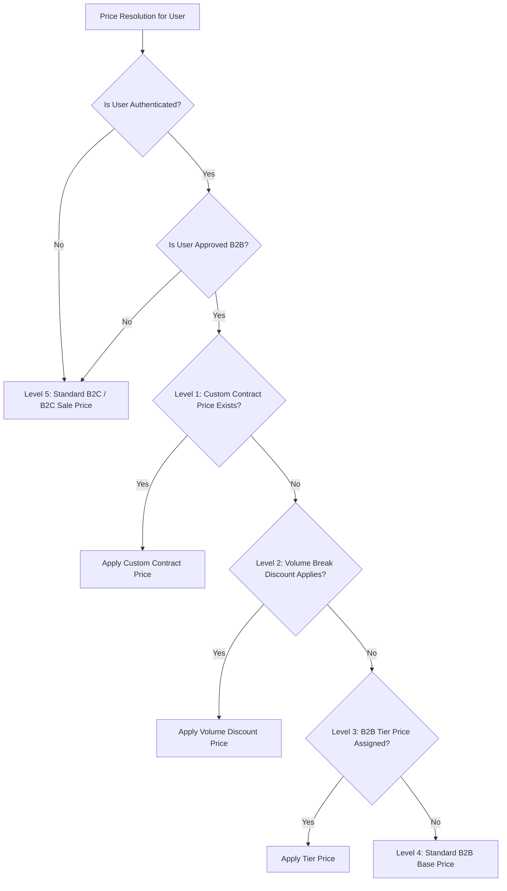
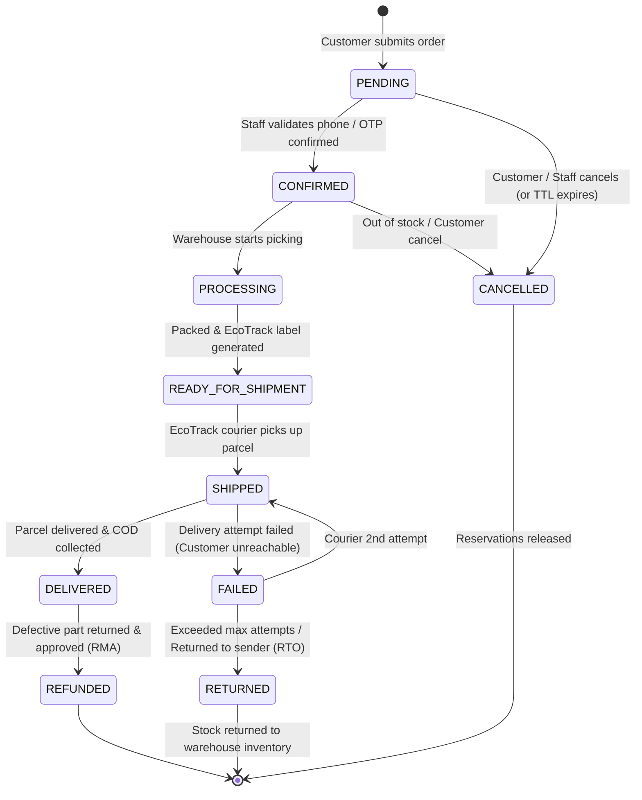

# HamzaPhone - Business Rules & Domain Logic

## 1. Pricing Engine & Price Resolution Hierarchy

When a client queries a product price on HamzaPhone, the system resolves the final unit price using a deterministic 5-level hierarchy:

### Price Evaluation Priority (Highest to Lowest):
1. **Level 1: Customer-Specific Contract Price (`customer_specific_prices`)**:
   * If an active contract price exists for `(customer_id, product_id)` and `valid_until > NOW()`, use `custom_price_dzd`.
2. **Level 2: Volume / Quantity Break (`b2b_tier_prices.min_quantity`)**:
   * If quantity purchased $\ge$ `min_quantity` defined for the customer's tier, use the volume break price.
3. **Level 3: B2B Tier Price (`b2b_tier_prices`)**:
   * If customer belongs to a tier (e.g., `VIP_DISTRIBUTOR`), use the price assigned to that tier.
4. **Level 4: Base B2B Price (`products.b2b_price`)**:
   * Default price for verified B2B repair technicians with no tier override.
5. **Level 5: Consumer Retail (`products.b2c_sale_price` or `products.b2c_price`)**:
   * If `b2c_sale_price` is set and within valid promo dates, return sale price; otherwise, return standard `b2c_price`.

### Cost Guard & Negative Margin Protection Rule
* **Invariant**: Under no circumstances can any automated price adjustment or discount produce a selling price strictly lower than `cost_price_dzd + minimum_margin_dzd` (Default margin: 5% above cost), unless explicitly flagged with `allow_below_cost_override = true` by an `OWNER` role with an attached justification in the audit log.

### Bulk Percentage Price Adjustment Logic
Formula for updating prices across a targeted subset of products:
$$\text{New Price} = \text{ROUND\_DZD}\left(\text{Current Price} \times \left(1 + \frac{\Delta\%}{100}\right)\right)$$

* **Rounding Rule**: In Algeria, small cash denominations are impractical. All calculated prices are rounded to the nearest **10 DZD** (or configured 50 DZD in Settings).
  $$\text{ROUND\_DZD}(P) = \text{ROUND}(P / 10) \times 10$$
* **Preview Requirement**: Bulk operations must generate an immutable `Preview Snapshot` showing:
  * Count of affected products.
  * Total monetary impact on inventory value.
  * List of any items hitting the Minimum Cost Margin ceiling.

---

## 2. B2B Account Verification & Terms

1. **Self-Registration**: Prospective repair shops or wholesale distributors submit their business details:
   * Company/Shop Name
   * Commercial Register Number (*Registre de Commerce - RC*)
   * Tax Identification Number (*NIF - Numéro d'Identification Fiscale*)
   * Statistical ID (*NIS - Numéro d'Identification Statistique*)
   * Photo upload of Shop Front or RC Certificate.
2. **Review State**: Account is marked `B2B_PENDING_VERIFICATION`. During this state, the user can only view B2C retail prices.
3. **Approval Gate**:
   * Must be approved by `SALES_MANAGER` or `ADMINISTRATOR`.
   * Staff assigns: Initial B2B Tier (e.g., `TIER_1`), Payment Terms (`COD_ONLY` or `CREDIT_30_DAYS`), and Credit Limit (Default: `0 DZD`).
4. **Minimum Order Amount (MOQ / MOV)**:
   * B2B orders must satisfy a Minimum Order Value of **15,000 DZD** per order to unlock wholesale checkout rates.

---

## 3. Order Lifecycle & State Machine Rules

### State Transition Validation & Permission Matrix

| Current State | Target State | Permitted Roles | Business Logic & Side Effects |
| :--- | :--- | :--- | :--- |
| `[*] (None)` | `PENDING` | System, B2C, B2B, Admin | Validates stock availability; increments `reserved_stock`, decrements `available_stock`. |
| `PENDING` | `CONFIRMED` | ORDER_MGR, SALES_MGR, ADMIN | Triggers automated confirmation SMS/WhatsApp with tracking code. |
| `PENDING` | `CANCELLED` | Customer (within 1h), Staff | Decrements `reserved_stock`, increments `available_stock`. |
| `CONFIRMED` | `PROCESSING` | INVENTORY_MGR, ORDER_MGR | Prints warehouse pick-list and bin routing. |
| `PROCESSING` | `READY_FOR_SHIPMENT`| ORDER_MGR, ADMIN | Calls `EcoTrack.createShipment()`, receives tracking number & prints shipping label. |
| `READY_FOR_SHIPMENT`| `SHIPPED` | Courier Webhook, ORDER_MGR | Marks stock as fulfilled (`current_stock -= quantity`, `reserved_stock -= quantity`). |
| `SHIPPED` | `DELIVERED` | Courier Webhook, ORDER_MGR | Updates `payment_status = PAID` (if COD). Increments customer loyalty score. |
| `SHIPPED` | `FAILED` | Courier Webhook, ORDER_MGR | Alerts support team to contact customer for reschedule. |
| `FAILED` | `RETURNED` | Courier Webhook, INVENTORY_MGR | Warehouse inspects returned box. Restocks undamaged inventory via `CUSTOMER_RETURN_RESTOCK`. |
| `DELIVERED` | `REFUNDED` | ADMIN, OWNER | RMA inspection approved. Issues financial refund or B2B credit ledger entry. |

---

## 4. Stock Reservation & Expiration Rules

1. **Reservation on Checkout**: Submitting an order immediately reserves items from `available_stock`.
2. **TTL Expiration Window**:
   * **Unconfirmed COD Orders**: 24 hours. If phone confirmation is unreached within 24h, the order transitions to `CANCELLED` and stock is released.
   * **Bank Transfer / CCP**: 48 hours. Customer must upload transfer receipt. If unverified after 48h, auto-cancelled.
3. **Safety Stock Buffer**:
   * Products with `stock_quantity <= low_stock_threshold` are marked `LOW_STOCK` on the admin panel, and high-volume B2B bulk orders are capped to prevent full stock wipeout by a single customer.

---

## 5. Algerian Logistics & Delivery Rules (58 Wilayas)

1. **Wilaya & Commune Coverage**:
   * Delivery pricing is split into two modes:
     * **Home Delivery (*À Domicile*)**: Higher fee, courier delivers to customer door.
     * **Stop Desk Delivery (*Point Relais / Bureau*)**: Lower fee, customer collects at courier agency.
   * Remote Wilayas (Grand Sud e.g. Tamanrasset, Adrar, Tindouf, Illizi) have adjusted lead-time expectations (3–6 business days) versus Northern Wilayas (24–48 hours).
2. **Free Shipping Thresholds**:
   * B2C: Free shipping on orders over **20,000 DZD** (Northern Wilayas only).
   * B2B: Free shipping on orders over **100,000 DZD**.

---

## 6. Spare Parts Warranty & Defective Item (RMA) Rules

1. **Testing Before Installation Warranty**:
   * Screen displays and digitizers carry a **15-day return warranty** provided the protective factory plastic film has **not been peeled off**, warranty stamps are intact, and there is no trace of B-7000 glue/soldering.
2. **Defective Write-Off**:
   * Returned defective items are routed to the `DAMAGED_WRITEOFF` inventory transaction ledger and quarantined for supplier return (RMA to Shenzhen or local importer).
