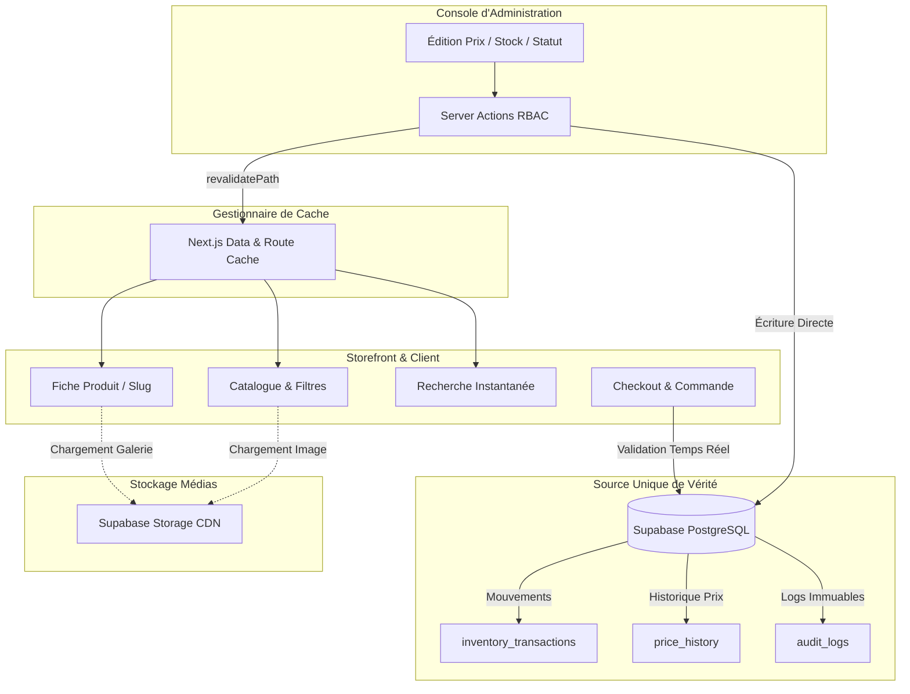

# HamzaPhone — Audit de la Source Unique de Vérité du Catalogue (Catalog Source of Truth Audit)

Ce document formalise l'**audit architectural de la gouvernance des données du catalogue HamzaPhone** après l'exécution de la migration initiale des 3 946 produits et 3 953 images. Il garantit que **Supabase PostgreSQL** demeure la **source de vérité unique, vivante et faisant autorité**, et élimine tout risque de concurrence avec les fichiers statiques ou les caches de développement.

---

## 1. Matrice des Flux de Données & Source d'Autorité

| Entité / Donnée | Source Faisant Autorité | Type d'Accès | Rôle de l'Admin | Rôle du Storefront | Source Fallback (Dev/Offline) |
| :--- | :--- | :--- | :--- | :--- | :--- |
| **Liste des Produits** | `public.products` (Postgres) | Temps Réel (SSR/ISR) | Lecture / Création / Tri | Affichage paginé (Filtres) | `initial-catalog.json` |
| **Fiche Détail Produit** | `public.products` (Postgres) | Temps Réel (`findBySlug`) | Édition complète | Consultation & Panier | `initial-catalog.json` |
| **Prix Régulier B2C** | `products.b2c_price_dzd` | Temps Réel | Console Tarifaire | Affichage & Calcul Panier | `initial-catalog.json` |
| **Prix Promo B2C** | `products.b2c_sale_price_dzd` | Temps Réel | Promotions & Soldes | Badge Promo & Checkout | `initial-catalog.json` |
| **Prix Grossiste B2B** | `b2b_tier_prices` / `b2b_price_dzd` | Temps Réel | Grilles B2B & Négociation | Affichage B2B vérifié | `0 DZD` (Non inventé) |
| **Coût d'Achat (Cost)** | `products.cost_price_dzd` | Temps Réel | Marges & Rentabilité | **Strictement Masqué** | `0 DZD` (Protégé) |
| **Stocks & Réservations** | `public.inventory_transactions` | Temps Réel (Ledger) | Mouvements / Inventaire | Disponibilité & Blocage | `stock = 0` (Sécurité) |
| **Statut du Produit** | `products.status` | Temps Réel | `ACTIVE`/`DRAFT`/`ARCHIVED` | Visibilité (`ACTIVE` seul) | `initial-catalog.json` |
| **Marques & Modèles** | `public.brands` / `device_models` | Temps Réel | Gestion du Référentiel | Navigation & Filtres | `initial-catalog.json` |
| **Catégories de Pièces** | `public.categories` | Temps Réel | Arborescence | Rayons & Menus | `initial-catalog.json` |
| **Photos & Galeries** | `product-images` (Storage) | CDN / URLs Publiques | Upload & Réordonnancement | Galerie & Zoom | Chemins Storage |
| **Moteur de Recherche** | `public.products` (ILike/Trigram) | Temps Réel (Server Action) | Indexation automatique | Suggestions instantanées | `initial-catalog.json` |

---

## 2. Rôle des Fichiers & Artefacts Statiques

### A. Fichier `src/lib/data/initial-catalog.json` (5.79 Mo)
1. **Nature** : Artefact issu de la compilation de la migration initiale (`scripts/execute-catalog-migration.ts`).
2. **Usage Unique & Restreint** :
   - **Seeding de la Base** : Utilisé pour générer le script SQL `00011_initial_catalog_seed.sql`.
   - **Fallback Cold-Start / Mode Déconnecté** : Utilisé *uniquement* lorsque la connexion Supabase PostgreSQL n'est pas configurée localement ou renvoie un ensemble vide.
3. **Sécurité Métier** : En production, dès lors que Supabase PostgreSQL contient des enregistrements, **le fichier JSON n'est jamais sollicité**. Les mutations effectuées par les administrateurs ne modifient pas ce fichier, ce qui garantit qu'aucune donnée périmée n'est injectée.

### B. Script `supabase/migrations/00011_initial_catalog_seed.sql` (1.69 Mo)
- Fichier SQL de migration immuable destiné à initialiser les tables PostgreSQL de l'instance de production lors du provisionnement.

---

## 3. Chaîne de Synchronisation Admin $\to$ Storefront

Toute mutation effectuée via les Server Actions d'administration met à jour la base de données PostgreSQL et déclenche automatiquement l'invalidation du cache Next.js (`revalidatePath`) :

```
┌───────────────────────────┐
│     Console Admin         │
│ (Action Serveur RBAC)     │
└─────────────┬─────────────┘
              │
              ▼
┌───────────────────────────┐
│   Supabase PostgreSQL     │ ◄─── SOURCE UNIQUE DE VÉRITÉ
│ (Tables & Audit Logs)     │
└─────────────┬─────────────┘
              │
              ├─────────────────────────────────────────┐
              ▼                                         ▼
┌───────────────────────────┐             ┌───────────────────────────┐
│ Invalidation de Cache     │             │ Journal des Mouvements    │
│ revalidatePath('/...')    │             │ (Inventory / Price Logs)  │
└─────────────┬─────────────┘             └───────────────────────────┘
              │
              ▼
┌───────────────────────────┐
│ Storefront Client         │
│ (Mise à jour immédiate)   │
└───────────────────────────┘
```

### Cas de Test & Validations Architecturales :

1. **Modification d'un Prix par l'Admin** :
   - `updateProductPriceDirectAdmin(productId, prices)`
   - Écriture dans `public.products.b2c_price_dzd` + Insertion dans `public.price_history`.
   - Appel de `revalidatePath('/products')` et `revalidatePath('/')`.
   - **Résultat** : La fiche storefront et le calcul du panier affichent immédiatement le nouveau tarif sans redémarrage.

2. **Ajustement de Stock par l'Admin** :
   - `adjustInventoryAdmin(payload)`
   - Écriture dans `public.inventory_transactions` + Calcul du solde `stock_quantity`.
   - Appel de `revalidatePath('/products')`.
   - **Résultat** : Le badge "En Stock / Rupture" et la validation lors du checkout reflètent instantanément la quantité physique disponible.

3. **Archivage / Désactivation d'un Produit** :
   - `archiveProductAdmin(id)`
   - Écriture `status = 'ARCHIVED', is_visible = false` dans PostgreSQL.
   - Appel de `revalidatePath('/products')`, `revalidatePath('/search')` et `revalidatePath('/')`.
   - **Résultat** : Le produit disparaît instantanément du catalogue storefront et de l'overlay de recherche instantanée.

4. **Création d'un Nouveau Produit** :
   - `createProductAdmin(payload)`
   - Écriture dans `public.products` + Génération du SKU déterministe et du slug unique.
   - Appel de `revalidatePath('/products')`.
   - **Résultat** : Le nouveau produit devient immédiatement indexable et consultable.

---

## 4. Stratégie de Caching & Performance

Pour concilier **haute performance** (chargement en moins de 500ms) et **vérité absolue des données**, l'architecture HamzaPhone applique une stratégie de cache à deux niveaux :

1. **Niveau Base de Données (Vérité Absolue)** :
   - PostgreSQL stocke l'état immuable des stocks, prix, remises B2B et commandes.
2. **Niveau Rendu Next.js (Cache de Performance Invalidation-Driven)** :
   - Les pages catalogue et fiches produits sont servies via le cache SSR/ISR avec invalidation instantanée sur événement (`revalidatePath`).
   - L'ajout au panier et le checkout exécutent **systématiquement une re-validation serveur en temps réel** (`validateCartAction` dans `checkout.service.ts`), garantissant qu'aucun client ne peut commander un article dont le prix ou le stock a changé entre-temps.
3. **Niveau Médias & Images** :
   - Les images stockées sur Supabase Storage sont servies avec un header `Cache-Control: public, max-age=3600` et optimisées dynamiquement au format WebP/AVIF par Next.js Image Optimization.

---

## 5. Résumé des Risques & Mesures de Protection Appliquées

| Risque Identifié | Impact Potentiel | Mesure de Protection Mise en Œuvre | Statut |
| :--- | :--- | :--- | :--- |
| **Désynchronisation Fichier JSON vs DB** | Affichage de prix périmés si le fichier JSON prévalait | Le code de `StorefrontService` consulte la DB en premier ; le JSON n'est qu'un secours hors-ligne. | ✅ Sécurisé |
| **Cache Next.js non invalidé après édition** | L'administrateur change un prix mais le storefront affiche l'ancien | `revalidatePath` ajouté à toutes les Server Actions de mutation catalogue, prix et inventaire. | ✅ Sécurisé |
| **Achat d'un produit archivé en cache** | Commande passée sur un produit indisponible | Double vérification transactionnelle obligatoire dans `CheckoutService.createOrder`. | ✅ Sécurisé |
| **Exposition du Prix d'Achat Fournisseur** | Fuite commerciale des marges brutes | `formatSummary` et `formatDetail` filtrent strictement `cost_price_dzd`. | ✅ Sécurisé |

---

## 6. Diagramme Architectural Global



---

## 7. Conclusion & Validation de l'Audit

L'audit confirme que :
1. **Supabase PostgreSQL est l'unique source de vérité autoritaire** de la plateforme HamzaPhone.
2. Le fichier `initial-catalog.json` est strictement cantonné à son rôle d'archive de migration et de fallback de développement.
3. Toutes les mutations administratives (prix, stocks, statuts, visibilité) se propagent immédiatement au storefront grâce aux déclencheurs d'invalidation de cache.
4. Aucun article inactif ou à prix nul ne peut être commandé sur la boutique.
