# HamzaPhone Database Implementation & Backend Foundation Specification

> **Document Version:** 1.0.0  
> **Status:** Production-Ready Foundation  
> **Audited Against:** `/docs/architecture-audit.md` (P0/P1/P2/P3 resolved)  
> **Stack:** Next.js 16 (App Router), React 19, TypeScript strict mode, Supabase / PostgreSQL 16+, Zod  
> **Target Market:** Algeria (58 Wilayas topology, EcoTrack logistics, DZD commercial rounding, B2C/B2B wholesale)

---

## 1. Executive Summary & Architectural Scope

The **HamzaPhone** backend foundation has been engineered as a high-concurrency, auditable, and resilient data layer tailored specifically for smartphone replacement-parts e-commerce in Algeria. It bridges consumer retail (B2C) and wholesale repair shops (B2B) while shielding sensitive supplier margins and enforcing granular staff access controls.

### Core Architectural Pillars
1. **Double-Entry Stock Ledger:** Inventory is never updated via raw increments; every change is an immutable entry in `inventory_transactions` with automatic trigger maintenance of physical (`stock_quantity`) and reserved (`reserved_stock`) counters.
2. **Deterministic 5-Level Pricing Engine:** Real-time resolution from custom contract prices down to consumer retail, with DZD commercial rounding (10/50 DZD) and margin floor protection.
3. **Column-Level & View-Level Security Shielding:** Internal cost prices (`cost_price_dzd`), supplier SKUs, and purchase margins are quarantined from public inspection via `public_products` view and RLS policies.
4. **Algerian Market Topology:** Native 58 Wilayas hierarchy (`wilayas`), courier abstraction matrix (`delivery_rate_matrix`), and Cash on Delivery (COD) state machine.
5. **Zero-Trust RBAC & RLS:** 26 granular permissions evaluated at PostgreSQL Row-Level Security, Next.js Server Actions, and client UI layers.

---

## 2. Database Schema & Migration Inventory

The schema is distributed across 9 ordered, idempotent Supabase migrations in `/supabase/migrations/`:

| Migration File | Domain / Scope | Key Entities & Functions Created |
| :--- | :--- | :--- |
| `00001_extensions_and_enums.sql` | PostgreSQL Extensions & ENUMs | `uuid-ossp`, `pg_trgm`, `unaccent`; ENUMs: `user_type`, `b2b_status`, `product_type`, `inventory_transaction_type`, `order_status`, `payment_method`, etc. |
| `00002_auth_rbac_and_users.sql` | Auth, RBAC & Customer Entities | `profiles`, `roles`, `permissions`, `role_permissions`, `user_roles`, `businesses`, `business_members`, `addresses`, `handle_new_user()` trigger |
| `00003_catalog_and_products.sql` | Catalog, Parts & Pricing | `brands`, `categories`, `device_models`, `suppliers`, `products`, `product_images`, `product_compatibility`, `supplier_products`, `b2b_pricing_tiers`, `b2b_tier_prices`, `customer_specific_prices`, `price_history` |
| `00004_inventory_and_orders.sql` | Inventory, Orders & Commerce | `inventory_transactions`, `carts`, `cart_items`, `orders`, `order_items`, `order_status_history`, `courier_providers`, `deliveries`, `payments`, `notifications`, `audit_logs` |
| `00005_functions_triggers_and_indexes.sql` | Search, Triggers & RBAC Functions | `get_user_role()`, `has_permission()`, `is_staff()`, `search_products_instant()`, `process_inventory_transaction()`, GIN trigram indexes |
| `00006_row_level_security.sql` | Tenant Isolation & Security Policies | Full RLS policies across all 31 core tables for B2C, B2B, and granular staff operations |
| `00007_storage_and_seed.sql` | Storage Buckets & Seed Roles | Buckets: `product-images`, `b2b-documents`, `invoices`; Seed: 5 system roles, 26 permissions, 3 B2B tiers, EcoTrack courier provider |
| `00008_additional_entities_and_optimizations.sql` | Security & Async Processing | `import_jobs`, `stock_alerts`, `product_reviews`, `wilayas`, `delivery_rate_matrix`, `public_products` view, `get_guest_order_tracking()`, `reserve_order_stock()` |
| `00009_algeria_58_wilayas_seed.sql` | National Geographic Baseline Seed | Full 58 Algerian Wilayas dataset (Arabic/French names, zone mapping, EcoTrack shipping rates) |

---

## 3. Entity Relationship & Foreign Key Architecture

```mermaid
erDiagram
    PROFILES ||--o{ USER_ROLES : has
    ROLES ||--o{ USER_ROLES : assigned_to
    ROLES ||--o{ ROLE_PERMISSIONS : contains
    PERMISSIONS ||--o{ ROLE_PERMISSIONS : grants
    
    PROFILES ||--o{ BUSINESS_MEMBERS : belongs_to
    BUSINESSES ||--o{ BUSINESS_MEMBERS : employs
    BUSINESSES ||--o{ CUSTOMER_SPECIFIC_PRICES : contracts
    
    BRANDS ||--o{ PRODUCTS : categorizes
    CATEGORIES ||--o{ PRODUCTS : groups
    SUPPLIERS ||--o{ PRODUCTS : supplies
    SUPPLIERS ||--o{ SUPPLIER_PRODUCTS : offers
    
    PRODUCTS ||--o{ PRODUCT_IMAGES : displays
    PRODUCTS ||--o{ PRODUCT_COMPATIBILITY : fits
    DEVICE_MODELS ||--o{ PRODUCT_COMPATIBILITY : targets
    
    PRODUCTS ||--o{ INVENTORY_TRANSACTIONS : logs
    PRODUCTS ||--o{ PRICE_HISTORY : tracks
    PRODUCTS ||--o{ B2B_TIER_PRICES : discounts
    
    CARTS ||--o{ CART_ITEMS : holds
    PRODUCTS ||--o{ CART_ITEMS : references
    
    ORDERS ||--o{ ORDER_ITEMS : contains
    ORDERS ||--o{ ORDER_STATUS_HISTORY : tracks
    ORDERS ||--o{ DELIVERIES : ships_via
    ORDERS ||--o{ PAYMENTS : settles
    
    WILAYAS ||--o{ DELIVERY_RATE_MATRIX : tariffs
```



---

## 4. Indexing & Query Acceleration Strategy

To ensure sub-50ms instant search and scalable indexing over 100,000+ spare parts SKUs, PostgreSQL indexes are organized into three tiers:

### 1. High-Performance Primary B-Tree Indexes
- `idx_products_sku`: `products(sku)` — unique part identification.
- `idx_products_barcode`: `products(barcode)` — handheld scanner lookups in warehouse.
- `idx_products_brand_cat`: `products(brand_id, category_id)` — composite storefront facet browsing.
- `idx_products_status_vis`: `products(status, is_visible)` — active storefront filter shield.
- `idx_orders_customer`: `orders(customer_id, created_at DESC)` — customer order history.
- `idx_orders_business`: `orders(business_id, created_at DESC)` — B2B corporate order history.
- `idx_orders_status`: `orders(status)` — admin dashboard order fulfillment pipeline.
- `idx_orders_tracking_token`: `orders(tracking_token)` — secure guest tracking lookup.

### 2. GIN Trigram Fuzzy Search Indexes (`pg_trgm`)
- `idx_products_name_trgm`: `products USING GIN (name gin_trgm_ops)` — substring and misspellings matching.
- `idx_products_sku_trgm`: `products USING GIN (sku gin_trgm_ops)` — partial SKU searches.
- `idx_products_compat_trgm`: `products USING GIN ((compatibility::text) gin_trgm_ops)` — expression index matching complex device variant codes like `SM-G998B`, `A2403`, `M2102J20SG`.

### 3. Generated Full-Text Search Vector
- `idx_products_search_vector`: `products USING GIN (search_vector)` — bilingual weighted document indexing:
  - Weight A: SKU + Brand Name
  - Weight B: Product Name
  - Weight C: Short Description + Keywords

---

## 5. Security & Isolation Matrix (RLS & Views)

```
+-------------------------------------------------------------------------------+
|                             CLIENT / APPLICATION LAYER                         |
+-------------------------------------------------------------------------------+
                                       │
        ┌──────────────────────────────┴──────────────────────────────┐
        ▼                                                             ▼
+───────────────────────────+                  +───────────────────────────────+
|     PUBLIC / STOREFRONT    |                  |        ADMIN / STAFF API      |
|  - public_products view   |                  |  - Full products table access |
|  - Masked guest tracking  |                  |  - Cost prices & supplier data|
|  - RLS: Own profile only  |                  |  - RBAC: has_permission()     |
+───────────────────────────+                  +───────────────────────────────+
        │                                                             │
        └──────────────────────────────┬──────────────────────────────┘
                                       ▼
+-------------------------------------------------------------------------------+
|                       POSTGRESQL ROW LEVEL SECURITY ENGINE                    |
|  - Tenant isolation for B2B repair shops                                     |
|  - Customer own-order privacy                                                 |
|  - Immutable audit trail enforcement                                          |
+-------------------------------------------------------------------------------+
```

### Security Defenses Implemented
1. **Cost Price Protection ([CRIT-01]):** Direct queries to `products` from public clients are shielded. Storefront components read from `public_products` view which omits `cost_price_dzd`, `supplier_sku`, and `primary_supplier_id`.
2. **Guest Order Privacy ([CRIT-02]):** `get_guest_order_tracking` RPC function requires matching phone number or cryptographic `tracking_token`, returning masked customer names (`H*** M***`) and hiding private contact info.
3. **Atomic Stock Locking ([HIGH-10]):** `reserve_order_stock(order_id)` executes `SELECT ... FOR UPDATE` row-level locks on `products` to prevent overselling during checkout spikes.

---

## 6. Double-Entry Inventory Ledger Architecture

```
                                  [ ORDER PLACED ]
                                         │
                                         ▼
                 ┌───────────────────────────────────────────────┐
                 │  Transaction: RESERVATION                     │
                 │  - stock_quantity: Unchanged                  │
                 │  - reserved_stock: +N                         │
                 │  - available_stock (computed): -N             │
                 └──────────────────────┬────────────────────────┘
                                        │
                      ┌─────────────────┴─────────────────┐
                      │                                   │
              [ DISPATCHED / SHIPPED ]           [ ORDER CANCELLED ]
                      │                                   │
                      ▼                                   ▼
       ┌───────────────────────────────┐   ┌───────────────────────────────┐
       │ Transaction: FULFILLMENT_OUT  │   │ Transaction: RESERVATION_REL  │
       │ - stock_quantity: -N          │   │ - stock_quantity: Unchanged   │
       │ - reserved_stock: -N          │   │ - reserved_stock: -N          │
       │ - available_stock: Unchanged  │   │ - available_stock: +N         │
       └───────────────────────────────┘   └───────────────────────────────┘
```

---

## 7. Deterministic 5-Level Price Resolution Matrix

When calculating product prices in carts, checkouts, or admin order drafting, the system evaluates a 5-tier waterfall hierarchy:

```
[ Incoming Request: Product + Quantity + User Context ]
                      │
                      ▼
 ┌─────────────────────────────────────────────────────────────┐
 │ Level 1: Customer-Specific Contract Price                   │
 │ (Matches customer_specific_prices where valid_until > NOW)  │
 └────────────────────────────┬────────────────────────────────┘
                      [ No / Invalid ]
                              │
                              ▼
 ┌─────────────────────────────────────────────────────────────┐
 │ Level 2: Volume Break Discount                              │
 │ (Matches b2b_tier_prices where qty >= min_quantity > 1)     │
 └────────────────────────────┬────────────────────────────────┘
                      [ No / Low Qty ]
                              │
                              ▼
 ┌─────────────────────────────────────────────────────────────┐
 │ Level 3: Base B2B Tier Price                                │
 │ (Matches b2b_tier_prices where min_quantity = 1)            │
 └────────────────────────────┬────────────────────────────────┘
                      [ No Tier Override ]
                              │
                              ▼
 ┌─────────────────────────────────────────────────────────────┐
 │ Level 4: Base B2B Price                                     │
 │ (products.b2b_price_dzd for verified business accounts)     │
 └────────────────────────────┬────────────────────────────────┘
                      [ B2C Consumer Context ]
                              │
                              ▼
 ┌─────────────────────────────────────────────────────────────┐
 │ Level 5: Consumer Retail / Promo Price                      │
 │ (products.b2c_sale_price_dzd ?? products.b2c_price_dzd)     │
 └─────────────────────────────────────────────────────────────┘
```

### Margin Floor & Commercial Rounding
- **DZD Rounding:** Prices are normalized to the nearest 10 or 50 DZD (`PricingService.roundDzd`).
- **Margin Floor Guard:** Bulk price reductions are checked against `cost_price_dzd + 5%` margin floor. Attempts to drop below cost trigger administrative confirmation warnings.

---

## 8. Algerian Logistics & 58 Wilayas Topology

Full baseline seed data is configured for all 58 Algerian Wilayas:

| Zone Code | Geographic Region | Sample Wilayas | Standard Home Rate | Stopdesk Desk Rate | Est. Days |
| :--- | :--- | :--- | :--- | :--- | :--- |
| **Zone 1 (Capital)** | Alger (16) | Alger | 400 DZD | 250 DZD | 1 Day |
| **Zone 2 (Nord)** | Coastal & Mitidja | Blida, Oran, Constantine, Annaba | 600 DZD | 400 DZD | 1–2 Days |
| **Zone 3 (Hauts-Plateaux)** | Interior Plains | Sétif, Batna, Djelfa, Tiaret | 750 DZD | 550 DZD | 2–3 Days |
| **Zone 4 (Sud)** | Northern Sahara | Biskra, Béchar, Ghardaïa, Ouargla | 900 DZD | 700 DZD | 3–5 Days |
| **Zone 5 (Grand Sud)** | Deep Sahara | Tamanrasset, Adrar, Illizi, Tindouf | 1,300 DZD | 950 DZD | 4–7 Days |

- **Free Shipping Rule:** Northern Wilayas qualify for free delivery on orders exceeding 20,000 DZD.

---

## 9. Storage Buckets & Realtime Subscriptions

### Supabase Storage Buckets
1. `product-images` (Public): Optimized WebP part photos, schematics, pinout diagrams (Max: 5MB).
2. `b2b-documents` (Private): Commercial registers (*Registre de Commerce*), NIF/NIS tax certificates (Max: 10MB, restricted to owner and `b2b.verify` staff).
3. `invoices` (Private): Generated PDF billing receipts and delivery slips (Max: 5MB).

### Supabase Realtime Channels
Realtime publication is enabled selectively to minimize connection saturation:
- `public:orders`: Live order feed for Admin Dashboard order managers.
- `public:products`: Real-time stock change broadcasts (`available_stock`) to prevent cart collisions.
- `public:notifications`: In-app notification delivery for customers and dispatchers.

---

## 10. Codebase Structure & Type Safety Reference

```
/supabase
  /migrations
    ├── 00001_extensions_and_enums.sql
    ├── 00002_auth_rbac_and_users.sql
    ├── 00003_catalog_and_products.sql
    ├── 00004_inventory_and_orders.sql
    ├── 00005_functions_triggers_and_indexes.sql
    ├── 00006_row_level_security.sql
    ├── 00007_storage_and_seed.sql
    ├── 00008_additional_entities_and_optimizations.sql
    └── 00009_algeria_58_wilayas_seed.sql

/src
  /types
    ├── database.types.ts       # Strictly typed Supabase database schema
    ├── domain.types.ts         # High-level domain contracts & pricing DTOs
    └── rbac.types.ts           # 5 roles, 26 permissions, auth context
  /lib
    ├── auth/                   # Server client & AuthService
    ├── permissions/            # PermissionsService & Route Guards
    ├── services/               # PricingService, InventoryService, OrderService, etc.
    ├── repositories/           # ProductRepository, OrderRepository
    └── validation/             # Zod validation schemas for all mutations
```

---

## 11. Verification Record & Automated Test Results

```
> npm run test:ts

▶ HamzaPhone Admin Commerce Engine (19 suites, 36 tests)
  ✔ Product Lifecycle & CRUD (3 tests)
  ✔ Order Workflow State Machine (2 tests)
  ✔ Bulk Pricing Engine & Margin Protection (2 tests)
  ✔ Double-Entry Inventory Ledger (1 test)
  ✔ B2B Wholesale Approvals (1 test)
  ✔ RBAC & Role Enforcement in Admin Store (1 test)
  ✔ PermissionsService & RBAC Evaluation (3 tests)
  ✔ Permission Guards (requirePermission & requireStaff) (3 tests)
  ✔ PricingService & Price Resolution Matrix (8 tests)
  ✔ OrderService & State Machine Transitions (3 tests)
  ✔ SearchService Query Sanitization (1 test)
  ✔ Validation Schemas (8 tests)

ℹ tests 36 | ℹ pass 36 | ℹ fail 0 | ℹ duration_ms ~1050ms

> npm run typecheck
> tsc --noEmit (0 errors)
```
