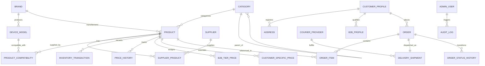

# HamzaPhone - Domain Model & Entity Specification

## 1. Domain Overview

The HamzaPhone domain model is tailored specifically for the smartphone spare parts and repair components industry. Unlike generic retail, smartphone parts require:
1. **Multi-level Device Compatibility**: A single spare part (e.g., an IC chip, charging flex, or OLED screen) may be compatible with multiple device models across years and sub-variants (e.g., European vs Global model codes: `SM-G998B`, `SM-G998U`).
2. **Dual-SKU & Barcode Indexing**: Universal internal SKU, supplier SKU for supplier reordering, and EAN-13/UPC-A barcode tracking for warehouse scanning.
3. **Tri-State Inventory Management**: Continuous tracking of `current_stock`, `reserved_stock`, and `available_stock` (`available = current - reserved`) backed by an immutable ledger of stock transactions.
4. **Multi-Dimensional Pricing Matrix**: Base cost price, standard B2C retail, promotional B2C sale price, tiered B2B wholesale prices, volume break discounts, and customer-specific negotiated contract rates.

---

## 2. Entity Relationship Diagram (ERD)



---

## 3. Core Domain Entities & Attributes

### 3.1 Product & Catalog Core

#### `products`
The central catalog entity representing smartphone spare parts, modules, ICs, and accessories.

| Field | Type | Description | Constraints / Index |
| :--- | :--- | :--- | :--- |
| `id` | `UUID` | Primary Key | Default: `gen_random_uuid()` |
| `sku` | `VARCHAR(64)` | Unique internal company SKU (e.g. `HP-SCR-SAM-S21U-BLK`) | Unique, Indexed (B-tree) |
| `barcode` | `VARCHAR(64)` | Physical barcode for scanner integration | Unique, Nullable, Indexed |
| `supplier_sku` | `VARCHAR(64)` | Primary supplier reference number | Indexed (B-tree) |
| `name` | `VARCHAR(255)` | Full product title | Indexed (GIN `gin_trgm_ops`) |
| `slug` | `VARCHAR(255)` | URL-friendly unique slug | Unique, Indexed |
| `brand_id` | `UUID` | Foreign Key -> `brands.id` | Indexed |
| `category_id` | `UUID` | Foreign Key -> `categories.id` | Indexed |
| `product_type` | `ENUM` | `OEM_ORIGINAL`, `SERVICE_PACK`, `REFURBISHED`, `HIGH_COPY`, `AFTERMARKET`, `ACCESSORY`, `TOOL` | Not Null |
| `status` | `ENUM` | `ACTIVE`, `DRAFT`, `ARCHIVED`, `DISCONTINUED` | Default: `DRAFT`, Indexed |
| `is_visible` | `BOOLEAN` | Storefront visibility toggle | Default: `true`, Indexed |
| `is_featured` | `BOOLEAN` | Homepage & curated collection spotlight | Default: `false` |
| `short_description` | `TEXT` | Summary specification (e.g. `120Hz Dynamic AMOLED 2X Display`) | |
| `description` | `TEXT` | Comprehensive HTML/Markdown repair specifications | |
| `main_image` | `VARCHAR(512)`| Primary image URL in Supabase Storage | Not Null |
| `gallery` | `TEXT[]` | Array of supplementary image URLs | Default: `{}` |
| `cost_price` | `NUMERIC(12,2)`| Supplier acquisition cost in DZD | Not Null, Check `cost_price >= 0` |
| `b2c_price` | `NUMERIC(12,2)`| Standard consumer retail price in DZD | Not Null, Check `b2c_price >= 0` |
| `b2c_sale_price`| `NUMERIC(12,2)`| Discounted consumer price (if active promo) | Nullable |
| `b2b_price` | `NUMERIC(12,2)`| Baseline wholesale price in DZD | Not Null, Check `b2b_price >= 0` |
| `stock_quantity`| `INTEGER` | Computed total physical stock on hand | Default: `0` |
| `reserved_stock`| `INTEGER` | Stock committed to pending/processing orders | Default: `0` |
| `available_stock`| `INTEGER` | Stock sellable (`stock_quantity - reserved_stock`) | Computed / Maintained via Trigger |
| `low_stock_threshold`| `INTEGER`| Warning threshold triggering reorder alerts | Default: `5` |
| `weight_grams` | `NUMERIC(8,2)`| Package weight for courier calculations | Default: `50.00` |
| `dimensions_cm` | `JSONB` | `{ length: number, width: number, height: number }` | Nullable |
| `compatibility` | `JSONB` | Structured compatibility tree (see Section 3.2) | Indexed (GIN) |
| `primary_supplier_id`| `UUID` | Foreign Key -> `suppliers.id` | Indexed |
| `created_at` | `TIMESTAMPTZ` | Record creation timestamp | Default: `NOW()` |
| `updated_at` | `TIMESTAMPTZ` | Last update timestamp | Default: `NOW()` |

---

### 3.2 Structured Compatibility Model

To avoid brittle text tags and allow structured device filtering (e.g. *Show all charging ports compatible with Samsung Galaxy S20 Plus Global `SM-G985F` and 5G `SM-G986B`*), compatibility is modeled at two levels:

1. **Normalized Relational Table (`product_compatibility`)**: For fast relational joins and indexed integrity.
2. **Denormalized JSONB Document inside `products.compatibility`**: For ultra-fast single-query storefront payload delivery without expensive multi-table joins.

```sql
CREATE TABLE product_compatibility (
    id UUID PRIMARY KEY DEFAULT gen_random_uuid(),
    product_id UUID NOT NULL REFERENCES products(id) ON DELETE CASCADE,
    device_model_id UUID NOT NULL REFERENCES device_models(id) ON DELETE CASCADE,
    variant_codes VARCHAR(64)[] DEFAULT '{}', -- e.g. ['SM-G998B', 'SM-G9980', 'SM-G998U']
    notes VARCHAR(255),                        -- e.g. 'Requires firmware update after installation'
    created_at TIMESTAMPTZ DEFAULT NOW(),
    UNIQUE(product_id, device_model_id)
);
CREATE INDEX idx_prod_compat_model ON product_compatibility(device_model_id);
CREATE INDEX idx_prod_compat_product ON product_compatibility(product_id);
```

**Denormalized JSONB Format in `products.compatibility`:**
```json
[
  {
    "brand_name": "Samsung",
    "brand_slug": "samsung",
    "model_name": "Galaxy S21 Ultra",
    "model_slug": "galaxy-s21-ultra",
    "model_code": "SM-G998",
    "variants": ["SM-G998B", "SM-G998U", "SM-G998W", "SM-G9980"],
    "year": 2021
  },
  {
    "brand_name": "Samsung",
    "brand_slug": "samsung",
    "model_name": "Galaxy S21 Plus",
    "model_slug": "galaxy-s21-plus",
    "model_code": "SM-G996",
    "variants": ["SM-G996B", "SM-G996U"],
    "year": 2021
  }
]
```

---

### 3.3 Multi-Tier Pricing Data Model

```sql
-- 1. Configurable B2B Pricing Tiers (e.g. Silver, Gold, VIP Distributor)
CREATE TABLE b2b_pricing_tiers (
    id UUID PRIMARY KEY DEFAULT gen_random_uuid(),
    tier_code VARCHAR(32) UNIQUE NOT NULL, -- e.g. 'TIER_1', 'TIER_2', 'VIP_DISTRIBUTOR'
    tier_name VARCHAR(100) NOT NULL,
    default_discount_percentage NUMERIC(5,2) DEFAULT 0.00,
    minimum_monthly_volume_dzd NUMERIC(14,2) DEFAULT 0.00,
    created_at TIMESTAMPTZ DEFAULT NOW()
);

-- 2. Explicit Product Price Overrides by B2B Tier
CREATE TABLE b2b_tier_prices (
    id UUID PRIMARY KEY DEFAULT gen_random_uuid(),
    product_id UUID NOT NULL REFERENCES products(id) ON DELETE CASCADE,
    tier_id UUID NOT NULL REFERENCES b2b_pricing_tiers(id) ON DELETE CASCADE,
    price_dzd NUMERIC(12,2) NOT NULL,
    min_quantity INTEGER DEFAULT 1,
    created_at TIMESTAMPTZ DEFAULT NOW(),
    updated_at TIMESTAMPTZ DEFAULT NOW(),
    UNIQUE(product_id, tier_id, min_quantity)
);

-- 3. Customer-Specific Negotiated Contract Pricing
CREATE TABLE customer_specific_prices (
    id UUID PRIMARY KEY DEFAULT gen_random_uuid(),
    customer_id UUID NOT NULL REFERENCES customer_profiles(id) ON DELETE CASCADE,
    product_id UUID NOT NULL REFERENCES products(id) ON DELETE CASCADE,
    custom_price_dzd NUMERIC(12,2) NOT NULL,
    valid_until TIMESTAMPTZ,
    notes VARCHAR(255),
    created_at TIMESTAMPTZ DEFAULT NOW(),
    UNIQUE(customer_id, product_id)
);

-- 4. Immutable Price Change Audit Log
CREATE TABLE price_history (
    id UUID PRIMARY KEY DEFAULT gen_random_uuid(),
    product_id UUID NOT NULL REFERENCES products(id) ON DELETE CASCADE,
    price_type VARCHAR(32) NOT NULL, -- 'COST', 'B2C', 'B2C_SALE', 'B2B_BASE', 'TIER_OVERRIDE'
    tier_id UUID REFERENCES b2b_pricing_tiers(id),
    old_price NUMERIC(12,2) NOT NULL,
    new_price NUMERIC(12,2) NOT NULL,
    change_reason VARCHAR(255) NOT NULL, -- e.g. 'Bulk 10% increase for Samsung displays', 'Supplier price update'
    bulk_batch_id UUID,
    changed_by UUID NOT NULL, -- Admin User ID
    created_at TIMESTAMPTZ DEFAULT NOW()
);
CREATE INDEX idx_price_hist_product ON price_history(product_id, created_at DESC);
```

---

### 3.4 Inventory Ledger & Transactions

To guarantee zero discrepancy between physical warehouse bins and digital records, inventory mutations **must never be direct updates to a single counter**. Instead, every mutation creates an `inventory_transaction` ledger row.

```sql
CREATE TYPE inventory_transaction_type AS ENUM (
    'RECEIVING',            -- Inbound purchase order from supplier
    'RESERVATION',          -- Customer placed order (current untouched, reserved +N, available -N)
    'RESERVATION_RELEASE',  -- Order cancelled/expired (reserved -N, available +N)
    'FULFILLMENT_OUT',      -- Order packed & shipped (current -N, reserved -N)
    'MANUAL_ADJUSTMENT',    -- Stock count correction / audit adjustment
    'DAMAGED_WRITEOFF',     -- Defective screen/part removed from stock
    'CUSTOMER_RETURN_RESTOCK', -- Returned working part added back
    'SUPPLIER_RETURN'       -- Defective part returned to supplier (RMA)
);

CREATE TABLE inventory_transactions (
    id UUID PRIMARY KEY DEFAULT gen_random_uuid(),
    product_id UUID NOT NULL REFERENCES products(id) ON DELETE RESTRICT,
    transaction_type inventory_transaction_type NOT NULL,
    quantity_change INTEGER NOT NULL, -- Positive or negative delta
    previous_stock INTEGER NOT NULL,
    new_stock INTEGER NOT NULL,
    previous_reserved INTEGER NOT NULL,
    new_reserved INTEGER NOT NULL,
    reference_type VARCHAR(64),       -- 'ORDER', 'PURCHASE_ORDER', 'IMPORT_BATCH', 'MANUAL'
    reference_id VARCHAR(64),         -- e.g. Order UUID or Import Batch ID
    warehouse_bin VARCHAR(32),        -- e.g. 'A-12-04'
    notes TEXT,
    created_by UUID,                  -- Admin User ID or NULL for system
    created_at TIMESTAMPTZ DEFAULT NOW()
);
CREATE INDEX idx_inv_tx_product ON inventory_transactions(product_id, created_at DESC);
CREATE INDEX idx_inv_tx_ref ON inventory_transactions(reference_type, reference_id);
```

---

### 3.5 Orders & Fulfillment Domain

```sql
CREATE TYPE order_status AS ENUM (
    'PENDING',              -- Created, awaiting validation or payment confirmation
    'CONFIRMED',            -- Verified by customer/staff (stock reserved)
    'PROCESSING',           -- Warehouse picking & packing in progress
    'READY_FOR_SHIPMENT',   -- Package sealed, label generated, awaiting courier pickup
    'SHIPPED',              -- Dispatched with courier (EcoTrack, etc.)
    'DELIVERED',            -- Successfully delivered and COD collected
    'CANCELLED',            -- Terminated before dispatch (reservations released)
    'FAILED',               -- Courier delivery failed / address unreachable
    'RETURNED',             -- Customer refused parcel / returned to sender (RTO)
    'REFUNDED'              -- Payment refunded or credit issued
);

CREATE TYPE payment_method AS ENUM (
    'CASH_ON_DELIVERY',     -- COD (Paiement à la livraison)
    'CIB_EDAHABIA',         -- Algerian SATIM card payment
    'BANK_TRANSFER',        -- Virement bancaire / CCP
    'B2B_CREDIT_ACCOUNT'    -- Net-30 / Monthly invoice term
);

CREATE TABLE orders (
    id UUID PRIMARY KEY DEFAULT gen_random_uuid(),
    order_number VARCHAR(32) UNIQUE NOT NULL, -- e.g. 'HP-2026-004921'
    customer_id UUID REFERENCES customer_profiles(id) ON DELETE SET NULL,
    is_guest BOOLEAN DEFAULT false,
    customer_type VARCHAR(8) NOT NULL DEFAULT 'B2C', -- 'B2C' or 'B2B'
    
    -- Contact & Delivery Details
    recipient_name VARCHAR(150) NOT NULL,
    recipient_phone VARCHAR(32) NOT NULL,
    recipient_phone_secondary VARCHAR(32),
    shipping_address_line TEXT NOT NULL,
    wilaya_code INTEGER NOT NULL,          -- 1 to 58 (e.g. 16 for Alger, 31 for Oran)
    wilaya_name VARCHAR(64) NOT NULL,
    commune_name VARCHAR(100) NOT NULL,
    delivery_type VARCHAR(16) NOT NULL DEFAULT 'HOME', -- 'HOME' (À domicile) or 'DESK' (Stop Desk)
    
    -- Financials (All in DZD)
    subtotal_dzd NUMERIC(12,2) NOT NULL,
    discount_dzd NUMERIC(12,2) DEFAULT 0.00,
    shipping_cost_dzd NUMERIC(10,2) NOT NULL,
    total_dzd NUMERIC(12,2) NOT NULL,
    
    -- State & Payment
    status order_status NOT NULL DEFAULT 'PENDING',
    payment_method payment_method NOT NULL DEFAULT 'CASH_ON_DELIVERY',
    payment_status VARCHAR(32) NOT NULL DEFAULT 'UNPAID', -- 'UNPAID', 'PAID', 'PARTIALLY_REFUNDED', 'REFUNDED'
    
    -- Logistics Link
    tracking_number VARCHAR(64),
    courier_code VARCHAR(32),              -- 'ECOTRACK', 'YALIDINE', 'INTERNAL'
    
    internal_notes TEXT,
    customer_notes TEXT,
    created_at TIMESTAMPTZ DEFAULT NOW(),
    updated_at TIMESTAMPTZ DEFAULT NOW()
);
CREATE INDEX idx_orders_status ON orders(status);
CREATE INDEX idx_orders_customer ON orders(customer_id);
CREATE INDEX idx_orders_wilaya ON orders(wilaya_code);
CREATE INDEX idx_orders_tracking ON orders(tracking_number);

CREATE TABLE order_items (
    id UUID PRIMARY KEY DEFAULT gen_random_uuid(),
    order_id UUID NOT NULL REFERENCES orders(id) ON DELETE CASCADE,
    product_id UUID NOT NULL REFERENCES products(id) ON DELETE RESTRICT,
    sku VARCHAR(64) NOT NULL,
    product_name VARCHAR(255) NOT NULL,
    unit_price_dzd NUMERIC(12,2) NOT NULL,
    quantity INTEGER NOT NULL CHECK (quantity > 0),
    total_price_dzd NUMERIC(12,2) NOT NULL,
    product_type_snapshot VARCHAR(32),
    created_at TIMESTAMPTZ DEFAULT NOW()
);
```

---

### 3.6 Supplier Domain

```sql
CREATE TABLE suppliers (
    id UUID PRIMARY KEY DEFAULT gen_random_uuid(),
    name VARCHAR(150) NOT NULL,
    code VARCHAR(32) UNIQUE NOT NULL,      -- e.g. 'SUP-SHENZHEN-01', 'SUP-ALGER-LOCAL'
    contact_person VARCHAR(100),
    phone VARCHAR(32),
    email VARCHAR(150),
    country VARCHAR(64) DEFAULT 'China',   -- 'Algeria', 'China', 'UAE', 'France'
    lead_time_days INTEGER DEFAULT 14,
    rating NUMERIC(3,2) DEFAULT 5.00,
    is_active BOOLEAN DEFAULT true,
    currency VARCHAR(3) DEFAULT 'USD',     -- Purchase currency: 'USD', 'DZD', 'EUR', 'RMB'
    exchange_rate_to_dzd NUMERIC(10,4) DEFAULT 1.00,
    created_at TIMESTAMPTZ DEFAULT NOW(),
    updated_at TIMESTAMPTZ DEFAULT NOW()
);

CREATE TABLE supplier_products (
    id UUID PRIMARY KEY DEFAULT gen_random_uuid(),
    supplier_id UUID NOT NULL REFERENCES suppliers(id) ON DELETE CASCADE,
    product_id UUID NOT NULL REFERENCES products(id) ON DELETE CASCADE,
    supplier_sku VARCHAR(64) NOT NULL,
    supplier_product_name VARCHAR(255),
    cost_price_foreign NUMERIC(12,2) NOT NULL,
    foreign_currency VARCHAR(3) NOT NULL,
    cost_price_dzd NUMERIC(12,2) NOT NULL,
    moq INTEGER DEFAULT 1,                 -- Minimum Order Quantity
    is_primary BOOLEAN DEFAULT false,
    last_synced_at TIMESTAMPTZ DEFAULT NOW(),
    UNIQUE(supplier_id, supplier_sku)
);
```

---

## 4. TypeScript Domain Models (Strict Mode)

```typescript
export type ProductType = 
  | 'OEM_ORIGINAL' 
  | 'SERVICE_PACK' 
  | 'REFURBISHED' 
  | 'HIGH_COPY' 
  | 'AFTERMARKET' 
  | 'ACCESSORY' 
  | 'TOOL';

export type ProductStatus = 'ACTIVE' | 'DRAFT' | 'ARCHIVED' | 'DISCONTINUED';

export interface DeviceCompatibility {
  brandName: string;
  brandSlug: string;
  modelName: string;
  modelSlug: string;
  modelCode: string;
  variants: string[];
  year?: number;
  notes?: string;
}

export interface ProductDimensions {
  lengthCm: number;
  widthCm: number;
  heightCm: number;
}

export interface Product {
  id: string;
  sku: string;
  barcode: string | null;
  supplierSku: string | null;
  name: string;
  slug: string;
  brandId: string;
  categoryId: string;
  productType: ProductType;
  status: ProductStatus;
  isVisible: boolean;
  isFeatured: boolean;
  shortDescription: string;
  description: string;
  mainImage: string;
  gallery: string[];
  costPriceDzd: number;
  b2cPriceDzd: number;
  b2cSalePriceDzd: number | null;
  b2bPriceDzd: number;
  stockQuantity: number;
  reservedStock: number;
  availableStock: number;
  lowStockThreshold: number;
  weightGrams: number;
  dimensions: ProductDimensions | null;
  compatibility: DeviceCompatibility[];
  primarySupplierId: string | null;
  createdAt: string;
  updatedAt: string;
}

export type OrderStatus =
  | 'PENDING'
  | 'CONFIRMED'
  | 'PROCESSING'
  | 'READY_FOR_SHIPMENT'
  | 'SHIPPED'
  | 'DELIVERED'
  | 'CANCELLED'
  | 'FAILED'
  | 'RETURNED'
  | 'REFUNDED';

export type PaymentMethod =
  | 'CASH_ON_DELIVERY'
  | 'CIB_EDAHABIA'
  | 'BANK_TRANSFER'
  | 'B2B_CREDIT_ACCOUNT';
```
