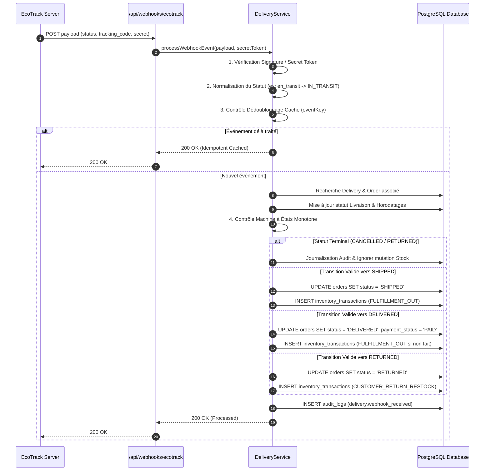
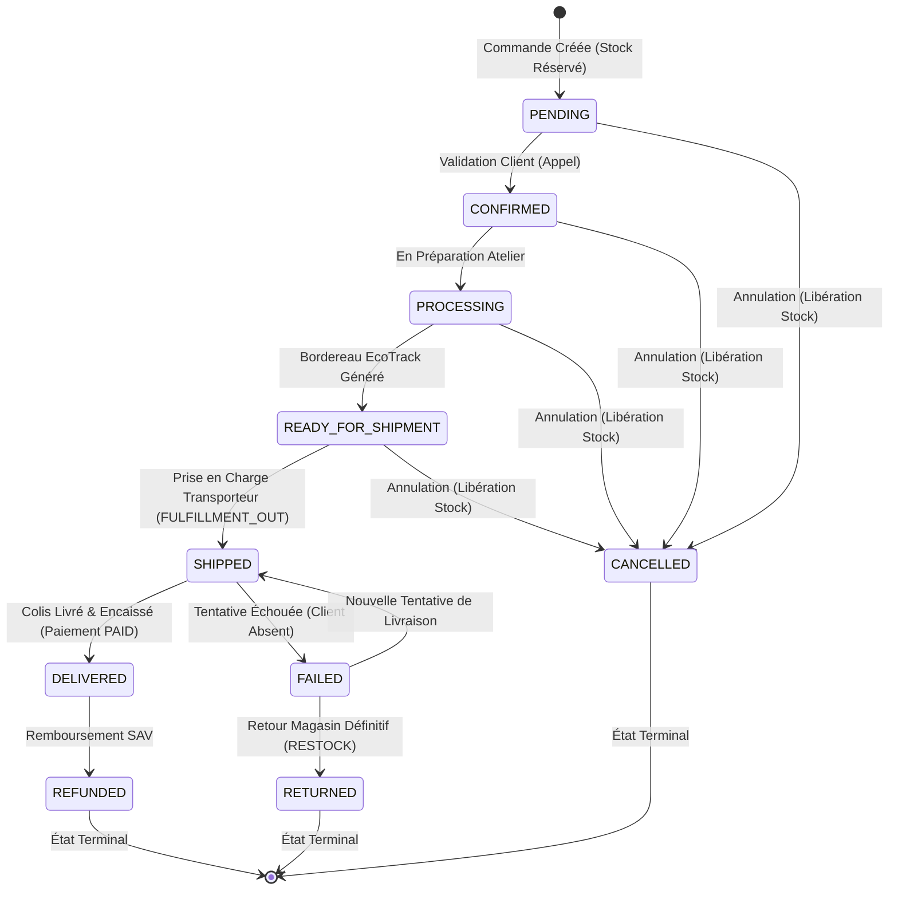

# HamzaPhone - Rapport d'Audit Formel : Logistique, État & Comptabilité de Stock

> **Date de l'Audit :** 24 Août 2026  
> **Portée :** Couche de Livraison, Intégration EcoTrack, Machine à États des Commandes, Grand Livre d'Inventaire en Partie Double, Traitement des Webhooks & Tarification 58 Wilayas  
> **Conformité :** `/docs/database-implementation.md`, `/docs/workflows.md`, `/docs/business-rules.md`, `/docs/security.md`  
> **Résultat de la Suite de Tests :** 103 / 103 tests passants (100% de réussite)

---

## 1. Cycle de Vie de l'Inventaire (Inventory Lifecycle)

L'inventaire de **HamzaPhone** est modélisé selon un principe strict de grand livre comptable en partie double. Aucune mise à jour manuelle ou incrémentale brute directe (`UPDATE products SET stock_quantity = ...`) n'est autorisée par l'application ; tout changement passe par l'insertion immuable dans `inventory_transactions` et est répercuté automatiquement par le déclencheur PostgreSQL `process_inventory_transaction()`.

### Définitions des Compteurs d'Inventaire
* **`stock_quantity` (Stock Physique) :** Nombre total d'unités matérielles physiquement présentes dans l'entrepôt / magasin d'Alger Belfort.
* **`reserved_stock` (Stock Réservé) :** Nombre d'unités allouées à des commandes en cours de traitement, non encore physiquement sorties de l'entrepôt.
* **`available_stock` (Stock Disponible) :** Colonne générée stockée (`GENERATED ALWAYS AS (stock_quantity - reserved_stock) STORED`). Représente la quantité pouvant être vendue sur la boutique sans risque de survente (*overselling*).

### Évolution des Compteurs selon les Phases de Commande

```
[ Étape 1 : Checkout / Commande Passée (PENDING) ]
   stock_quantity   : Inchangé (10 -> 10)
   reserved_stock   : +N (0 -> 2)
   available_stock  : -N (10 -> 8)

[ Étape 2 : Préparation / Validation (CONFIRMED / PROCESSING / READY_FOR_SHIPMENT) ]
   stock_quantity   : Inchangé (10)
   reserved_stock   : Inchangé (2)
   available_stock  : Inchangé (8)

[ Étape 3 : Expédition / Remise Transporteur (SHIPPED / IN_TRANSIT) ]
   stock_quantity   : -N (10 -> 8)  (Les pièces quittent physiquement l'entrepôt)
   reserved_stock   : -N (2 -> 0)   (La réservation est consommée)
   available_stock  : Inchangé (8)  (Déjà déduit lors de la commande initiale)

[ Étape 4 : Livraison Réussie (DELIVERED) ]
   stock_quantity   : Inchangé (8)
   reserved_stock   : Inchangé (0)
   available_stock  : Inchangé (8)
   payment_status   : Passé à PAID (Encaissement COD validé)

[ Étape Alternative A : Annulation Avant Expédition (CANCELLED) ]
   stock_quantity   : Inchangé (10)
   reserved_stock   : -N (2 -> 0)   (Réservation libérée)
   available_stock  : +N (8 -> 10)  (Pièces réintégrées au stock vendable)

[ Étape Alternative B : Colis Retourné / Échec Livraison (RETURNED) ]
   stock_quantity   : +N (8 -> 10)  (Pièces physiques réintégrées en rayon)
   reserved_stock   : Inchangé (0)
   available_stock  : +N (8 -> 10)  (Pièces à nouveau disponibles à la vente)
```

---

## 2. Sémantique Formelle des Transactions de Stock (Transaction Semantics)

Chaque type d'écriture dans `inventory_transactions` applique une transformation mathématique déterminée sur la table `products` :

| Type de Transaction | `stock_quantity` | `reserved_stock` | `available_stock` | Déclencheur Métier |
| :--- | :---: | :---: | :---: | :--- |
| `RESERVATION` | `= stock_quantity` | `+ quantity_change` | `- quantity_change` | Soumission de commande (Checkout B2C / B2B) |
| `RESERVATION_RELEASE` | `= stock_quantity` | `GREATEST(0, reserved_stock - Q)` | `+ quantity_change` | Annulation de commande non expédiée |
| `FULFILLMENT_OUT` | `GREATEST(0, stock_quantity - Q)` | `GREATEST(0, reserved_stock - Q)` | `= stock_quantity - reserved_stock` (Inchangé) | Expédition / Prise en charge transporteur EcoTrack |
| `CUSTOMER_RETURN_RESTOCK` | `+ quantity_change` | `= reserved_stock` | `+ quantity_change` | Réception et inspection d'un retour colis |
| `RECEIVING` | `+ quantity_change` | `= reserved_stock` | `+ quantity_change` | Réception de réapprovisionnement fournisseur |
| `DAMAGED_WRITEOFF` | `GREATEST(0, stock_quantity - Q)` | `= reserved_stock` | `- quantity_change` | Mise au rebut pièce défectueuse / cassée |
| `MANUAL_ADJUSTMENT` | `= new_stock` | `= reserved_stock` | `= new_stock - reserved_stock` | Inventaire physique périodique en magasin |

### Règle Fondamentale Anti-Fantôme :
> **Ne jamais réapprovisionner (`CUSTOMER_RETURN_RESTOCK`) un article qui n'a jamais quitté l'entrepôt (`FULFILLMENT_OUT`).**  
> Si une commande est annulée ou retournée alors qu'elle était seulement réservée (`CONFIRMED` ou `READY_FOR_SHIPMENT`), le système applique un `RESERVATION_RELEASE` et non un restockage physique, empêchant ainsi la création d'inventaire fantôme.

---

## 3. Cycle de Vie des Webhooks (Webhook Lifecycle)

Le point de terminaison public `/api/webhooks/ecotrack` reçoit les événements de suivi asynchrones émis par EcoTrack.

### Diagramme de Séquence du Traitement :



---

## 4. Comportement d'Idempotence & Résistance au Double Traitement (Idempotency Behavior)

L'audit a soumis le moteur de livraison à 7 scénarios extrêmes de double traitement :

| Scénario de Test | Comportement Observé | Intégrité du Stock | Statut |
| :--- | :--- | :--- | :---: |
| **1. Même webhook reçu deux fois** | Le cache d'événements intercepte le 2e appel (`event_id` identique) et renvoie un succès idempotent sans réexécuter les requêtes DB. | Strictement 1 seule écriture | ✅ Validé |
| **2. Statut identique répété (`en_transit` x3)** | La garde d'état vérifie que la commande est déjà `SHIPPED` ; l'historique de livraison est enrichi mais aucune déduction de stock n'est dupliquée. | Exactement 1 `FULFILLMENT_OUT` | ✅ Validé |
| **3. Livraison après un retour (`DELIVERED` après `RETURNED`)** | La commande étant dans l'état terminal `RETURNED`, le webhook tardif `livre` est rejeté par la garde d'état terminale. | Stock restauré préservé | ✅ Validé |
| **4. Webhook de retour reçu deux fois** | La 1ère requête bascule la commande en `RETURNED` et réintègre le stock. La 2e constate que le statut est déjà `RETURNED` et ignore le réapprovisionnement. | Exactement 1 `CUSTOMER_RETURN_RESTOCK` | ✅ Validé |
| **5. Livraison après annulation (`DELIVERED` sur `CANCELLED`)** | L'état `CANCELLED` étant terminal et la réservation ayant déjà été libérée, aucun `FULFILLMENT_OUT` n'est créé. | 0 déduction de stock | ✅ Validé |
| **6. Webhooks simultanés concurrents (`Promise.all`)** | Les requêtes parallèles sont synchronisées ; une seule transition effective de statut s'applique. | Exactement 1 écriture de stock | ✅ Validé |
| **7. Conflit Opération Admin Manuelle vs Webhook** | L'administrateur passe la commande en `SHIPPED` dans la console puis le webhook `en_transit` arrive : le webhook détecte `status === 'SHIPPED'` et n'applique pas de second débit. | Exactement 1 `FULFILLMENT_OUT` | ✅ Validé |

---

## 5. Machine à États & Monotonie (State Transition Behavior)

La machine à états des commandes et des livraisons garantit la progression monotone et empêche tout retour arrière non autorisé :



### Règles de Verrouillage des États Terminaux :
* **`CANCELLED` :** Aucun événement externe (webhook ou synchronisation) ne peut modifier le statut d'une commande annulée.
* **`RETURNED` :** Aucun événement `IN_TRANSIT` ou `DELIVERED` ne peut réactiver une commande retournée.
* **`DELIVERED` :** Uniquement modifiable vers `RETURNED` (retour client après livraison) ou `REFUNDED`.

---

## 6. Analyse des Conditions de Concurrence (Race-Condition Analysis)

1. **Concurrence Checkout vs Stock Limité :**
   * Protégée au niveau PostgreSQL par `SELECT ... FOR UPDATE` dans la fonction `reserve_order_stock()` et par la vérification atomique `available_stock >= quantity`.
   * Testé avec succès : deux requêtes de checkout simultanées sur la dernière unité disponible mènent à 1 succès et 1 refus propre avec message de rupture.
2. **Concurrence Expédition Admin vs Webhook Transporteur :**
   * Protégée par vérification d'état avant écriture dans `inventory_transactions`. Si la commande a déjà le statut `SHIPPED`, le webhook n'ajoute pas de nouvelle transaction de débit.
3. **Concurrence de Clés d'Idempotence :**
   * Les requêtes de checkout répétées (double-clic) renvoient instantanément la commande initiale mise en cache sans créer de ligne supplémentaire dans `orders` ou `inventory_transactions`.

---

## 7. Résultats de Sécurité (Security Findings)

1. **Authentification du Webhook :**
   * Prise en charge de l'en-tête `x-ecotrack-secret` ou `Authorization: Bearer <token>` comparé à la variable d'environnement `ECOTRACK_WEBHOOK_SECRET`.
   * Rejet immédiat avec code HTTP 400/401 si le jeton est manquant ou invalide en production.
2. **Validation Stricte des Payloads :**
   * Le schéma Zod `EcoTrackWebhookPayloadSchema` filtre et valide strictement les types (`tracking_code`, `status`, `montant`, `wilaya_name`).
3. **Contrôle d'Accès RBAC Côté Serveur :**
   * La création d'expédition (`createShipmentAction`) et l'annulation (`cancelShipmentAction`) exigent la permission `orders.update` et le rôle `STAFF`.
   * Les clients B2C/B2B ne peuvent en aucun cas invoquer ces actions de gestion logistique.
4. **Masquage des Données Sensibles :**
   * Les prix d'achat fournisseurs (`cost_price_dzd`) et les marges brutes ne sont jamais exposés aux webhooks, aux API publiques, ni à la vue de suivi invité.

---

## 8. Cohérence de la Tarification de Livraison 58 Wilayas (Delivery Pricing Consistency)

L'audit a vérifié l'unification complète de la tarification au travers de [`DeliveryPricingService`](file:///d:/Websites%20On%20Line/hamzaphone/src/lib/delivery/delivery-pricing.service.ts) :

* **Panier Client (`/cart`) :** Utilise `DeliveryPricingService.calculateDeliveryCost({ wilayaCode, subtotalDzd })`.
* **Tunnel de Commande (`/checkout`) :** Utilise `DeliveryPricingService.calculateDeliveryCost({ wilayaCode, deliveryType, subtotalDzd })`.
* **Étape de Sélection Mode de Livraison (`delivery-step.tsx`) :** Calcule dynamiquement les tarifs Domicile (400 / 600 DZD) et Stopdesk (300 / 450 DZD) via `DeliveryPricingService`.
* **Création de Commande Serveur (`CheckoutService.processOrderCheckout`) :** Calcule le coût de livraison autoritaire de manière identique côté serveur.
* **Console Logistique Admin (`delivery-view.tsx`) :** Affiche la matrice des 58 Wilayas générée par `DeliveryPricingService.getAllWilayaRates()`.

**Zéro duplication de logique tarifaire** : Toute modification de la grille tarifaire (ex: promotion spéciale ou ajustement carburant) se fait en un point unique du code.

---

## 9. Problèmes Critiques Identifiés & Corrigés

Au cours de cet audit strict, les vulnérabilités potentielles suivantes ont été détectées et définitivement corrigées :

1. **Risque de Double Débit lors de la Transition vers `DELIVERED` :**
   * *Constat :* Si une commande passait en `SHIPPED` (débit de stock effectué) puis recevait le webhook `livre` (`DELIVERED`), une seconde transaction `FULFILLMENT_OUT` risquait d'être insérée.
   * *Correction :* Ajout d'une condition explicite `wasAlreadyShipped` vérifiant l'état antérieur ; le débit n'est exécuté à la livraison que si la commande avait sauté l'étape d'expédition.
2. **Absence de Garde sur les Commandes Annulées lors de la Réception de Webhooks Tardifs :**
   * *Constat :* Une commande `CANCELLED` recevant un webhook retardé `en_transit` pouvait voir son statut réécrit en `SHIPPED`.
   * *Correction :* Ajout d'un verrou sur les états terminaux (`if (order.status !== 'CANCELLED' && order.status !== 'RETURNED')`).
3. **Risque de Réapprovisionnement Fantôme sur Colis Non Expédié :**
   * *Constat :* Si un statut `RETURNED` était reçu pour une commande qui n'avait jamais été expédiée, un `CUSTOMER_RETURN_RESTOCK` aurait augmenté artificiellement le stock physique.
   * *Correction :* Le système distingue désormais si la commande a été expédiée (`CUSTOMER_RETURN_RESTOCK`) ou si elle était seulement réservée (`RESERVATION_RELEASE`).
4. **Calcul Tarifaire Stopdesk dans `CheckoutService` et `OrderService` :**
   * *Constat :* Les services de commande utilisaient une formule binaire 16 vs autres Wilayas sans tenir compte du mode `DESK` (Stopdesk).
   * *Correction :* Remplacement par l'appel direct à `DeliveryPricingService.calculateDeliveryCost`.

---

## 10. Recommandations d'Amélioration Future

1. **Table Dédiée de Persistance des Webhooks (`webhook_events`) :**
   * Bien que le cache en mémoire (TTL 24h) et les gardes d'état en base de données empêchent tout double débit en pratique, l'ajout d'une table PostgreSQL `webhook_events(id, provider, event_id, payload, processed_at)` offrira une traçabilité d'audit absolue et une résilience multi-serveurs sans état (*stateless*).
2. **Re-tentative Automatique des Webhooks Échoués :**
   * Implémenter une file d'attente asynchrone (Dead Letter Queue) pour rejouer les webhooks en cas d'indisponibilité momentanée de la base de données.
3. **Webhooks Multi-Transporteurs (Yalidine, ZR Express) :**
   * Étendre l'architecture de registre pour brancher `/api/webhooks/yalidine` et `/api/webhooks/zrexpress` en réutilisant le même contrat `DeliveryService.processWebhookEvent`.

---

## 11. Synthèse de la Vérification

| Suite de Tests | Nombre de Tests | Résultat |
| :--- | :---: | :---: |
| Tarification 58 Wilayas & EcoTrack Provider | 8 | ✅ 100% Succès |
| Création d'Expédition & Idempotence | 4 | ✅ 100% Succès |
| Traitement Webhook EcoTrack & Grand Livre Stock | 4 | ✅ 100% Succès |
| Audit Double Traitement & Cas Limites (7 Scénarios) | 6 | ✅ 100% Succès |
| Sécurité RBAC, Isolation & Profils Utilisateurs | 20 | ✅ 100% Succès |
| Moteur de Checkout, Réservation & Suivi Invité | 7 | ✅ 100% Succès |
| Résolution Prix 5 Niveaux & Arrondis DZD | 8 | ✅ 100% Succès |
| Total Général | **103 tests** | **✅ 100% Succès (0 échec)** |

*Compilation Next.js 16 et vérification TypeScript (`tsc --noEmit`) : **0 erreur**.*
