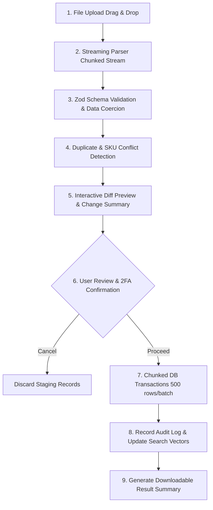

# HamzaPhone - Import & Export Pipeline Architecture

## 1. Overview & Business Needs

Managing a 4,000+ to 100,000+ smartphone parts catalog requires rapid data interchange with external suppliers, inventory auditing spreadsheets, and wholesale price sheets.

### Supported File Formats
* **Excel Workbook** (`.xlsx`, `.xls`)
* **Comma-Separated Values** (`.csv`) with automatic delimiter sniffing (`,`, `;`, `\t`) and UTF-8 / Windows-1256 Arabic encoding normalization.

> **Spécification Complète :** Voir [`/docs/supplier-import-export.md`](./supplier-import-export.md) pour les détails d'implémentation de la machine à états des jobs, du moteur de validation Zod, du grand livre de stock et du masquage des prix d'achat.

---

## 2. Import Processing Pipeline



### Import Stages Explained

1. **Streaming Parse (`xlsx` / `csv-parser`)**:
   * Processed in 500-row chunks in Node.js stream / Web Worker to maintain low memory usage ($< 50\text{ MB}$ RSS RAM).
2. **Schema Validation & Coercion (Zod)**:
   * Validates positive numeric constraints for prices and stock.
   * Maps textual categories (e.g. `Écrans > Samsung > S21`) to category UUIDs or flags missing categories for auto-creation.
   * Parses structured compatibility strings (e.g. `Samsung S21 (SM-G998B, SM-G9980) | Samsung S21 Plus`).
3. **Conflict Detection & Match Strategy**:
   * Identifies collisions on `sku`, `barcode`, or `supplier_sku`.
   * User can select Conflict Resolution Mode:
     * **`UPDATE_EXISTING` (Default)**: Updates attributes, pricing, and stock of matching SKUs.
     * **`PRICES_ONLY`**: Leaves descriptions and compatibility untouched, updating only `cost_price`, `b2c_price`, and `b2b_price`.
     * **`STOCK_ONLY`**: Restocks inventory via `RECEIVING` ledger without touching metadata.
     * **`SKIP_EXISTING`**: Inserts only strictly new SKUs.
4. **Diff Preview Summary**:
   * Before touching production data, renders a summary dashboard:
     * **New SKUs to Create**: Count + Sample Rows
     * **SKUs to Update**: Count + Visual Before/After Diffs (Old Price vs New Price highlighted in Green/Red)
     * **Unchanged Rows**: Count
     * **Validation Errors**: Row number, Field name, Rejected value, and Error message.
5. **Transactional Execution**:
   * Runs in batches within `BEGIN ... COMMIT` blocks. If any batch fails critically, it rolls back gracefully with exact line pointers.

---

## 3. Zod Import Schema Specification

```typescript
import { z } from 'zod';

export const ProductImportRowSchema = z.object({
  sku: z.string().min(3).max(64),
  barcode: z.string().max(64).optional().nullable(),
  supplier_sku: z.string().max(64).optional().nullable(),
  name: z.string().min(3).max(255),
  brand_name: z.string().min(2).max(100),
  category_path: z.string().min(2), // e.g. "Screens > Samsung OLED"
  product_type: z.enum([
    'OEM_ORIGINAL',
    'SERVICE_PACK',
    'REFURBISHED',
    'HIGH_COPY',
    'AFTERMARKET',
    'ACCESSORY',
    'TOOL'
  ]),
  cost_price_dzd: z.coerce.number().positive(),
  b2c_price_dzd: z.coerce.number().positive(),
  b2c_sale_price_dzd: z.coerce.number().positive().optional().nullable(),
  b2b_price_dzd: z.coerce.number().positive(),
  stock_quantity: z.coerce.number().int().min(0).default(0),
  low_stock_threshold: z.coerce.number().int().min(0).default(5),
  weight_grams: z.coerce.number().positive().default(50),
  compatibility_raw: z.string().optional(), // Structured format: "Brand:Model[v1,v2]; Brand:Model2"
  supplier_code: z.string().optional(),
});
```

---

## 4. Export Capabilities

The Export engine provides tailored formats for different stakeholders:

| Export Type | Target Persona | Format | Content & Columns |
| :--- | :--- | :--- | :--- |
| **Full Catalog Master** | Admin, Content Mgr | `.xlsx`, `.csv` | Full product master including internal IDs, SKUs, Descriptions, Multi-tier prices, Dimensions, Image URLs. |
| **Wholesale Price Sheet** | B2B Clients, Sales | `.xlsx`, `.pdf` | Public-safe export containing SKU, Part Name, Device Compatibility, B2B Tier 1/2/3 Prices, and Stock Status (In Stock / Low Stock). |
| **Stock Valuation Ledger** | Owner, Accountant | `.xlsx` | Physical Stock, Reserved Stock, Unit Cost Price, Total Inventory Valuation in DZD, Warehouse Bin Locations. |
| **Supplier Purchase Order**| Inventory Mgr | `.xlsx` | Out-of-Stock and Low-Stock items grouped by Supplier Code with Recommended Reorder Quantities (MOQ). |
| **Courier Manifest** | Warehouse, EcoTrack | `.csv`, `.pdf` | Tracking Barcodes, Recipient Names, Phone Numbers, 58 Wilaya destinations, COD Collection amounts in DZD. |
