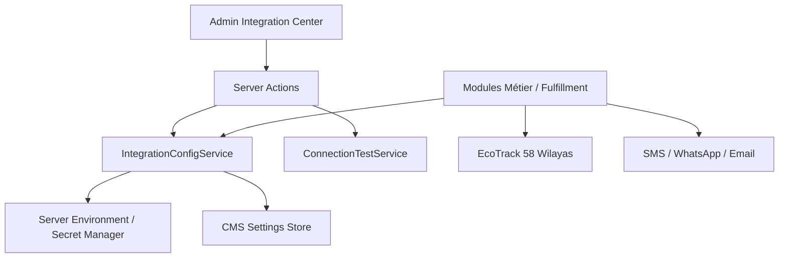

# HamzaPhone — Inventaire Exhaustif des Intégrations & Référentiel des Identifiants

> **Version:** 1.0.0 (Prêt pour Démo Client & Production)  
> **Plateforme Démo :** `https://hamzaphone.vercel.app`  
> **Règle Fondamentale de Sécurité :** Aucun secret cryptographique, mot de passe ou jeton d'API n'est exposé côté client ou stocké en clair dans la base de données. Tous les secrets sont gérés au niveau du serveur (Variables d'environnement Vercel / Hostinger Secrets Manager).

---

## 1. Vue d'Ensemble de l'Architecture d'Intégration

Toutes les interactions avec des prestataires externes (logistique algérienne, passerelles SMS, WhatsApp Cloud API, stockage S3, authentification, APM) transitent par une couche d'abstraction centrale unifiée : **`IntegrationConfigService`** et **`ConnectionTestService`**.

---

## 2. Inventaire Matriciel Exhaustif de Chaque Intégration

| Intégration | Rôle & Usage Métier | Requis pour Démo ? | Requis pour Production ? | Nom de la Variable / Secret | Type de Variable | Emplacement d'Exécution | Statut Actuel | Mode de Configuration | Stratégie de Remplacement Sécurisé |
| :--- | :--- | :--- | :--- | :--- | :--- | :--- | :--- | :--- | :--- |
| **EcoTrack Express Algérie** | Création automatique des bordereaux d'expédition 58 Wilayas, StopDesk, suivi des colis | **Optionnel** *(Émulation Démo active)* | **Requis** | `ECOTRACK_API_TOKEN` | `SERVER_SECRET` | Serveur uniquement | Configuré / Missing | Vercel Project Secrets / Hostinger Env | Découplé via `DeliveryProvider` : remplaçable sans toucher au code métier |
| **EcoTrack Webhook** | Réception en temps réel des statuts de livraison (Livré, Échec, En transit) | **Optionnel** | **Requis** | `ECOTRACK_WEBHOOK_SECRET` | `WEBHOOK_SECRET` | Serveur uniquement | Configuré / Missing | Signature HMAC dans variables serveur | Modifiable via Vercel Secrets sans redéploiement applicatif |
| **EcoTrack Endpoint** | URL de l'API EcoTrack (Sandbox vs Production) | **Optionnel** | **Requis** | `ECOTRACK_API_URL` | `SERVER_CONFIG` | Serveur uniquement | Configuré (`https://api.ecotrack.dz/api/v1`) | Admin Settings ou Variable Serveur | Modifiable en un clic depuis le Centre des Intégrations |
| **Supabase PostgreSQL & Auth** | Base de données relationnelle, RLS, gestion des sessions clients B2C/B2B et staff | **Requis** | **Requis** | `NEXT_PUBLIC_SUPABASE_URL` | `PUBLIC_CONFIG` | Client & Serveur | Configuré | Vercel Env | Variable d'environnement publique |
| **Supabase Anon Key** | Clé publique anonyme avec contrôle d'accès au niveau des lignes (RLS) | **Requis** | **Requis** | `NEXT_PUBLIC_SUPABASE_ANON_KEY` | `PUBLIC_CONFIG` | Client & Serveur | Configuré | Vercel Env | Clé publique avec RLS strict |
| **Supabase Service Role** | Exécution des transactions privilégiées serveur (création commande multi-tables, ledger) | **Requis** | **Requis** | `SUPABASE_SERVICE_ROLE_KEY` | `SERVER_SECRET` | Serveur uniquement | Configuré | Vercel Secrets | Jamais injecté dans le bundle client |
| **Supabase Object Storage (S3)** | Hébergement et CDN des images des pièces détachées smartphone | **Requis** | **Requis** | `NEXT_PUBLIC_SUPABASE_URL` + Bucket `product-images` | `SERVER_CONFIG` | Client & Serveur | Configuré | Console Supabase Storage (Bucket Public) | Compatible S3 générique |
| **Passerelle SMS Algérie** | Envoi des SMS de confirmation de commande et avis de passage livreur | **Optionnel** *(Simulé en Démo)* | **Requis** | `SMS_GATEWAY_API_KEY` | `SERVER_SECRET` | Serveur uniquement | Non requis pour démo | Variables d'environnement serveur | Abstraction `SmsChannel` interchangeable (MaghrebSMS / Ooredoo) |
| **SMS Sender ID** | Nom d'expéditeur validé par l'ARPT (ex: `HamzaPhone`) | **Optionnel** | **Requis** | `SMS_GATEWAY_SENDER_ID` | `SERVER_CONFIG` | Serveur uniquement | Non requis pour démo | Admin Center ou Variable serveur | Modifiable sans changement de code |
| **Meta WhatsApp Cloud API** | Envoi automatique des liens de suivi et factures PDF proforma | **Optionnel** *(Simulé en Démo)* | **Requis** | `WHATSAPP_CLOUD_API_TOKEN` | `SERVER_SECRET` | Serveur uniquement | Non requis pour démo | Meta Developers Console / Vercel Secrets | Abstraction `WhatsAppChannel` |
| **WhatsApp Phone ID** | Identifiant de la ligne WhatsApp Business HamzaPhone | **Optionnel** | **Requis** | `WHATSAPP_PHONE_NUMBER_ID` | `SERVER_CONFIG` | Serveur uniquement | Non requis pour démo | Meta App Settings / Admin Center | Modifiable sans changement de code |
| **E-mail / SMTP Transactionnel** | Envoi des factures proforma PDF et relevés de compte B2B | **Optionnel** *(Simulé en Démo)* | **Requis** | `SMTP_PASSWORD` / `RESEND_API_KEY` | `SERVER_SECRET` | Serveur uniquement | Non requis pour démo | Vercel Secrets | Compatible Resend, Sendgrid ou SMTP personnalisé |
| **Alertes Telegram Bot** | Notifications instantanées pour l'équipe (nouvelles commandes, alerte stock bas) | **Optionnel** *(Simulé en Démo)* | **Optionnel** | `TELEGRAM_BOT_TOKEN` | `SERVER_SECRET` | Serveur uniquement | Non requis pour démo | BotFather / Vercel Secrets | Découplé via `TelegramChannel` |
| **Google OAuth 2.0** | Connexion sociale rapide pour les clients particuliers | **Non requis** *(Login mot de passe actif)* | **Optionnel** | `GOOGLE_CLIENT_SECRET` | `OAUTH_SECRET` | Serveur Supabase | Non requis pour démo | Console Supabase Auth (Providers) | Géré directement dans Supabase |
| **Tâches Cron Automatisées** | Nettoyage des réservations expirées et recalcul des soldes | **Optionnel** | **Requis** | `CRON_SECRET` | `SERVER_SECRET` | Serveur uniquement | Non requis pour démo | Vercel Cron Headers | Bearer token sécurisé |
| **Sentry / APM** | Suivi en temps réel des erreurs applicatives et performances | **Non requis** | **Optionnel** | `SENTRY_DSN` | `SERVER_SECRET` | Serveur uniquement | Non requis pour démo | Sentry Dashboard / Vercel Env | SDK Sentry Next.js standard |

---

## 3. Classification Rigoureuse des Types de Données

Les variables du système sont réparties en 6 catégories étanches :

1. **`PUBLIC_CONFIG`** :
   - Exemple : `NEXT_PUBLIC_SITE_URL`, `NEXT_PUBLIC_SUPABASE_URL`, `NEXT_PUBLIC_SUPABASE_ANON_KEY`.
   - Visibilité : Accessible par le navigateur, sans données sensibles.
2. **`SERVER_CONFIG`** :
   - Exemple : `ECOTRACK_API_URL`, `SMS_GATEWAY_SENDER_ID`, `WHATSAPP_PHONE_NUMBER_ID`.
   - Visibilité : Côté serveur Node.js uniquement. Non sensible mais opérationnel.
3. **`SERVER_SECRET`** :
   - Exemple : `SUPABASE_SERVICE_ROLE_KEY`, `ECOTRACK_API_TOKEN`, `SMS_GATEWAY_API_KEY`, `SMTP_PASSWORD`.
   - Visibilité : Strictement confiné au serveur. **Jamais affiché dans les réponses d'API, les logs ou le navigateur**.
4. **`WEBHOOK_SECRET`** :
   - Exemple : `ECOTRACK_WEBHOOK_SECRET`.
   - Visibilité : Serveur uniquement, pour la validation HMAC des requêtes entrantes.
5. **`OAUTH_SECRET`** :
   - Exemple : `GOOGLE_CLIENT_SECRET`, `APPLE_PRIVATE_KEY`.
   - Visibilité : Configuré directement dans la console du fournisseur d'identité ou Supabase.
6. **`USER_MANAGED_SETTING`** :
   - Exemple : Nom de la boutique, Logo, Téléphone du support, Coordonnées d'El Harrach Belfort, Textes d'annonces.
   - Visibilité : Géré par le propriétaire depuis le panneau d'administration (`WebsiteSettingsView`).

---

## 4. Politique de Tolérance aux Pannes & Mode Démonstration

* Si un secret optionnel est absent (ex: `ECOTRACK_API_TOKEN`), le système passe **automatiquement en mode émulation démo transparente** sans bloquer ni planter :
  - Génération d'un numéro de suivi mock déterministe (`ECO-XXXXXX`).
  - Simulation de l'étiquette PDF et de l'historique de suivi dans les 58 Wilayas.
  - Journalisation de la transaction avec l'identifiant `DEMO_SEED` ou `DEMO_ORDER`.
* Si un secret obligatoire de base est absent (`NEXT_PUBLIC_SUPABASE_URL`, `SUPABASE_SERVICE_ROLE_KEY`), une alerte explicite et descriptive est émise pour guider la configuration sans divulguer de données.
