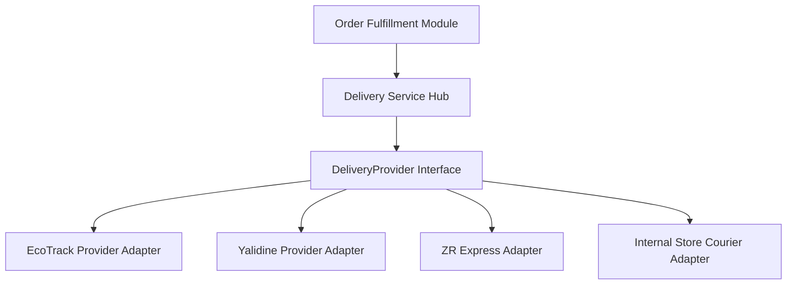
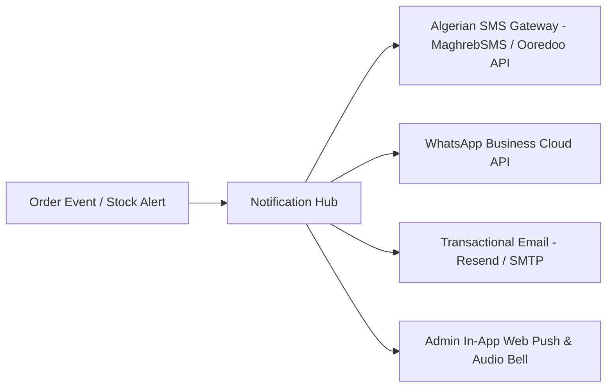

# HamzaPhone - External Integrations & Service Adapters

## 1. Courier Logistics Abstraction Layer

To prevent vendor lock-in with any single Algerian courier, all logistics operations communicate through a generic TypeScript interface: `DeliveryProvider`.



### TypeScript Delivery Provider Contract

```typescript
export interface CreateShipmentInput {
  orderId: string;
  orderNumber: string;
  recipientName: string;
  recipientPhone: string;
  recipientPhoneSecondary?: string;
  wilayaCode: number;
  wilayaName: string;
  communeName: string;
  addressLine: string;
  isStopDesk: boolean;
  stopDeskAgencyCode?: string;
  codAmountDzd: number; // Cash on delivery to collect (0 if prepaid)
  declaredValueDzd: number;
  weightKg: number;
  parcelCount: number;
  itemDescription: string; // e.g. "Smartphone Spare Parts"
  allowCustomerToOpenParcel: boolean;
}

export interface ShipmentResult {
  provider: string;
  trackingNumber: string;
  barcode: string;
  shippingLabelPdfUrl?: string;
  estimatedDeliveryDate?: string;
  rawResponse: Record<string, unknown>;
}

export interface TrackingEvent {
  status: 'PENDING' | 'PICKED_UP' | 'IN_TRANSIT' | 'OUT_FOR_DELIVERY' | 'DELIVERED' | 'FAILED' | 'RETURNED';
  description: string;
  location?: string;
  timestamp: string;
}

export interface DeliveryProvider {
  readonly providerCode: string;
  createShipment(input: CreateShipmentInput): Promise<ShipmentResult>;
  trackShipment(trackingNumber: string): Promise<TrackingEvent[]>;
  cancelShipment(trackingNumber: string, reason?: string): Promise<boolean>;
  getShipmentLabelPdf(trackingNumber: string): Promise<Buffer | string>;
  calculateShippingRate(wilayaCode: number, isStopDesk: boolean, weightKg: number): Promise<number>;
}
```

---

## 2. Concrete EcoTrack Adapter Implementation

```typescript
export class EcoTrackDeliveryProvider implements DeliveryProvider {
  readonly providerCode = 'ECOTRACK';
  private apiUrl: string;
  private apiToken: string;

  constructor() {
    this.apiUrl = process.env.ECOTRACK_API_URL || 'https://api.ecotrack.dz/api/v1';
    this.apiToken = process.env.ECOTRACK_API_TOKEN || '';
  }

  async createShipment(input: CreateShipmentInput): Promise<ShipmentResult> {
    const payload = {
      api_token: this.apiToken,
      reference: input.orderNumber,
      nom_client: input.recipientName,
      telephone: input.recipientPhone,
      telephone_2: input.recipientPhoneSecondary || '',
      adresse: input.addressLine,
      code_wilaya: input.wilayaCode,
      commune: input.communeName,
      montant: input.codAmountDzd,
      type: input.isStopDesk ? 2 : 1, // 1: Domicile, 2: Stop Desk
      stopdesk_code: input.stopDeskAgencyCode || '',
      remarque: input.itemDescription,
      ouvrir_colis: input.allowCustomerToOpenParcel ? 1 : 0,
    };

    const response = await fetch(`${this.apiUrl}/create_colis`, {
      method: 'POST',
      headers: { 'Content-Type': 'application/json' },
      body: JSON.stringify(payload),
    });

    if (!response.ok) {
      const err = await response.json();
      throw new Error(`EcoTrack Error: ${err.message || 'Failed to create shipment'}`);
    }

    const data = await response.json();

    return {
      provider: this.providerCode,
      trackingNumber: data.tracking_code,
      barcode: data.barcode || data.tracking_code,
      shippingLabelPdfUrl: data.label_url,
      rawResponse: data,
    };
  }

  async trackShipment(trackingNumber: string): Promise<TrackingEvent[]> {
    const response = await fetch(`${this.apiUrl}/track/${trackingNumber}?api_token=${this.apiToken}`);
    const data = await response.json();
    
    return (data.history || []).map((step: any) => ({
      status: this.mapEcoTrackStatus(step.status_code),
      description: step.status_text,
      location: step.wilaya_name,
      timestamp: step.created_at,
    }));
  }

  async cancelShipment(trackingNumber: string): Promise<boolean> {
    const res = await fetch(`${this.apiUrl}/cancel_colis`, {
      method: 'POST',
      headers: { 'Content-Type': 'application/json' },
      body: JSON.stringify({ api_token: this.apiToken, tracking_code: trackingNumber }),
    });
    return res.ok;
  }

  async getShipmentLabelPdf(trackingNumber: string): Promise<string> {
    return `${this.apiUrl}/label/${trackingNumber}?api_token=${this.apiToken}`;
  }

  async calculateShippingRate(wilayaCode: number, isStopDesk: boolean, weightKg: number): Promise<number> {
    // Queries local cached database rate matrix for wilayaCode
    return 600; // Default DZD baseline
  }

  private mapEcoTrackStatus(code: string): TrackingEvent['status'] {
    switch (code?.toLowerCase()) {
      case 'livre': return 'DELIVERED';
      case 'en_cours': return 'IN_TRANSIT';
      case 'echec': return 'FAILED';
      case 'retour': return 'RETURNED';
      default: return 'PENDING';
    }
  }
}
```

---

## 3. Authentication Integrations (Google, Apple, Facebook)

Supabase Auth is configured to support OAuth and Passwordless credentials:

1. **Google OAuth 2.0**: Standard Web Client ID and Secret configured in Supabase Auth Console.
2. **Apple Sign-In**: Configured with Apple Services ID, Team ID, Key ID, and Private Key (`.p8`) for iOS Safari and Native Storefront compliance.
3. **Facebook Login**: App ID & Secret for Algerian mobile-first Facebook users.
4. **Phone / SMS OTP (Optional Upgrade)**: Verification via local SMS providers.

---

## 4. Multi-Channel Notification Hub



* **SMS**: Triggered for Order Created (B2C confirmation with tracking URL) and Out for Delivery alerts.
* **WhatsApp**: Dispatches clickable tracking updates and PDF invoices directly to customer's WhatsApp number.
* **Email**: PDF Proforma and Tax Invoices for B2B accounts.
* **Admin In-App**: Real-time sound chime and toast notification on incoming new orders using Supabase Realtime CDC channels.

---

## 5. Central Integration Architecture & Admin Integration Center

All service adapters and credentials are orchestrated via the central **`IntegrationConfigService`** and managed through **Admin -> Centre Intégrations** :

* **Zero Secret Leakage**: API tokens and private keys are never exposed in client bundles or plain text tables.
* **Safe Connection Testing**: Non-destructive server-side connectivity tests measure real-time latency and status.
* **Controlled Demo Mode**: Full platform simulation (Mock EcoTrack `ECO-XXXXXX`, SMS logs, DEMO_SEED inventory) allowing client testing without external costs.
* **Documentation**:
  - [Inventaire Complet des Intégrations & Secrets](file:///d:/Websites%20On%20Line/hamzaphone/docs/integration-credentials-inventory.md)
  - [Guide des Identifiants Requis](file:///d:/Websites%20On%20Line/hamzaphone/docs/demo-required-credentials.md)
  - [Spécification du Mode Démo](file:///d:/Websites%20On%20Line/hamzaphone/docs/demo-mode.md)

