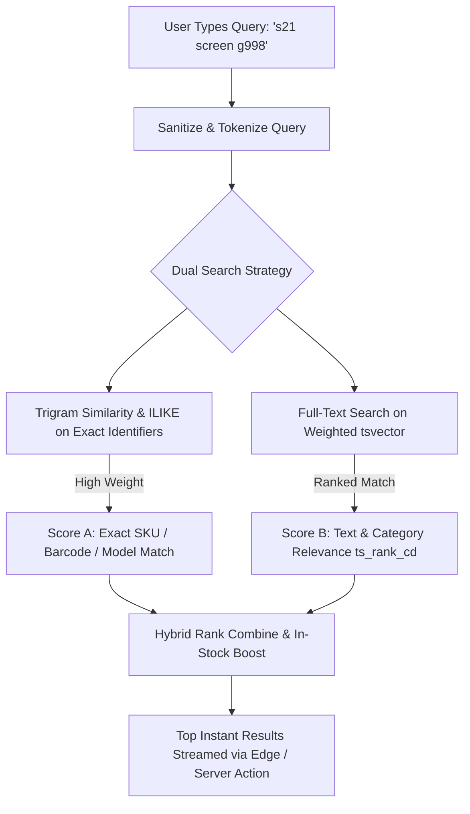

# HamzaPhone - Search Architecture & Discovery Engine

## 1. Overview & Performance Objectives

In the smartphone spare parts industry, search is the primary conversion driver. Repair technicians and retail customers search using varied queries:
* **Product Titles**: "Ecran OLED Samsung S21 Ultra"
* **Technical SKUs**: `HP-SCR-SAM-S21U`
* **Supplier Codes & Part Numbers**: `GH82-26031A` (Samsung Service Pack Part Number)
* **Model Codes**: `SM-G998B`, `A2633`, `M2102J20SG`
* **Barcodes / EAN**: `6934177724123`
* **Fuzzy & Transliterated Strings**: "afficheur samsung", "batterie iphon 13"

### Performance Targets
* **Keystroke Response Latency**: $< 50\text{ ms}$ query turnaround.
* **Typo Tolerance**: Matches results with up to 2-character transpositions/omissions.
* **Client Payload**: Paginated/limited to top 8 instant dropdown matches; full results view with cursor pagination.
* **Zero Full-Catalog Ingestion**: Search is strictly server-side indexed via PostgreSQL; never downloads 4,000+ items into browser RAM.

---

## 2. PostgreSQL Full-Text & Trigram Indexing Architecture

HamzaPhone uses a hybrid indexing model combining PostgreSQL `tsvector` document ranking with `pg_trgm` (trigram fuzzy matching).



### PostgreSQL Schema & Generated Column Setup

```sql
-- Enable necessary PostgreSQL extensions
CREATE EXTENSION IF NOT EXISTS pg_trgm;
CREATE EXTENSION IF NOT EXISTS unaccent;

-- 1. Add generated search vector column with weighted importance
ALTER TABLE products ADD COLUMN search_vector tsvector
GENERATED ALWAYS AS (
    setweight(to_tsvector('simple', coalesce(sku, '')), 'A') ||
    setweight(to_tsvector('simple', coalesce(barcode, '')), 'A') ||
    setweight(to_tsvector('simple', coalesce(supplier_sku, '')), 'A') ||
    setweight(to_tsvector('french', unaccent(coalesce(name, ''))), 'B') ||
    setweight(to_tsvector('simple', coalesce(compatibility::text, '')), 'B') ||
    setweight(to_tsvector('french', unaccent(coalesce(short_description, ''))), 'C') ||
    setweight(to_tsvector('french', unaccent(coalesce(description, ''))), 'D')
) STORED;

-- 2. GIN Index on Full-Text Search Vector
CREATE INDEX idx_products_search_vector ON products USING GIN (search_vector);

-- 3. Trigram GIN Indexes for Substring / Fuzzy SKU & Title Matching
CREATE INDEX idx_products_sku_trgm ON products USING GIN (sku gin_trgm_ops);
CREATE INDEX idx_products_name_trgm ON products USING GIN (name gin_trgm_ops);
CREATE INDEX idx_products_supplier_sku_trgm ON products USING GIN (supplier_sku gin_trgm_ops);
CREATE INDEX idx_products_barcode_trgm ON products USING GIN (barcode gin_trgm_ops);
```

---

## 3. Instant Search SQL Execution Strategy

```sql
-- Instant Search RPC Function
CREATE OR REPLACE FUNCTION search_products_instant(
    search_query TEXT,
    filter_brand_id UUID DEFAULT NULL,
    filter_category_id UUID DEFAULT NULL,
    max_results INT DEFAULT 8
)
RETURNS TABLE (
    id UUID,
    sku VARCHAR,
    barcode VARCHAR,
    name VARCHAR,
    slug VARCHAR,
    main_image VARCHAR,
    product_type product_type,
    b2c_price NUMERIC,
    b2c_sale_price NUMERIC,
    available_stock INT,
    relevance_score FLOAT
) AS $$
DECLARE
    cleaned_query TEXT := trim(search_query);
    ts_query tsquery;
BEGIN
    -- Format query for prefix matching on each term (e.g. 's21:* & scr:*')
    ts_query := to_tsquery('simple', string_agg(quote_literal(term) || ':*', ' & '))
                FROM unnest(string_to_array(cleaned_query, ' ')) AS term
                WHERE length(term) > 0;

    RETURN QUERY
    SELECT 
        p.id,
        p.sku,
        p.barcode,
        p.name,
        p.slug,
        p.main_image,
        p.product_type,
        p.b2c_price,
        p.b2c_sale_price,
        p.available_stock,
        (
            -- Trigram exact match boost (100 pts)
            (CASE WHEN p.sku ILIKE cleaned_query || '%' THEN 100.0 ELSE 0.0 END) +
            (CASE WHEN p.barcode = cleaned_query THEN 120.0 ELSE 0.0 END) +
            -- Full text rank (weighted 0-50 pts)
            (coalesce(ts_rank_cd(p.search_vector, ts_query), 0.0) * 50.0) +
            -- Trigram similarity score (0-30 pts)
            (similarity(p.name, cleaned_query) * 30.0) +
            -- Stock availability boost (in-stock items prioritized)
            (CASE WHEN p.available_stock > 0 THEN 10.0 ELSE 0.0 END)
        )::FLOAT AS relevance_score
    FROM products p
    WHERE 
        p.status = 'ACTIVE' 
        AND p.is_visible = true
        AND (filter_brand_id IS NULL OR p.brand_id = filter_brand_id)
        AND (filter_category_id IS NULL OR p.category_id = filter_category_id)
        AND (
            p.search_vector @@ ts_query
            OR p.sku ILIKE '%' || cleaned_query || '%'
            OR p.barcode ILIKE '%' || cleaned_query || '%'
            OR p.name % cleaned_query
            OR p.compatibility::text ILIKE '%' || cleaned_query || '%'
        )
    ORDER BY relevance_score DESC, p.available_stock DESC
    LIMIT max_results;
END;
$$ LANGUAGE plpgsql STABLE;
```

---

## 4. Storefront Client-Side Interaction & Ergonomics

```typescript
// Storefront Search Hook with Debounce and TanStack Query
import { useState } from 'react';
import { useQuery } from '@tanstack/react-query';
import { useDebounce } from '@/hooks/use-debounce';

export function useInstantProductSearch() {
  const [searchTerm, setSearchTerm] = useState('');
  const debouncedTerm = useDebounce(searchTerm, 120); // 120ms debounce threshold

  const { data: results, isLoading, isFetching } = useQuery({
    queryKey: ['instant-search', debouncedTerm],
    queryFn: async () => {
      if (!debouncedTerm || debouncedTerm.trim().length < 2) return [];
      const res = await fetch(`/api/search/instant?q=${encodeURIComponent(debouncedTerm)}`);
      return res.json();
    },
    enabled: debouncedTerm.trim().length >= 2,
    staleTime: 1000 * 60 * 5, // 5 min client cache for identical queries
  });

  return {
    searchTerm,
    setSearchTerm,
    results: results || [],
    isLoading: isLoading || isFetching,
  };
}
```

### Keyboard Navigation & UX Details
* **Instant Drawer**: Triggered on input focus; displays recent searches + trending models (e.g. *iPhone 11 screen*, *Redmi Note 10 charging port*).
* **Keyboard Control**: `ArrowDown` / `ArrowUp` to navigate instant matches; `Enter` to navigate to the active highlighted item or full search results page; `ESC` to dismiss.
* **Instant SKU Paste**: Pasting a known SKU immediately routes to the product detail view if an exact 100% confidence match is returned.
