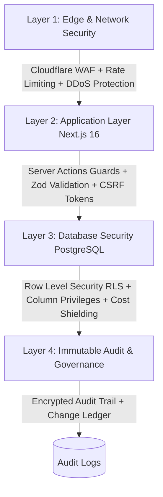

# HamzaPhone - Security Architecture & Audit Governance

## 1. Security Threat Model & Defense-in-Depth

Given the commercial value of smartphone components and sensitive wholesale pricing data in Algeria, HamzaPhone implements a four-layer defense architecture:



---

## 2. PostgreSQL Row Level Security (RLS) Policies

All application tables have RLS enabled by default (`ALTER TABLE <table> ENABLE ROW LEVEL SECURITY;`).

### 2.1 Products & Cost Price Shielding Policy
* **Vulnerability Mitigated**: Competitors or B2C consumers inspecting network responses in browser DevTools to deduce profit margins or supplier costs.
* **Architecture**: The `products` base table restricts column access; public storefront views and APIs select only sanitized columns.

```sql
-- Public API Policy: Read-only access to active items
CREATE POLICY "Public Read Active Products"
ON products FOR SELECT
USING (
    (is_visible = true AND status = 'ACTIVE')
    OR
    auth.has_permission('products.read')
);

-- Protect write operations
CREATE POLICY "Staff Write Products"
ON products FOR ALL
USING (auth.has_permission('products.update'))
WITH CHECK (auth.has_permission('products.update'));
```

### 2.2 Customer & B2B Data Isolation Policy
```sql
ALTER TABLE customer_profiles ENABLE ROW LEVEL SECURITY;

CREATE POLICY "Customers view and edit own profile"
ON customer_profiles FOR ALL
USING (id = auth.uid() OR auth.has_permission('customers.read'))
WITH CHECK (id = auth.uid() OR auth.has_permission('customers.update'));
```

### 2.3 Orders & Address Data Policy
```sql
ALTER TABLE orders ENABLE ROW LEVEL SECURITY;

CREATE POLICY "User View Own Orders"
ON orders FOR SELECT
USING (
    customer_id = auth.uid() 
    OR 
    auth.has_permission('orders.read')
);
```

---

## 3. Server Actions & API Authorization Guards

Every Next.js 16 Server Action verifies authentication and permission claims prior to executing business mutations.

```typescript
// Authorization Guard Utility
import { createServerClient } from '@/lib/supabase/server';

export async function requirePermission(permission: string) {
  const supabase = await createServerClient();
  const { data: { user }, error } = await supabase.auth.getUser();

  if (error || !user) {
    throw new Error('UNAUTHORIZED: Authentication required');
  }

  const { data: hasPerm } = await supabase.rpc('has_permission', {
    required_permission: permission,
  });

  if (!hasPerm) {
    throw new Error(`FORBIDDEN: Missing required permission [${permission}]`);
  }

  return user;
}
```

---

## 4. Tamper-Resistant Audit Logging Architecture

All sensitive administrative actions (price adjustments, inventory modifications, order cancellations, user role promotions, bulk imports, and system settings edits) automatically write to an immutable audit log.

```sql
CREATE TABLE audit_logs (
    id UUID PRIMARY KEY DEFAULT gen_random_uuid(),
    actor_id UUID REFERENCES auth.users(id) ON DELETE SET NULL,
    actor_email VARCHAR(255) NOT NULL,
    actor_role VARCHAR(64) NOT NULL,
    action VARCHAR(64) NOT NULL,          -- e.g. 'PRICING.BULK_ADJUST', 'ORDER.CANCEL'
    entity_type VARCHAR(64) NOT NULL,     -- e.g. 'PRODUCT', 'ORDER', 'SETTINGS'
    entity_id VARCHAR(64),
    old_values JSONB,
    new_values JSONB,
    ip_address VARCHAR(45),
    user_agent TEXT,
    created_at TIMESTAMPTZ DEFAULT NOW()
);

-- Immutable Rule: Disallow all updates and deletes on audit logs
CREATE POLICY "Audit logs are append-only"
ON audit_logs FOR INSERT
WITH CHECK (true);

CREATE POLICY "Audit logs cannot be updated"
ON audit_logs FOR UPDATE
USING (false);

CREATE POLICY "Audit logs cannot be deleted"
ON audit_logs FOR DELETE
USING (false);
```

---

## 5. Rate Limiting & Anti-Scraping

* **Storefront Instant Search**: Rate limited to **30 queries per 10 seconds** per IP to prevent competitor price scrapers from crawling the 4,000+ SKU catalog.
* **Checkout & OTP Dispatch**: Rate limited to **5 attempts per minute** per IP/Phone to mitigate SMS toll fraud and spam orders.
* **Admin Login & Password Resets**: Exponential backoff with IP lockout after 5 consecutive failed attempts.
