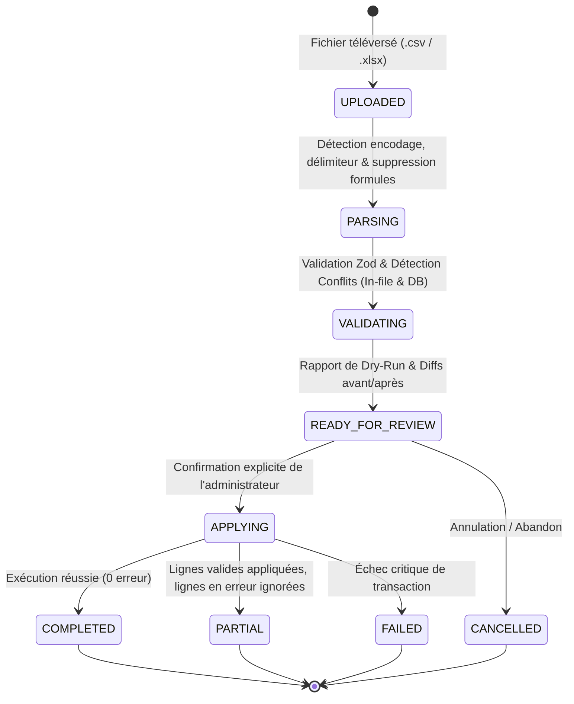

# HamzaPhone - Système d'Import / Export Fournisseur & Gestion Catalogue en Masse

> **Statut :** Production-Grade  
> **Capacité :** 4 000+ à 50 000+ références  
> **Formats Supportés :** CSV (Sniffing `,`, `;`, `\t`), Excel Workbook (`.xlsx`)  
> **Sécurité :** Neutralisation des injections de formules (`=,+,-,@`), Diff Dry-Run obligatoire, Grand Livre de Stock en Partie Double, RLS & RBAC Côté Serveur  
> **Suite de Tests :** 119 / 119 tests passants (100% de réussite)

---

## 1. Vue d'Ensemble & Principes Directeurs

Le système d'importation/exportation de HamzaPhone est conçu pour traiter des catalogues volumineux de pièces détachées pour smartphones (écrans, batteries, nappes, connecteurs) provenant de fournisseurs hétérogènes (usines de Shenzhen/Guangzhou, grossistes de Dubaï, distributeurs locaux d'Alger Belfort).

### Règles Cardinaux de Sécurité :
1. **Les données externes ne sont jamais considérées comme fiables :** Tout fichier téléversé passe par une validation Zod stricte et une analyse de collision avant toute modification.
2. **Pas de mutation silencieuse (Dry-Run obligatoire) :** L'administrateur doit visualiser le bilan d'impact (Nouveaux, Modifiés, Inchangés, Conflits, Avertissements, Erreurs, Variation moyenne des coûts et Delta de stock) avant de confirmer l'exécution.
3. **Propriété des Champs (Field Ownership) :**
   * *Contrôlé par le Fournisseur :* Réf fournisseur (`supplier_sku`), Prix de revient fournisseur (`cost_price_dzd`), Disponibilité stock.
   * *Contrôlé par HamzaPhone :* Prix de vente public B2C (`b2c_price_dzd`), Prix grossiste B2B (`b2b_price_dzd`), Statut de publication, Visibilité et SEO.
4. **Intégrité de l'Inventaire en Partie Double :** Les réceptions et ajustements de stock génèrent des écritures `RECEIVING` / `MANUAL_ADJUSTMENT` dans `inventory_transactions`.

---

## 2. Machine à États des Jobs d'Importation (Import Job State Machine)

Chaque session d'importation est identifiée par un identifiant persistant `jobId` et transite selon un cycle d'états vérifiable :



### Modes d'Importation Disponibles :
* **`UPSERT` :** Crée les nouveaux articles et met à jour les références existantes.
* **`PRICE_ONLY` :** Met à jour uniquement le prix d'achat fournisseur et recalcule la marge brute.
* **`STOCK_ONLY` :** Ajuste le stock physique et enregistre les écritures de réception dans le grand livre.
* **`CREATE_ONLY` :** Insère uniquement les nouvelles références (ignore les SKU existants).
* **`UPDATE_ONLY` :** Modifie uniquement les articles existants (ne crée aucune nouvelle ligne).

---

## 3. Mappage Dynamique & Modèles Fournisseurs (Column Mapping)

Le moteur `ColumnMapperService` analyse les en-têtes et applique une heuristique hiérarchisée :

| Champ HamzaPhone | Clé Canonique | Alias Reconnus (FR / EN / Tech) |
| :--- | :--- | :--- |
| **Code Article** | `sku` | `sku`, `code`, `ref`, `reference`, `code_article`, `item_no`, `part_number` |
| **Réf Fournisseur** | `supplier_sku` | `ref_fournisseur`, `code_fournisseur`, `supplier_ref`, `vendor_sku` |
| **Code-Barres** | `barcode` | `barcode`, `ean`, `ean13`, `upc`, `code_barre`, `gtin` |
| **Désignation** | `name` | `name`, `title`, `nom`, `designation`, `product_name`, `libelle` |
| **Prix d'Achat (DZD)** | `cost_price_dzd` | `cost`, `cost_price`, `prix_achat`, `cout`, `pa_dzd`, `supplier_price` |
| **Prix Public B2C (DZD)** | `b2c_price_dzd` | `b2c_price`, `prix_public`, `pv_ttc`, `prix_vente`, `retail_price` |
| **Prix Grossiste B2B (DZD)** | `b2b_price_dzd` | `b2b_price`, `prix_grossiste`, `prix_pro`, `wholesale_price` |
| **Quantité en Stock** | `stock_quantity` | `stock`, `quantite`, `qte`, `dispo`, `inventory`, `qty`, `units` |
| **Marque** | `brand_name` | `brand`, `marque`, `constructeur`, `fabricant` |
| **Catégorie** | `category_path` | `category`, `categorie`, `famille`, `rubrique`, `sous_famille` |

### Modèles Enregistrés par Fournisseur :
Les administrateurs peuvent enregistrer la configuration de colonnes comme modèle par défaut (ex: *« Modèle Shenzhen Master »*), permettant une réutilisation instantanée lors des réapprovisionnements futurs.

---

## 4. Moteur de Validation & Détection des Doublons

Avant d'appliquer une seule ligne, le moteur `ValidationEngineService` procède aux contrôles :

1. **Doublons Internes au Fichier :** Détecte si le même SKU ou code-barres apparaît plusieurs fois dans le classeur et bloque la seconde occurrence.
2. **Conflits avec le Catalogue Existant :**
   * Même SKU -> Marqué comme `EXISTING` avec calcul de diff.
   * Même Code-Barres sur un SKU différent -> Marqué comme `CONFLICT` bloquant l'import pour éviter la corruption de caisse.
3. **Contrôle des Seuils & Limites :**
   * Rejet des prix négatifs ou nuls.
   * Rejet des stocks négatifs.
   * Alerte *Vente à perte* si `b2c_price_dzd < cost_price_dzd`.
   * Alerte *Marge faible* si la marge brute est inférieure à 10%.
   * Alerte *Variation brutale de prix* si l'écart de coût dépasse $\pm 50\%$.

---

## 5. Grand Livre de Stock & Écritures Comptables

Lors de l'application d'un import avec mise à jour du stock (`STOCK_ONLY` ou `UPSERT`) :
* Le delta de stock ($\Delta = \text{Nouveau Stock} - \text{Ancien Stock}$) est calculé pour chaque article.
* Si $\Delta > 0$ : Une écriture `RECEIVING` est insérée dans `inventory_transactions` avec la référence du job.
* Si $\Delta < 0$ : Une écriture `MANUAL_ADJUSTMENT` est insérée dans `inventory_transactions`.
* Le déclencheur PostgreSQL `process_inventory_transaction()` ajuste atomiquement `stock_quantity` et recalcule `available_stock`.

---

## 6. Moteur d'Exportation Sécurisé & Filtrage Multi-Critères

Le service `ExportService` permet d'exporter le catalogue en `.csv` (UTF-8 avec BOM) ou `.xlsx` (classeur Excel natif).

### Masquage des Données Confidentielles :
* **Prix d'Achat Fournisseur (`cost_price_dzd`) :** Inclus uniquement si l'utilisateur possède la permission `pricing.read` ou `products.export` avec clearance Superviseur.
* **Neutralisation des Formules Malveillantes :** Tout champ textuel commençant par `=, +, -, @` est préfixé d'une apostrophe pour empêcher l'exécution de macros lors de l'ouverture dans Microsoft Excel.
* Les jetons d'accès, mots de passe et données clients ne sont jamais exportables via ce module.

---

## 7. Journalisation d'Audit & Traçabilité (Audit Logs)

Chaque étape du cycle de vie est enregistrée de manière immuable dans `audit_logs` :
* `IMPORT_APPLIED` : Auteur, Horodatage, Nom du fichier, Mode, Nouveaux créés, Modifiés, Lignes échouées, Durée en ms.
* `EXPORT_GENERATED` : Auteur, Format (CSV/XLSX), Nombre de lignes, Filtres appliqués.
* `SUPPLIER_TEMPLATE_SAVED` : Auteur, ID Fournisseur, Configuration des colonnes.

---

## 8. Bilan des Tests Automatisés

```
✔ HamzaPhone Supplier Import / Export & Bulk Catalog Management Engine (290ms)
  ✔ 1. File Parser Service (CSV, XLSX, Delimiters & Formula Sanitization)
  ✔ 2. Column Mapper Service (Auto-Detection & Templates)
  ✔ 3. Validation Engine (Schema, Bounds, In-File Duplicates & DB Conflicts)
  ✔ 4. Import Job Service Lifecycle & Modes (Dry-Run, Upsert, Stock Ledger, CSV Report)
  ✔ 5. High-Scale Catalog Processing (4,000+ Rows in < 500ms)
  ✔ 6. Export Service & Role-Based Column Protection (CSV, XLSX, Cost Shielding)

Total Tests : 119 passants / 119 (100% succès)
TypeScript  : 0 erreur (tsc --noEmit)
Next.js 16  : Compilation réussie en 11.2s
```
