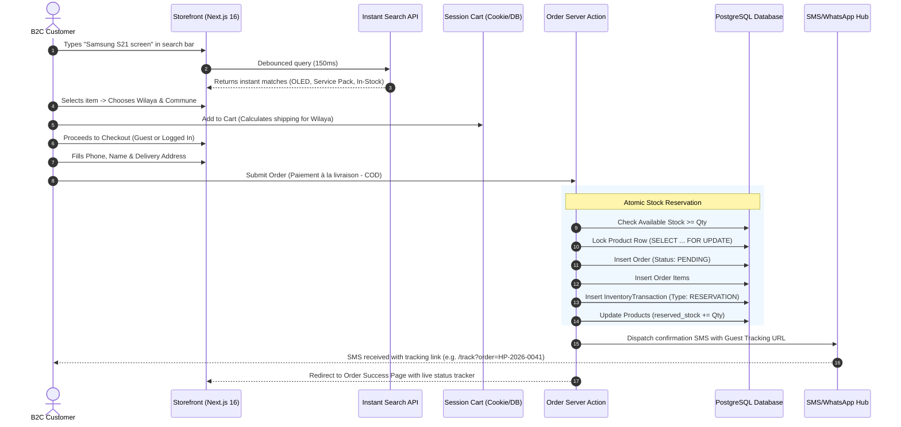
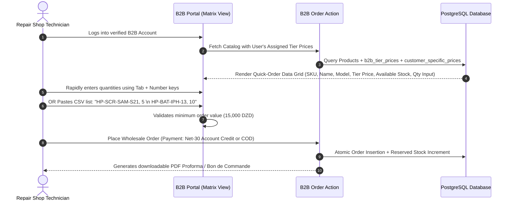
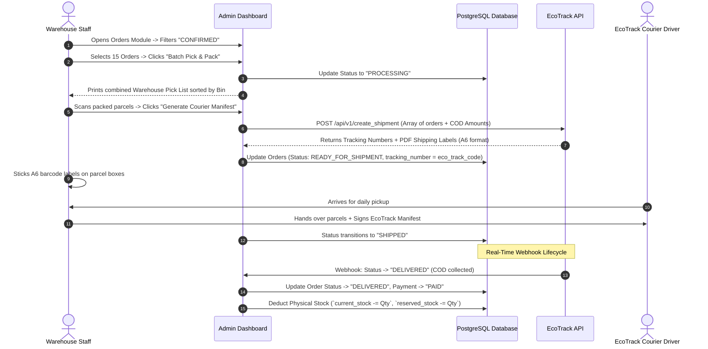
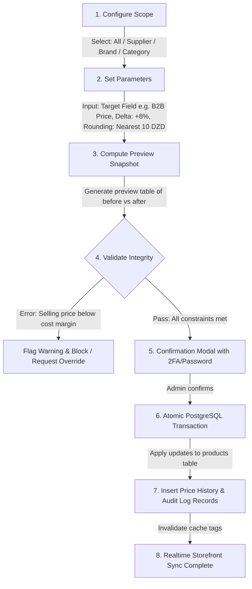

# HamzaPhone - Operational & Technical Workflows

## 1. B2C Storefront Discovery & Checkout Workflow

---

## 2. B2B Wholesale Portal & Quick Bulk Order Workflow

Repair shops and corporate wholesale clients require a fast ordering interface where they do not have to browse consumer product pages one-by-one.

---

## 3. Order Fulfillment & EcoTrack Courier Dispatch Workflow

---

## 4. Bulk Percentage Price Adjustment Pipeline

To handle supplier cost fluctuations or currency shifts in Algeria, administrators can adjust prices across thousands of items in seconds with zero downtime and complete auditability:

---

## 5. Supplier Catalog Import & Automated Price Sync Pipeline

When receiving updated price catalogs from Shenzhen or local distributors (often 10,000+ rows in `.xlsx` format):

1. **Upload & Parse**: Admin drags spreadsheet to the Import Module. File is parsed in a Web Worker / streaming Node chunk.
2. **Schema & SKU Matching**: System matches incoming rows by `supplier_sku`, `barcode`, or internal `sku`.
3. **Diff Calculation**:
   * **New SKUs**: Staged for review with default category assignments.
   * **Price Changes**: Highlights old cost vs new cost, computes expected margin impacts on B2C and B2B selling prices.
   * **Stock Quantity Adjustments**: Differentiates between price-only updates and inventory restocks.
4. **Validation Report**: Rejects malformed rows (missing prices, negative quantities, invalid characters) with line-by-line downloadable error logs.
5. **Execution**: On approval, runs batch `UPSERT` queries within an isolated transaction.
